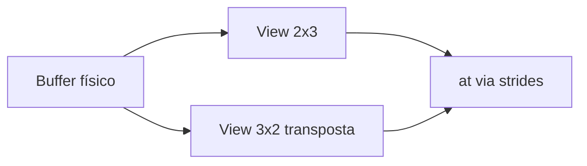

# Teoria passo a passo — Tensor, shape, strides e matmul

## 1. Dados físicos x geometria lógica

Nosso `Tensor2D` guarda floats contíguos. Uma matriz 2x3 `[1,2,3;4,5,6]` é fisicamente `[1,2,3,4,5,6]`. `rows`/`cols` descrevem forma; *strides* dizem como transformar índice lógico em offset.

Esta separação é o núcleo de NumPy, PyTorch, TensorFlow e bibliotecas de inferência: o **buffer** é único; **views** reinterpretam geometria sem copiar.

## 2. Fórmula de offset

Em uma view 2D:

```text
offset = row * row_stride + col * col_stride
```

No projeto, strides são medidos em **elementos**, não bytes. Para 2x3 contígua: `(row_stride=3, col_stride=1)`.

### Tabela de layouts comuns

| Layout | rows | cols | row_stride | col_stride | offset(1,2) |
|--------|-----:|-----:|-----------:|-----------:|--------------:|
| C contíguo 2x3 | 2 | 3 | 3 | 1 | 1*3+2*1=5 |
| Transposta view 3x2 | 3 | 2 | 1 | 3 | 1*1+2*3=7 |
| Fatia com passo 2 | 2 | 2 | 6 | 2 | 1*6+1*2=8 |

## 3. Exemplo manual passo a passo

Dados: `[1,2,3,4,5,6]`, shape 2x3, strides (3,1).

```text
       col0 col1 col2
row0     1    2    3
row1     4    5    6

at(0,0)=0  at(0,2)=2  at(1,1)=4
```

Transposta como view 3x2 com strides (1,3):

```text
       col0 col1
row0     1    4
row1     2    5
row2     3    6

at(2,1) = 2*1 + 1*3 = 5 -> valor 6
```

## 4. Transpose zero-copy

A mesma memória pode ser vista como 3x2. Basta trocar dimensões e strides:

```text
original: rows=2 cols=3 row_stride=3 col_stride=1
transpose: rows=3 cols=2 row_stride=1 col_stride=3
```



Nenhuma cópia ocorre; apenas metadados mudam.

## 5. Matmul

Para `C=A*B`:

```text
C[i,j] = soma_k A[i,k] * B[k,j]
```

Se A é MxK, B deve ser KxN e C será MxN.

### Trace manual 2x2

```text
A = [1 2]    B = [5 6]
    [3 4]        [7 8]

C[0,0] = 1*5 + 2*7 = 19
C[0,1] = 1*6 + 2*8 = 22
C[1,0] = 3*5 + 4*7 = 43
C[1,1] = 3*6 + 4*8 = 50
```

## 6. Loop order do laboratório

Usaremos `i-k-j`. Para cada `A[i,k]`, reutilizamos o valor enquanto percorremos colunas de B/saída. É uma introdução a locality; não é um GEMM otimizado.

```text
for i in rows(A):
  for k in cols(A):
    a = A[i,k]
    for j in cols(B):
      C[i,j] += a * B[k,j]
```

Comparado com `i-j-k`, o fator `a` sai do loop interno e pode permanecer em registrador.

## 7. Invariantes

| Invariante | Verificação |
|------------|-------------|
| dimensões não nulas | `rows>0 && cols>0` na construção |
| `values.size() == rows*cols` | vetor cobre toda a forma |
| índices dentro do shape | `at` lança `out_of_range` |
| `left.cols == right.rows` | pré-condição de matmul |
| views não são donas da memória | `data` é ponteiro externo |

## 8. Bugs clássicos

1. **Confundir stride em bytes com elementos**: multiplicar por `sizeof(float)` sem necessidade.
2. **Transpor copiando dados**: perde o exercício de zero-copy.
3. **Usar `i-j-k` com índices trocados**: resultado plausível mas errado.
4. **Esquecer validação em `at`**: corrupção silenciosa ou acesso fora do buffer.
5. **Assumir matriz sempre contígua após transpose view**: loops ingênuos podem ter cache ruim.

## 9. Comparação com produção

| Aspecto | Este lab | NumPy/PyTorch | BLAS/cuBLAS |
|---------|----------|---------------|-------------|
| Dimensões | 2D fixo | N-D genérico | 2D/3D otimizado |
| Stride | explícito manual | automático | layout contratado |
| Matmul | triplo loop float | delega a GEMM | SIMD/GPU |
| Ownership | `vector` próprio | refcount/GC | buffers gerenciados |

Frameworks reais adicionam broadcasting, dtype, device (CPU/GPU) e fusão de operadores. O que você aprende aqui — **offset por stride** — continua valendo em todos eles.

## 10. Locality e cache (visão prática)

Percorrer `B[k,j]` com `k` fixo e `j` variando acessa uma linha de B de forma sequencial quando B é row-major contíguo. Em matrizes grandes, ordem de loop pode mudar tempo em ordens de magnitude; por isso benchmarks futuros comparam `ijk`, `ikj` e versões tiled.

## 11. Diagrama de pipeline do módulo

```text
Tensor2D (owner)
    |
    +-- view() --------> TensorView2D contígua
    |
    +-- transpose_view() -> TensorView2D zero-copy
    |
    +-- matmul(left, right) -> novo Tensor2D denso
```

## 12. Perguntas de verificação

1. Sem copiar, como `at(2,1)` na transposta de `[1..6]` retorna 6?
2. Por que `matmul` cria novo tensor em vez de view?
3. Qual ordem de loop você esperaria mais rápida em 1024x1024 e por quê?

## 13. Extensões futuras no portfólio

Tiling, SIMD, multithread e integração com GPU partem deste modelo. Se você não dominar stride, otimizações posteriores mascaram bugs de indexação.

---

## Por quê — síntese pedagógica

### Por quê este módulo existe?
Conectar teoria de baixo nível a decisões de implementação verificáveis — não decorar API.

### Por quê estas invariantes?
Cada `TODO [ID]` protege uma propriedade que quebra silenciosamente em produção se ignorada (overflow, estado inválido, parsing parcial).

### Por quê medir e portar para `projects/`?
Lab isola o aprendizado; `projects/chris-*` consolida engenharia de portfólio com testes e benchmarks reproduzíveis.
