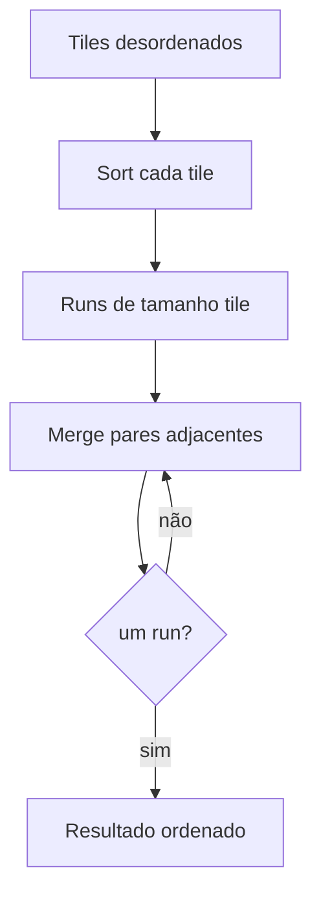

# Teoria passo a passo — Blocked / external-style merge sort

## 1. O problema de sistemas

Ordenar n inteiros “na RAM” esconde o custo que domina em data lakes, logs e bancos: **mover blocos** entre disco↔memória ou entre níveis de cache. External merge sort clássico: (1) criar runs ordenados do tamanho da memória disponível; (2) mesclar runs até sobrar um.

Neste lab a “memória disponível” é `tile_size`. O vetor vive na RAM, mas `block_reads` / `block_writes` **contam** cargas e stores em unidades de tile — o mesmo esqueleto de um sort externo.

### O quê

`blocked_merge_sort(data, tile_size, stats)` com `SortIoStats{comparisons, block_reads, block_writes}`.

### Como

Ordenar cada tile in-place → mesclar pares adjacentes de runs (`run_len = tile, 2·tile, 4·tile, …`) via scratch até `run_len ≥ n`.

### Por quê

Sem tiles, você não vê por que DB engines escolhem page size / buffer pool. Sem contagem de I/O, o algoritmo “parece” só merge sort clássico e a intuição de sistemas some.

## 2. Modelo de I/O (simulado)

Um **tile** cobre até `tile_size` elementos contíguos. Contagem:

```text
tiles_covering(begin, end) = ceil((end - begin) / tile_size)   se begin < end
                            = 0                                 caso contrário
```

| Evento | Conta |
|--------|-------|
| Carregar um intervalo antes de ordenar/mesclar | `block_reads += tiles_covering(...)` |
| Gravar o intervalo resultante | `block_writes += tiles_covering(...)` |
| Comparar duas chaves | `comparisons++` |

Não há `read()`/`write()` de arquivo: o modelo isola a **estrutura** do algoritmo.

## 3. Fase 0 — sort de tiles

Para `begin = 0, tile_size, 2·tile_size, …`:

```text
end = min(begin + tile_size, n)
READ  [begin, end)
ordenar [begin, end) in-place (insertion sort contado)
WRITE [begin, end)
```

Trace — `data = [8,7,6,5,4,3,2,1]`, `tile_size = 4`:

```text
tile0 [8,7,6,5] → [5,6,7,8]   +1 read +1 write
tile1 [4,3,2,1] → [1,2,3,4]   +1 read +1 write
runs iniciais: [5,6,7,8 | 1,2,3,4]
```

## 4. Merge de dois runs

Dados dois intervalos **já ordenados** `[begin, mid)` e `[mid, end)` em `src`, produzir `[begin, end)` em `dst`:

```text
left=begin, right=mid, out=begin
enquanto ambos têm itens:
  ++comparisons
  menor-ou-igual (esquerda se empate) → dst[out++]
copie sobras
```

Estabilidade: `<=` preserva ordem de iguais vindos da esquerda — útil quando a chave não é única.

Trace — `src = [5,6,7,8 | 1,2,3,4]`, `begin=0, mid=4, end=8`:

```text
5<=1? não → 1
5<=2? não → 2
5<=3? não → 3
5<=4? não → 4
sobra 5,6,7,8 → dst = [1,2,3,4,5,6,7,8]
```

## 5. Passes multi-run

Após a fase 0, `run_len = tile_size`. Enquanto `run_len < n`:

```text
para begin em 0, 2·run_len, 4·run_len, …:
  mid = min(begin+run_len, n)
  end = min(begin+2·run_len, n)
  READ  [begin,mid) e [mid,end)
  se mid < end: merge_runs → dst
  senão: copie o run ímpar restante
  WRITE [begin,end)
troque src ↔ dst
run_len *= 2
```

Número de passes de merge ≈ `ceil(log2(ceil(n / tile_size)))`.



## 6. Contagem completa do exemplo n=8, tile=4

| Fase | Reads | Writes |
|------|------:|-------:|
| Sort tiles | 2 | 2 |
| Merge pass (run_len=4) | 2 | 2 |
| **Total** | **4** | **4** |

Caso “cabe em um tile” (`n=3`, `tile=8`): só 1 read + 1 write; nenhum pass de merge (`run_len` já ≥ n).

## 7. Comparação com quicksort in-memory

| Aspecto | Blocked merge (lab) | Quicksort típico |
|---------|---------------------|------------------|
| Pior caso CPU | O(n log n) | O(n²) se pivot ruim |
| Memória extra | O(n) scratch | O(log n) stack |
| Localidade | Excelente dentro do tile | Depende do partition |
| I/O / páginas | Explícito (modelo) | Implícito / caótico |
| Estável | Sim (com `<=`) | Não |

Quicksort “ganha” quando tudo cabe em cache e o pivot é bom: menos movimentos e sem scratch O(n). Blocked merge “ganha” quando o gargalo é **trazer blocos** — o mesmo motivo de sort externo em warehouses.

## 8. Por que o tamanho do tile importa

- **Tile pequeno demais:** muitos tiles → mais passes de merge → mais `block_reads`/`block_writes` (e overhead de loops).
- **Tile grande demais:** a fase 0 deixa de caber em L1/L2 (ou na “página”); insertion sort local fica O(tile²) caro.
- **Tile ≈ page / buffer:** alinha o algoritmo ao hardware — hipótese central do lab.

Hipóteses sugeridas antes do benchmark:

```text
H1: block_reads cresce quando tile_size diminui (mais passes / mais tiles)
H2: comparisons da fase 0 sobem com tile_size (insertion O(t²) por tile)
H3: wall-clock tem um mínimo em tile intermediário nesta máquina
```

## 9. Invariantes

1. Após a fase 0, cada janela `[k·tile, min((k+1)·tile, n))` está ordenada.
2. Após um pass com `run_len`, cada janela de comprimento `2·run_len` (cortada em `n`) está ordenada.
3. `src`/`dst` alternam; se o último resultado ficou em `scratch`, copie/swap de volta para `data`.
4. Intervalos são **semiabertos** `[begin, end)`.

## 10. Bugs clássicos

1. Esquecer de copiar o run ímpar quando `mid == end` (último run sem parceiro).
2. Contar I/O por elemento em vez de por tile — os testes de Caso 4 falham.
3. Usar `<` no merge e quebrar estabilidade (não é assertado, mas é o modelo certo).
4. `tile_size == 0` sem rejeição.
5. Não devolver o resultado para `data` quando o último pass escreveu em `scratch`.

## 11. Relação com produção

- PostgreSQL / BigQuery / Spark: external merge / sort-merge join com runs em disco.
- `std::sort`: introsort in-memory — ótimo quando cabe; não modela page I/O.
- LSM trees: sorted runs (SSTables) + compaction ≈ ideia de merges multi-pass.

## 12. Protocolo de benchmark

```text
hipótese → Release → warm-up → ≥5 reps → mediana
fixar n e seed; variar só tile_size
registrar cmp, bread, bwrite, us
```

## 13. Perguntas de fechamento

1. Por que `block_reads` do exemplo 8/4 vale 4 e não 8?
2. Se `tile_size = n`, quantos passes de merge ocorrem?
3. Onde o modelo diverge de um sort externo real (prefetch, double buffering, k-way)?

## Fundamentos — cache e páginas

### O quê

Tiles aproximam linhas de cache ou páginas de disco: unidades de transferência, não elementos isolados.

### Como

Trabalhe o paper-trace `[8,7,6,5,4,3,2,1]` com `tile=4` até `dst` final **antes** de editar o starter.

### Por quê

Sem o modelo mental, `block_reads` vira magia e o lab vira “mais um mergesort”.

### Por quê falhar no starter

O starter compila; o teste falha até os TODOs existirem — prova que o harness mede ordenação e I/O.

### Trace manual resumido

```text
entrada → sort tiles → runs → merge passes → invariante (ordenado) → stats
```

### Bugs comuns (módulo)

| Sintoma | Causa | Depuração |
|---------|-------|-----------|
| Ordenado mas Caso 4 falha | I/O por elemento ou pass faltando | Conte tiles no papel |
| Metade ordenada | Esqueceu swap src/dst ou cópia final | Imprima run_len e buffer ativo |
| assert comparisons == 0 | Sort tile vazio de lógica | Trace insertion em 3 elementos |
