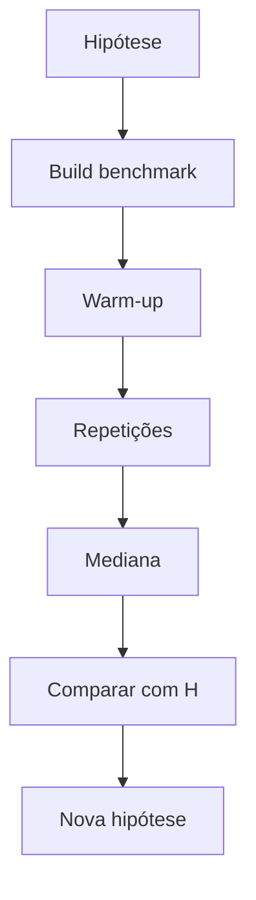

# Teoria passo a passo — Pesquisa empírica de sorting

## 1. Duas perguntas diferentes

Análise assintótica pergunta como custo cresce com n. Benchmark pergunta quanto uma implementação leva em uma máquina/configuração específica. Precisamos dos dois.

Um algoritmo O(n log n) pode perder para outro na prática em n pequeno por constantes, alocações e cache. Este módulo treina **hipótese → medição → conclusão cautelosa**.

## 2. Merge sort

Divide ao meio até subarrays de tamanho 1; depois intercala. A recorrência é aproximadamente `T(n)=2T(n/2)+Theta(n)`, portanto O(n log n). Usa scratch adicional O(n).

```text
        [38 27 43 3]
       /            \
  [38 27]          [43 3]
   /    \           /   \
[38] [27]        [43] [3]
   \    /           \   /
  [27 38]          [3 43]
       \            /
        [3 27 38 43]
```

### Contagem esperada (ordem de grandeza)

Para n=1024, comparações ~ n log2(n) ≈ 10240. O instrumento `SortStats.comparisons` permite verificar.

## 3. Quicksort do laboratório

Usa Lomuto-like partition com **último elemento como pivot**. Em dados aleatórios pode funcionar bem, mas dados já ordenados produzem partições 0 e n-1 repetidamente, levando a ~n²/2 comparações.

```text
sorted: [1 2 3 4 5], pivot=5
partição: tudo à esquerda, pivot no fim -> subproblema de tamanho n-1
repete -> degeneração quadrática
```

## 4. Tabela comparativa teórica

| Algoritmo | Melhor caso | Médio | Pior caso | Memória extra | Estável? |
|-----------|------------|-------|-----------|---------------|----------|
| Merge sort | O(n log n) | O(n log n) | O(n log n) | O(n) | sim |
| Quicksort (último pivot) | O(n log n) | O(n log n) | O(n²) | O(log n) stack* | não |

*Com loop no lado maior, limitamos profundidade de recursão, não o número de comparações no pior caso.

## 5. Instrumentação

`SortStats.comparisons` conta comparações-chave; `moves` aproxima movimentações. Não mede branches, cache misses, alocações do runtime nem frequência de CPU.

### O que cada métrica captura

| Métrica | Captura | Não captura |
|---------|---------|-------------|
| comparisons | decisões de ordenação | custo de cada comparação |
| moves | swaps/cópias contadas | prefetch, SIMD |
| tempo wall-clock | experiência total | ruído de SO, turbo |

## 6. Pesquisa empírica

O benchmark usa quatro distribuições com seed fixa: random, sorted, reversed e muitos duplicates. Hipótese deve ser escrita antes de rodar.

```text
H1: merge mantém ~n log n em todas as distribuições
H2: quicksort degrada em sorted/reversed
H3: duplicates reduzem custo de quicksort (muitos elementos iguais ao pivot)
```

## 7. Exemplo manual — partition

Array `{2, 1}`, pivot=1 (último):

```text
i=0: 2 < 1? não
store=0
swap pos 0 com pivot -> {1, 2}
retorna store=0
```

Array `{3,1,2}`, pivot=2:

```text
i=0: 3<2? não
i=1: 1<2? sim, swap -> {1,3,2}, store=1
swap store com pivot -> {1,2,3}
```

## 8. Invariantes do merge

Durante `merge_range` em `[begin,end)`:
- `left` aponta próximo não copiado do lado esquerdo;
- `right` idem no lado direito;
- `out` avança em `scratch`;
- ao final, `scratch[begin:end)` está ordenado.

## 9. Bugs clássicos

1. **Off-by-one no merge**: usar `middle` inclusivo em vez de semiaberto `[begin,middle)`.
2. **Não copiar scratch de volta**: array principal permanece parcialmente ordenado.
3. **Partition com pivot no meio sem colocá-lo no lugar certo**.
4. **Recursão infinita em quicksort**: `begin`/`end` não avançam.
5. **Comparar apenas tempo sem comparisons**: conclusão frágil.

## 10. Comparação com produção

| Contexto | Escolha típica | Por quê |
|----------|----------------|---------|
| `std::sort` em libstdc++/libc++ | introsort (quick+heap+insertion) | bom médio, evita n² |
| Python `sorted` | Timsort | aproveita runs ordenados |
| Banco de dados | sort externo | n maior que RAM |
| GPU | bitonic/radix | paralelismo massivo |

Nosso quicksort pedagógico é **intencionalmente frágil** para gerar dados de pesquisa.

## 11. Protocolo de benchmark responsável

```text
1. hipótese escrita
2. build Release, mesma máquina
3. warm-up >= 1
4. >= 5 repetições
5. mediana (não só média)
6. registrar seed, n, distribuição
7. uma variável por experimento
```

## 12. Diagrama do fluxo experimental



## 13. Perguntas de verificação

1. Por que sorted input destrói quicksort com último pivot mas não merge sort?
2. O que muda se trocarmos para mediana-de-três sem mudar seed?
3. Quando O(n²) ainda "ganha" de O(n log n) na prática?

---

## Por quê — síntese pedagógica

### Por quê este módulo existe?
Conectar teoria de baixo nível a decisões de implementação verificáveis — não decorar API.

### Por quê estas invariantes?
Cada `TODO [ID]` protege uma propriedade que quebra silenciosamente em produção se ignorada (overflow, estado inválido, parsing parcial).

### Por quê medir e portar para `projects/`?
Lab isola o aprendizado; `projects/chris-*` consolida engenharia de portfólio com testes e benchmarks reproduzíveis.
