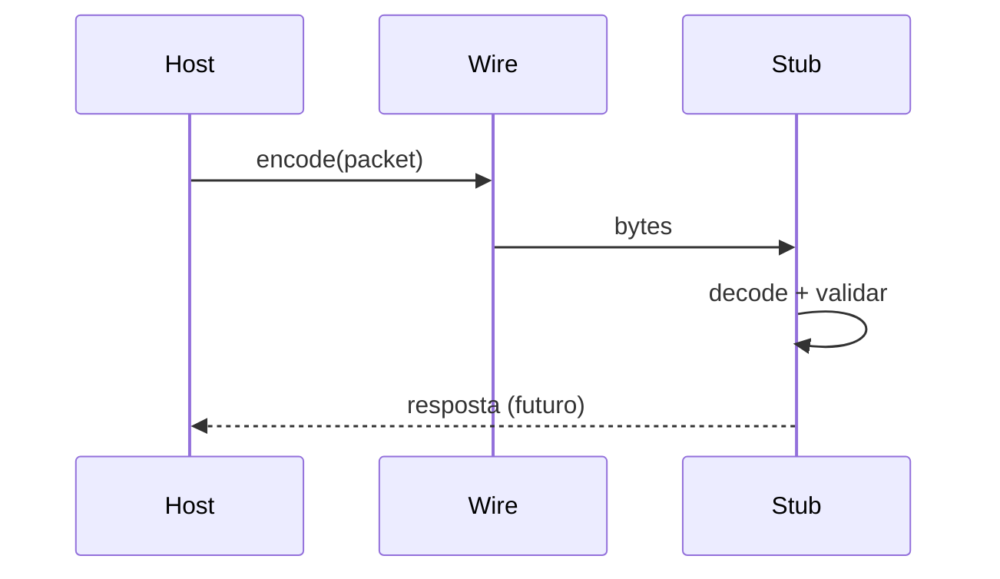

# Teoria passo a passo — Debug protocol v1

## 1. Por que um protocolo binário?

Debuggers precisam trocar mensagens compactas e parseáveis entre host e stub no kernel/alvo. Texto livre é frágil (encoding, delimitadores, injeção). Um layout fixo permite validação defensiva antes de interpretar payload.

Este módulo implementa **chris-debugger protocol v1**: serialização little-endian, checksum FNV-1a e decode que falha cedo.

## 2. Layout do pacote

Header fixo de 20 bytes:

```text
offset  size  campo
0       4     magic "CKD1" (0x31444B43 LE)
4       2     version
6       2     command
8       4     request_id
12      4     payload_size
16      4     FNV-1a(payload)
20      N     payload
```

Inteiros são little-endian. O decoder deve rejeitar header truncado, magic/version incorretos, comprimento divergente e checksum inválido.

## 3. Diagrama encode/decode



## 4. Little-endian na prática

Valor `0x1234` como u16:

```text
byte0 = 0x34
byte1 = 0x12
```

Valor `0x31444B43` (magic CKD1):

```text
bytes: 43 4B 44 31  ("C" "K" "D" "1" em ASCII)
```

### Tabela de operações

| Operação | Entrada | Saída bytes |
|----------|---------|-------------|
| append_u16(0x0102) | 258 | 02 01 |
| append_u32(0x00000005) | 5 | 05 00 00 00 |
| read_u16 em [0x34,0x12] | — | 0x1234 |

## 5. FNV-1a

Algoritmo simples de hash 32-bit:

```text
hash = 2166136261
para cada byte b:
  hash ^= b
  hash *= 16777619
```

**Não é criptografia.** Serve para detectar corrupção acidental de transporte. Em produção, protocolos críticos usam MAC/HMAC ou AEAD.

## 6. Encode — ordem das validações

1. rejeitar payload > 1 MiB;
2. reservar `20 + payload.size()`;
3. escrever campos na ordem do layout;
4. calcular hash sobre payload;
5. concatenar payload.

## 7. Decode defensivo

Ordem recomendada (fail-fast):

```text
1. bytes.size() >= 20
2. magic == CKD1
3. version == 1
4. ler command, request_id, payload_size, expected_hash
5. bytes.size() == 20 + payload_size
6. copiar payload
7. actual_hash = fnv1a(payload)
8. actual_hash == expected_hash
```

Qualquer falha: exceção com mensagem específica (facilita testes).

## 8. Exemplo manual

Payload `{0xAA, 0xBB}`, command=1, request_id=42:

```text
header campos (conceitual):
  magic CKD1
  version 1
  command 1
  request_id 42
  payload_size 2
  hash = fnv1a([AA BB])
  + AA BB
```

Alterar último byte do payload deve mudar hash e falhar no passo 8.

## 9. Invariantes

| Invariante | Motivo |
|------------|--------|
| `kHeaderSize == 20` | layout fixo |
| `payload_size` consistente com buffer | evita leitura fora |
| hash cobre só payload, não header | contrato do protocolo |
| version explícita | evolução compatível |
| limite 1 MiB | anti-DoS no stub |

## 10. Bugs clássicos

1. **Big-endian em host BE sem conversão** (lab assume LE wire).
2. **Incluir header no hash**.
3. **Aceitar `payload_size` gigante sem checar `bytes.size()`**.
4. **Ler payload antes de validar tamanho total**.
5. **Confundir checksum com autenticação**.

## 11. Comparação com produção

| Aspecto | Protocol v1 | GDB remote | LLDB | KD/Windbg |
|---------|-------------|------------|------|-----------|
| Formato | binário fixo | RSP texto+bin | packetized | variado |
| Integridade | FNV-1a | opcional | checksums | depende |
| Extensibilidade | version field | rica | rica | rica |
| Contexto | stub futuro no kernel | userspace | userspace | kernel |

Nosso parser precisa ser pequeno porque no futuro estará próximo de código privilegiado.

## 12. Arquitetura futura

```text
chris-kd-stub (kernel)
    <-> transporte serial / virtio / TCP
    <-> protocolo v1 (este módulo)
    <-> cliente host chris-debugger
```

## 13. Ataques considerados (parcial)

| Ataque | Mitigação no v1 |
|--------|-----------------|
| Pacote truncado | checagem de tamanho |
| Tamanho mentiroso | `size == 20+payload_size` |
| Payload corrompido | FNV-1a |
| Payload enorme | limite 1 MiB |
| Replay / MITM | **não mitigado** (sem MAC/TLS) |

## 14. Perguntas de verificação

1. Por que validar magic antes de ler payload_size?
2. O que acontece se `payload_size=0`?
3. Por que FNV-1a não basta em rede hostil?
