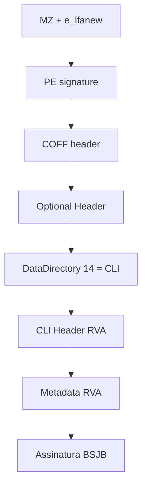

# Teoria passo a passo — PE, CLI Header e metadata BSJB

## 1. Por que um assembly .NET ainda é um PE

Quando você compila C# com `dotnet build`, o resultado continua sendo um arquivo **Portable Executable** — o mesmo contêiner usado por executáveis nativos Windows desde os anos 90. A diferença não está no contêiner externo, e sim no que existe **dentro** dele: além de seções `.text` e `.rdata`, um assembly gerenciado carrega um **CLI Header** apontado pelo data directory 14 do Optional Header.

Entender PE/CLI é pré-requisito para ferramentas como `ildasm`, analisadores de malware .NET, profilers nativos e debuggers híbridos que alternam entre world nativo e managed.

### O quê

`CliPeInspector.Inspect` navega MZ → PE → DataDirectory[14] → CLI header → metadata root `BSJB`.

### Como

Scaffolding parseia DOS/COFF/Optional; o aluno converte **dois RVAs** com `RvaToOffset` (CLI e metadata) via section table.

### Por quê

RVA ≠ file offset. Esse é o bug clássico em triage .NET e CTFs: sem a conversão, `BSJB` “nunca aparece” mesmo com o RVA certo.

## 2. Mapa do arquivo — visão de alto nível

```text
+------------------+
| DOS Header (MZ)  |  e_lfanew @ 0x3C aponta para PE
+------------------+
| DOS Stub         |
+------------------+
| PE Signature     |  "PE\0\0"
+------------------+
| COFF Header      |  Machine, #sections, SizeOfOptionalHeader
+------------------+
| Optional Header  |  Magic PE32/PE32+, DataDirectories[16]
+------------------+
| Section Table    |  .text, .rdata, ... (40 bytes cada)
+------------------+
| Raw section data |
+------------------+
```

### Diagrama de navegação



## 3. DOS Header e `e_lfanew`

Os primeiros dois bytes devem ser `4D 5A` (`MZ`). No offset `0x3C` existe um `uint32` little-endian chamado **`e_lfanew`**: offset absoluto no arquivo onde começa a assinatura PE.

Invariante defensiva: antes de ler `e_lfanew`, confirme que `image.Length >= 0x40`. Depois de ler `peOffset`, confirme que há espaço para PE signature + início do COFF.

## 4. COFF Header — campos que usamos hoje

| Offset relativo ao COFF | Tamanho | Campo | Uso neste lab |
|------------------------:|--------:|-------|---------------|
| +2 | 2 | NumberOfSections | iterar section table |
| +16 | 2 | SizeOfOptionalHeader | achar fim do optional |
| +20 | var | Optional Header | data directories |

`sectionTable = optional + optionalSize`.

## 5. Optional Header e Data Directory 14

O magic distingue PE32 (`0x10B`) de PE32+ (`0x20B`). O início do array de data directories depende disso:

```text
PE32  (0x10B): directoryStart = optional + 96
PE32+ (0x20B): directoryStart = optional + 112
```

Cada entrada ocupa 8 bytes: `RVA (4)` + `Size (4)`. O índice **14** é o **CLI Header**:

```text
cliEntry = directoryStart + 14 * 8
cliRva   = ReadU32(image, cliEntry)
cliSize  = ReadU32(image, cliEntry + 4)
```

Se `cliRva == 0`, o arquivo não é um assembly gerenciado (ou está corrompido).

## 6. RVA versus file offset — o erro clássico

**RVA** (Relative Virtual Address) é offset relativo à imagem **como carregada na memória**, não ao arquivo no disco. Seções podem ter:

- `VirtualAddress` / `VirtualSize` — região na imagem carregada
- `PointerToRawData` / `SizeOfRawData` — região no arquivo

```text
section cobre RVA r se:
  virtualAddress <= r < virtualAddress + max(virtualSize, rawSize)

fileOffset = pointerToRawData + (rva - virtualAddress)
```

### Exemplo numérico da fixture de teste

| Campo | Valor |
|-------|------:|
| Section VA | 0x2000 |
| PointerToRawData | 0x200 |
| CLI RVA | 0x2100 |
| CLI file offset | 0x200 + (0x2100 - 0x2000) = **0x300** |

Metadata RVA `0x2200` → file offset **0x400**, onde devem aparecer os bytes `BSJB`.

## 7. CLI Header — o que lemos

Depois de converter `cliRva` para offset de arquivo, lemos pelo menos 16 bytes. Neste milestone:

```text
+0  cb (4)
+4  MajorRuntimeVersion (2)
+6  MinorRuntimeVersion (2)
+8  Metadata RVA (4)      <-- segundo TODO do aluno
+12 Metadata Size (4)
```

O metadata root começa com assinatura ASCII **`BSJB`** (`0x42 0x53 0x4A 0x42` em ordem de leitura LE como uint32 `0x424A5342`).

## 8. Section table — layout de 40 bytes

```text
+0  Name (8)
+8  VirtualSize (4)
+12 VirtualAddress (4)
+16 SizeOfRawData (4)
+20 PointerToRawData (4)
+24 PointerToRelocations (4)
+28 PointerToLinenumbers (4)
+32 NumberOfRelocations (2)
+34 NumberOfLinenumbers (2)
+36 Characteristics (4)
```

A função `RvaToOffset` percorre sections linearmente. Em PEs reais com dezenas de sections, isso ainda é barato; em analisadores de alto volume, indexação por intervalo pode valer a pena — **depois** de provar que importa.

## 9. Parsing defensivo

Todo byte vem de input não confiável (malware, download parcial, fuzz). Regras deste laboratório:

1. **`RequireRange`** antes de cada leitura — nunca confie em tamanho declarado no header.
2. **`checked`** em aritmética de offsets — overflow vira exceção, não corrupção silenciosa.
3. **Rejeite magic desconhecido** — PE32/PE32+ apenas.
4. **Valide assinaturas** — MZ, PE, BSJB.

```text
[bytes recebidos] --> bounds check --> leitura --> validação semântica --> struct resultado
                         | falha |
                         v
                  InvalidDataException
```

## 10. Relação com ECMA-335

O metadata root BSJB inicia a área descrita pela ECMA-335 (CLI). Hoje só confirmamos a assinatura; amanhã você parseará `#~`, `#Strings`, `#US`, `#Blob` e tabelas de tipos/métodos. O caminho PE → CLI → Metadata é a porta de entrada.

## 11. Ferramentas de referência

| Ferramenta | O que mostra |
|------------|--------------|
| `file app.dll` | hint PE32/PE32+ |
| `llvm-objdump -h` | sections e RVAs |
| `dotnet peverify` | validação managed (quando aplicável) |
| HxD / 010 Editor | bytes crus, templates PE |

Compare manualmente um `ReadU32` seu com o hex editor no offset calculado.

## 12. Erros comuns de implementação

1. **Tratar RVA como file offset** — sintoma: `BSJB` nunca encontrado ou lido em lixo.
2. **Esquecer `max(virtualSize, rawSize)`** — section parcialmente preenchida no disco.
3. **Optional Header size errado para PE32+** — data directory 14 lido no lugar errado.
4. **Não validar `cliSize >= 16`** — metadata RVA lido fora do CLI header real.

## 13. Diagrama de estados do parser

```text
  START
    |
    v
  MZ ok? --no--> FAIL
    |
   yes
    v
  PE ok? --no--> FAIL
    |
   yes
    v
  CLI dir ok? --no--> FAIL
    |
   yes
    v
  RVA->offset CLI --fail--> FAIL
    |
   ok
    v
  RVA->offset Metadata --fail--> FAIL
    |
   ok
    v
  BSJB ok? --no--> FAIL
    |
   yes
    v
  RETURN CliImageInfo
```

## 14. Objetivo pedagógico deste milestone

Você **não** reimplementa todo o PE parser — o scaffolding já percorre DOS/COFF/Optional/DataDirectory. Seu trabalho é **conectar** dois RVAs ao helper existente e internalizar a diferença RVA/file offset. Esse é exatamente o bug que aparece em CTFs e triage de .NET malicioso.

## 15. Perguntas de verificação

1. Por que data directory 14 e não 0 (Export Table)?
2. O que acontece se `virtualSize > rawSize` e o RVA cai na região "só virtual"?
3. Como você provaria que `0x424A5342` é BSJB e não coincidência em `.text`?
4. Por que `ReadOnlySpan<byte>` é adequado para parsing PE em memória?

## 16. Extensões futuras

- Parse de `#~` stream e contagem de rows por tabela.
- Suporte a arquivos mapeados em memória (`MemoryMappedFile`).
- Benchmark comparando busca linear vs. interval tree por sections.
- Correlacionar CLI Header com `CorFlags` (ILONLY, 32BITREQUIRED).
