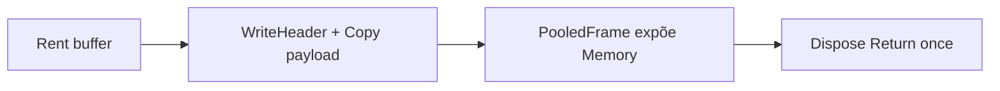

# Teoria passo a passo — Span, ArrayPool e frame binário

## 1. O problema de produção

Serviços de rede frequentemente precisam montar headers pequenos. Criar `byte[]` novo para cada mensagem aumenta a taxa de alocação e a pressão sobre o GC. O exercício separa três ideias: **ownership** do buffer, **view** temporária e **encoding** binário.

Em microserviços de alta taxa de mensagens, alocações de curta duração dominam perfis de GC gen0 — pools e spans são ferramentas para reduzir churn sem sacrificar segurança de tipos.

### O quê

`FrameCodec` grava/lê um header fixo de 8 bytes (LE) e monta frames via `ArrayPool` + `PooledFrame`.

### Como

`BinaryPrimitives` em `Span`/`ReadOnlySpan`; `Rent` → `WriteHeader` → copiar payload → `Dispose` devolve o array uma vez (`Interlocked.Exchange`).

### Por quê

Separar view (`Span`) de ownership (`PooledFrame`) evita use-after-return e reduz churn de `byte[]` no hot path — o padrão de Kestrel/pipelines, em escala de lab.

## 2. `Span<T>` não é dono da memória

`Span<byte>` descreve uma região contígua. Ele pode apontar para array, `stackalloc` ou memória nativa, mas não gerencia o lifetime do backing store. Isso explica por que `Span<T>` é `ref struct` e não pode ser campo de classe async.

```text
byte[] arr = pool.Rent(1024);
Span<byte> header = arr.AsSpan(0, 8);
// Span morre; array ainda pertence ao pool até Return
```

## 3. Layout do frame (8 bytes)

| Offset | Tipo | Campo |
|-------:|------|-------|
| 0..3 | int32 LE | PayloadLength |
| 4..7 | int32 LE | MessageType |

`BinaryPrimitives.WriteInt32LittleEndian` torna endianness explícita — essencial em protocolos que cruzam SO.

### Exemplo manual

PayloadLength=100, MessageType=7:

```text
bytes: 64 00 00 00  07 00 00 00
       ^^^^^^^^^^^  ^^^^^^^^^^^
       100 LE       7 LE
```

## 4. `ArrayPool<T>`

O pool troca alocação frequente por reutilização. O custo passa a ser disciplina de ownership:

```text
Rent -> usar -> Return (exatamente uma vez)
```

`Shared` é global — contenção possível em cenários extremos; pools dedicados existem em produção.

## 5. `PooledFrame` e dispose idempotente

`Interlocked.Exchange` garante retorno único ao pool mesmo se `Dispose` for chamado duas vezes. Sem isso, double-return corrompe o pool (dois consumidores recebem mesmo array).

## 6. Invariantes

| Invariante | Onde verificar |
|------------|----------------|
| `destination.Length >= 8` | WriteHeader |
| `PayloadLength >= 0` | WriteHeader / ReadHeader |
| `required = 8 + payload.Length` sem overflow | RentFrame (`checked`) |
| após Dispose, Memory inválida | testes |
| cópia payload começa em offset 8 | RentFrame |

## 7. Bugs clássicos

1. **Copiar payload no offset 0** (sobrescreve header).
2. **Usar `BitConverter` sem garantir LE** em protocolo wire.
3. **Esquecer `Return` após Rent** (retenção de memória).
4. **Usar buffer após Dispose** (use-after-free lógico).
5. **Rent sem `clearArray: true` com dados sensíveis** (vazamento entre requests).

## 8. Comparação com produção

| Abordagem | Prós | Contras |
|-----------|------|---------|
| `new byte[]` por frame | simples | GC pressure |
| `ArrayPool` + Span | menos alocações | contrato manual |
| `IBufferWriter<byte>` | composável pipelines | abstração extra |
| stackalloc (pequeno) | zero heap | limite de tamanho |
| Native memory / POH | controle fino | complexidade |

ASP.NET Core, Kestrel e gRPC usam combinações de pool + spans para buffers de I/O.

## 9. Diagrama de ownership



## 10. Quando pool ajuda — checklist sênior

1. Qual taxa de alocações por segundo?
2. Qual tamanho típico/máximo do buffer?
3. Há risco de retenção (buffer grande vivo por referência)?
4. Dados sensíveis exigem limpeza?
5. Medição A/B com BenchmarkDotNet no workload real?

## 11. ReadHeader sem alocar

Slices `source[0..4]` e `source[4..8]` decodificam sem `new byte[]` — importante em hot path de parsing.

## 12. Relação com CLR e GC

Gen0 collections são baratas mas frequentes; reduzir alocações melhora latência p99. Pools não eliminam GC — mudam **quando** e **quanto** a heap cresce.

## 13. Extensões futuras

- length-prefix com varint;
- checksum após header;
- `ReadOnlySequence<byte>` para payloads fragmentados;
- integração com `System.IO.Pipelines`.

## 14. Perguntas de verificação

1. Por que `Span` é `ref struct`?
2. O que acontece com dois `Dispose` sem `Interlocked`?
3. Quando `ArrayPool` **não** melhora o benchmark?

## 15. Síntese

O frame de 8 bytes é pequeno, mas o padrão Rent→encode→Return escala para buffers de I/O maiores em serviços reais. Domine ownership antes de micro-otimizar cópias.

---

## Por quê — síntese pedagógica

### Por quê este módulo existe?
Conectar teoria de baixo nível a decisões de implementação verificáveis — não decorar API.

### Por quê estas invariantes?
Cada `TODO [ID]` protege uma propriedade que quebra silenciosamente em produção se ignorada (overflow, estado inválido, parsing parcial).

### Por quê medir e portar para `projects/`?
Lab isola o aprendizado; `projects/chris-*` consolida engenharia de portfólio com testes e benchmarks reproduzíveis.
