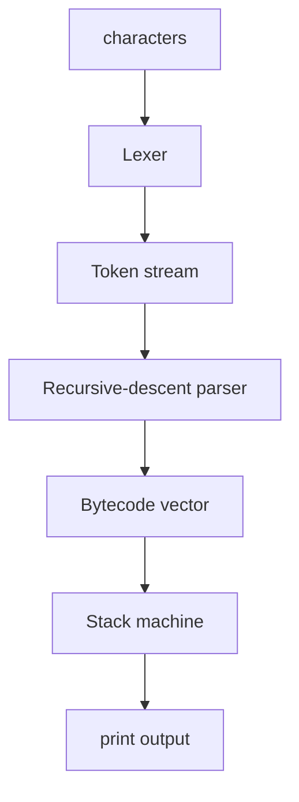

# Teoria passo a passo — Lexer, parser, bytecode e VM JavaScript-like

## 1. Por que construir um runtime mínimo

Node e browsers escondem um pipeline enorme: parse → AST → bytecode/IR → JIT → GC. Este laboratório **encolhe** esse pipeline até caber em centenas de linhas C++, para você ver invariantes que V8 documenta apenas indiretamente.

Não imitamos ECMAScript completo — apenas um subconjunto com `let`, `print`, inteiros, `+ - *` e precedência.

## 2. Programa de entrada

```js
let x = 10;
let y = 20;
print(x + y * 2);
```

Saída esperada: `60` (porque `*` tem precedência sobre `+`).

## 3. Pipeline completo

```text
  source text
       |
       v
    [ Lexer ]  --> stream de Token { Number, Ident, Let, Print, +, -, *, ;, (, ) }
       |
       v
    [ Parser ] --> emite OpCode + operandos (sem AST explícito neste milestone)
       |
       v
    [ Bytecode buffer ]
       |
       v
    [ Stack VM ] --> stdout
```

### Diagrama mermaid



## 4. Lexer — consumir caracteres

Responsabilidades deste lab:

| Token | Regra |
|-------|-------|
| Number | sequência de dígitos `0-9` → valor Int64 |
| Ident | letra/dígito/`_`; palavras reservadas `let`, `print` |
| Símbolos | `+ - * ( ) ;` single-char |
| EOF | fim do buffer |

Whitespace separa tokens e é ignorado.

### Exemplo tokenização

```text
"let x = 10;"
  Let, Ident(x), = nao implementado como token separado no subset,
  Number(10), Semicolon
```

Neste subset, `=` faz parte da gramática de statement, não do lexer.

## 5. Parser recursive-descent e precedência

Gramática simplificada:

```text
program   := statement*
statement := letStmt | printStmt
letStmt   := 'let' ident '=' expression ';'
printStmt := 'print' '(' expression ')' ';'
expression:= term (('+'|'-') term)*
term      := factor (('*') factor)*
factor    := number | ident | '(' expression ')'
```

Precedência sobe descendo na árvore de funções: `expression` chama `term`, `term` chama `factor`. Multiplicação fica **mais profunda**, portanto amarrada primeiro.

### Árvore conceitual para `x + y * 2`

```text
        +
       / \
      x   *
         / \
        y   2
```

## 6. Bytecode emitido (ordem típica)

Para `print(x + y * 2)`:

```text
LoadGlobal x
LoadGlobal y
PushConst 2
Mul
Add
Print
```

Cada operação aritmética consome operandos da **pilha** e empilha resultado.

## 7. Stack VM — modelo de execução

```text
Stack (topo à direita):

PushConst 10     -->  [ 10 ]
LoadGlobal y     -->  [ 10, 20 ]
PushConst 2      -->  [ 10, 20, 2 ]
Mul              -->  [ 10, 40 ]
Add              -->  [ 50 ]   // bug se Add só empilhar primeiro operando!
Print            -->  stdout: 50
```

Invariante: **cada opcode binário remove dois valores e empilha um**.

## 8. Tabela de opcodes deste milestone

| Opcode | Efeito na pilha |
|--------|-----------------|
| PushConst n | push n |
| LoadGlobal i | push globals[i] |
| StoreGlobal i | pop → globals[i] |
| Add | pop b, pop a, push a+b |
| Sub | pop b, pop a, push a-b |
| Mul | pop b, pop a, push a*b |
| Print | pop, imprime |

## 9. Globals e índices

Identificadores mapeiam para slots em `std::vector<int64_t>`. Primeiro `let x` aloca slot; usos posteriores referenciam o mesmo índice. Este lab não implementa escopos aninhados — extensão futura.

## 10. Erros de lexer/parser comuns

1. **Number sem dígitos** — consumir loop vazio e falhar depois.
2. **Ident vs keyword** — comparar string antes de classificar como Ident.
3. **Esquecer consumir `;` ou `)`** — parser desincroniza.
4. **Precedência invertida** — parse `+` antes de `*` gera bytecode errado.

## 11. Erros de VM

1. **Add pop order** — `a+b` vs `b+a` (commutativo em inteiros, não em floats/strings futuros).
2. **Stack underflow** — opcode sem operandos suficientes.
3. **Print sem pop** — vazamento de valores na pilha.

## 12. Diagrama de estados do interpretador

```text
  INIT globals
     |
     v
  FETCH opcode @ PC
     |
     v
  EXEC --> atualiza PC e stack
     |
     v
  PC < end? --yes--+
     |             |
    no             |
     v             |
    HALT <---------+
```

## 13. Comparação com V8 / SpiderMonkey (qualitativo)

| Este lab | Engine real |
|----------|-------------|
| bytecode interpretado | tiered: Ignition → TurboFan |
| int64 only | tagged pointers, doubles, heap numbers |
| globals flat | lexical environments, closures |
| sem GC | generational GC complexo |

O **formato** muda; a **disciplina** (lexer limpo, precedência correta, invariantes de stack) é a mesma.

## 14. Debugging guiado

1. Imprima tokens gerados antes do parse.
2. Dump bytecode com índices antes de executar.
3. Trace VM: após cada opcode, mostre stack e PC.
4. Compare bytecode manual com o gerado para expressão mínima `1+2*3`.

## 15. Testes pedagógicos (`PEDAGOGY-TEST`)

| ID | Foco |
|----|------|
| D2-JS-LEX-NUMBER | acumular dígitos |
| D2-JS-LEX-IDENT | keywords vs idents |
| D2-JS-STMT-LET | StoreGlobal |
| D2-JS-STMT-PRINT | chamada print |
| D2-JS-PREC-ADD | nível expression |
| D2-JS-PREC-MUL | nível term |
| D2-JS-VM-ADD | opcode Add correto |

## 16. Benchmark — o que esperar

Compile Release e meça tempo de compilar+executar programa fixo vs. número de linhas. Hipótese: lexer+parser dominam para inputs pequenos; VM domina se bytecode crescer. Registre mediana — JIT não existe aqui, então resultados são estáveis entre runs.

## 17. Segurança e sandbox

Este runtime **não** é sandbox. Não exponha a input de rede. Em extensões futuras, limite tamanho de source, profundidade de parse e altura da pilha para evitar DoS.

## 18. Extensões futuras

- AST explícito antes de codegen;
- `if/while`, comparadores, booleanos;
- Funções e call stack separada de operand stack;
- Peephole optimization no bytecode;
- Disassembler human-readable.

## 19. Perguntas de verificação

1. Por que `term` chama `factor` e não o contrário?
2. Qual bytecode distingue `2+3*4` de `(2+3)*4`?
3. O que acontece na pilha se `Add` não remover dois elementos?
4. Por que keywords são reconhecidas no lexer e não no parser?

## 20. Objetivo do dia

Sair com modelo mental **operacional** de linguagem: texto → tokens → regras → bytecode → máquina. Tudo que você debugar aqui reaparece quando ler dumps de Ignition ou escrever DSLs internas.
