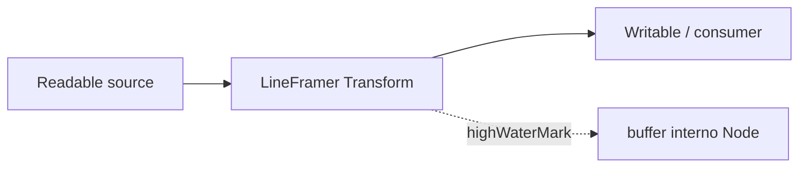

# Teoria passo a passo — Framing de linhas e backpressure em Node.js

## 1. O problema de produção

Serviços Node.js frequentemente consomem **streams** — logs, NDJSON, protocolos texto, pipes de subprocessos. TCP e `Readable` **não garantem fronteiras de mensagem**: um `chunk` pode conter meia linha, três linhas ou um JSON cortado no meio.

Sem framing, você acumula bytes até EOF (memória ilimitada) ou interpreta chunks como mensagens completas (corrupção silenciosa). Backpressure entra quando o produtor envia mais rápido que o consumidor processa.

## 2. Modelo mental — bytes vs mensagens

```text
Produtor envia:     [ "hel" ] [ "lo\nwor" ] [ "ld\n" ]
                         \___________/   \_____/
                         chunk 1         chunk 2

Mensagens lógicas:  "hello"  e  "world"
```

### Diagrama do pipeline



## 3. Por que `Transform` e não função solta

`Transform` é um `Duplex` especializado: recebe chunks binários ou string, emite objetos downstream (aqui, **strings de linha**). Integra-se ao ecossistema:

- `pipeline()` propaga erros e fecha streams na ordem correta;
- `highWaterMark` controla quanto buffer interno é aceito antes de pausar upstream;
- `objectMode: true` no readable side permite `push("linha")` sem serializar manualmente.

## 4. Estado interno `#pending`

O framer mantém bytes incompletos entre invocações de `_transform`:

```text
Estado inicial:  pending = ""

Chunk "abc":     pending = "abc"     (sem \n, nada emitido)
Chunk "de\nfg":  emite "abcde", pending = "fg"
_flush:          emite "fg" se restou (linha final sem \n)
```

Invariante: **`pending` só contém sufixo sem `\n` completo**.

## 5. Algoritmo de framing

Pseudo-código:

```text
pending += incoming
loop:
  idx = indexOf('\n', pending)
  if idx == -1: break
  line = pending[0:idx]        // ou [0:idx) excluindo \n
  emit(line)
  pending = pending[idx+1:]
```

No código real, cuidado com:

- concatenação eficiente (`Buffer.concat` vs acumulador);
- encoding UTF-8 — este lab assume UTF-8 válido por linha;
- `\r\n` — extensão futura: normalizar removendo `\r` final.

## 6. Backpressure — o que Node faz por você

Quando downstream está lento, `push()` retorna `false` sinalizando que devemos pausar leitura upstream. Streams aplicam pressão em cadeia:

```text
[Fast producer] --chunks--> [Transform lento] --obj--> [DB lento]
        ^                           |
        |______ pause() ____________|
```

Neste milestone o foco é **framing correto**; o teste de backpressure demonstra que `pipeline` + transform não explode memória com produtor rápido.

## 7. Limite `maxLineBytes`

Framing sem limite permite atacante (ou bug) enviar gigabytes sem `\n`, crescendo `#pending` indefinidamente.

Regra deste lab:

```text
if pending.length > maxLineBytes:
  throw RangeError('unterminated line exceeds maxLineBytes')
```

Default: 64 KiB — suficiente para logs normais, insuficiente para exfiltração por linha infinita.

### Diagrama de decisão

```text
  novo byte em pending
         |
         v
  len > maxLineBytes? ----yes----> ERRO (fail-closed)
         |
        no
         v
  procura \n e emite linhas completas
```

## 8. `_flush` e linha final

EOF pode chegar com `#pending` não vazio **sem** `\n` terminal. Política deste exercício: emitir a linha restante no `_flush` (comportamento comum em parsers de log).

Alternativa em produção: rejeitar linha incompleta no EOF se protocolo exige `\n` terminador estrito.

## 9. Comparação com abordagens reais

| Abordagem | Prós | Contras |
|-----------|------|---------|
| `readline` interface | simples para TTY | menos controle de backpressure |
| `Transform` custom | controle fino, testável | você implementa edge cases |
| `split2` / pacotes npm | battle-tested | dependência externa |
| Acumular tudo em string | fácil | OOM em streams grandes |

## 10. TypeScript e contratos

`LineFramer` valida `maxLineBytes` no construtor:

```typescript
if (!Number.isInteger(maxLineBytes) || maxLineBytes <= 0)
  throw new RangeError('maxLineBytes must be a positive integer');
```

Isso falha cedo — preferível a comportamento indefinido em runtime.

## 11. Testes que provam correção

Cenários mínimos:

1. linha única em um chunk;
2. linha partida em dois chunks;
3. múltiplas linhas em um chunk;
4. chunk vazio (no-op);
5. linha sem `\n` final + `_flush`;
6. linha > `maxLineBytes` → erro.

Marcadores `PEDAGOGY-TEST: D2-NODE-FRAME-LINES` amarram testes ao TODO.

## 12. Erros comuns

1. **Emitir `#pending` inteiro a cada chunk** — duplica linhas.
2. **Esquecer de avançar após `\n`** — loop infinito no mesmo índice.
3. **Não tratar `\r\n`** — linhas com `\r` residual (extensão).
4. **Ignorar `_flush`** — perde última linha legítima.
5. **Sem limite de tamanho** — DoS por memória.

## 13. Relação com HTTP/2, gRPC e NDJSON

NDJSON (Newline Delimited JSON) exige exatamente este padrão: uma JSON por linha. Agents de observabilidade, pipelines ETL e CLIs de ML usam o mesmo framing. Entender `Transform` aqui generaliza para qualquer delimitador (não só `\n`).

## 14. Diagrama de estados do framer

```text
  [VAZIO]
     | append chunk
     v
  [ACUMULANDO] --encontrou \n--> emit linha --> [ACUMULANDO ou VAZIO]
     |
     | len > max
     v
  [ERRO]
     |
  _flush com resto
     v
  [FECHADO]
```

## 15. Performance — o que medir no benchmark

Hipóteses típicas:

- overhead de `Buffer.concat` repetido vs. lista de chunks;
- custo de `toString('utf8')` por linha vs. manter Buffers downstream;
- impacto de `maxLineBytes` pequeno em validação.

Registre mediana de throughput (linhas/s) e memória RSS — números variam por versão Node e hardware.

## 16. Objetivo pedagógico

Implementar **uma** função `_transform` correta ensina:

- diferença chunk/mensagem;
- estado entre callbacks assíncronos;
- limites de segurança em parsers de stream;
- integração com `pipeline` e backpressure nativo.

## 17. Perguntas de verificação

1. Por que `objectMode: true` no construtor?
2. O que acontece se `push()` retornar `false`?
3. Quando `_flush` é chamado?
4. Por que validar `maxLineBytes` no construtor e em `_transform`?

## 18. Extensões futuras

- Suporte a delimitador configurável (`\0`, `\r\n`).
- Métricas: linhas emitidas, bytes descartados, pausas upstream.
- Integração com `Readable.from()` e async iterators.
- Benchmark comparando esta implementação com `readline.createInterface`.
