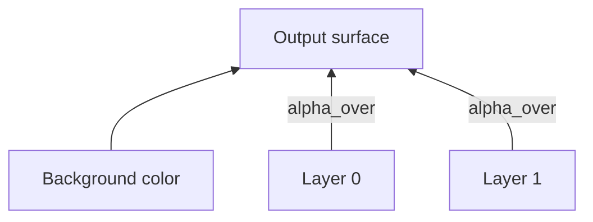

# Teoria passo a passo — Surface e compositor 2D

## 1. Surface

Uma surface é uma matriz de pixels RGBA em memória. Nosso layout é row-major: índice `y*width+x`.

```text
width=4, (x=1,y=2) -> index = 2*4+1 = 9

  x: 0  1  2  3
y0   .  .  .  .
y1   .  .  .  .
y2   .  *  .  .   <- pixel (1,2)
y3   .  .  .  .
```

Cada `Pixel` guarda `r,g,b,a` em 0..255. Este é o mesmo modelo conceitual de framebuffers, textures e canvases 2D.

## 2. Clipping

Desenhar fora do buffer corromperia memória num kernel real. `fill_rect` recorta o retângulo nos limites da surface.

```text
surface 4x4, fill_rect(-1,-1,3,3)
clipped: x in [0,2), y in [0,2)  -- apenas 3x3 visível, 2x2 dentro
```

### Tabela de recorte

| Pedido x,y,w,h | x0 | y0 | x1 | y1 |
|----------------|----|----|----|-----|
| 1,1,2,2 em 4x4 | 1 | 1 | 3 | 3 |
| -1,-1,3,3 em 4x4 | 0 | 0 | 2 | 2 |
| 3,3,5,5 em 4x4 | 3 | 3 | 4 | 4 |

## 3. Layers

Uma layer referencia uma surface e uma posição `(x,y)` no destino. Ordem do vetor define z-order simples: layers posteriores são compostas por cima.

```text
Layer0 (fundo)  -> desenhada primeiro
Layer1 (sprite) -> por cima
Layer2 (HUD)    -> por último
```

## 4. Alpha source-over

Usamos uma aproximação inteira para RGB, assumindo destino opaco:

```text
out = src*alpha + dst*(1-alpha)
```

com alpha 0..255. Ainda não tratamos gamma correta, premultiplied alpha nem saída semi-transparente.

### Exemplo manual

Vermelho (255,0,0,255) sobre azul (0,0,255,255) com alpha 128 (~50%):

```text
out_r = (255*128 + 0*127 + 127) / 255 ≈ 128
out_b = (0*128 + 255*127 + 127) / 255 ≈ 128
resultado ~ (128, 0, 128)
```

## 5. Invariantes

| Invariante | Onde |
|------------|------|
| `0 <= x < width` para acesso | `index` lança se violado |
| retângulos vazios não desenham | `width<=0 || height<=0` |
| `alpha` em 0..255 | tipo `uint8_t` |
| output do compositor tem tamanho fixo | `(width,height)` do destino |
| layers `nullptr` ignoradas | sem crash |

## 6. Bugs clássicos

1. **Confundir x/y no índice** (`x*width+y` em vez de `y*width+x`).
2. **Não clippar antes de `set_pixel`**.
3. **Alpha-over com destino transparente tratado como opaco** (cor errada).
4. **Esquecer offset da layer** (`dx = layer.x + sx`).
5. **Compor fora da ordem z** (vetor invertido).

## 7. Comparação com produção

| Camada | Este lab | Skia | Compositor Wayland | Kernel frame buffer |
|--------|----------|------|--------------------|---------------------|
| Pixel format | RGBA8 | vários | DRM formats | fixo por hardware |
| Clipping | retângulo axis-aligned | paths complexos | damage regions | scanout |
| Blending | source-over int | muitos modos | GPU shaders | raro em CPU |
| Performance | O(pixels*layers) | SIMD/GPU | composição HW | memcpy/flip |

Nosso código é **referência didática** para o futuro `chris-os` graphics stack.

## 8. Caminho até o SO

```text
CPU reference (este módulo)
    -> framebuffer abstraction
    -> window server
    -> compositor
    -> virtio-gpu / display driver
    -> damage tracking / vsync / fences
```

## 9. Diagrama de composição



## 10. Gamma e premultiplied alpha (conceito)

Monitores não são lineares. Engines reais convertem sRGB ↔ linear antes de misturar. **Premultiplied alpha** armazena `r*α/255` para evitar halos em filtros. Ignorar isso produz bordas escuras/claras em sprites — bug visual comum.

## 11. Benchmark do módulo

640x360, 40 frames, duas layers: mede FPS de composição CPU pura. Serve como baseline antes de SIMD, damage rects e GPU.

## 12. Exemplo completo 2x2

Fundo preto, layer vermelha semi-transparente cobrindo (0,0)-(1,1):

```text
sem layer: todos (0,0,0,255)
com layer 50% vermelho no pixel (0,0): ~(128,0,0,255)
```

## 13. Perguntas de verificação

1. Por que `+127` antes de dividir por 255?
2. O que acontece se `layer.x` empurra sprite parcialmente fora?
3. Qual diferença entre clipping em `fill_rect` e no compositor?

---

## Por quê — síntese pedagógica

### Por quê este módulo existe?
Conectar teoria de baixo nível a decisões de implementação verificáveis — não decorar API.

### Por quê estas invariantes?
Cada `TODO [ID]` protege uma propriedade que quebra silenciosamente em produção se ignorada (overflow, estado inválido, parsing parcial).

### Por quê medir e portar para `projects/`?
Lab isola o aprendizado; `projects/chris-*` consolida engenharia de portfólio com testes e benchmarks reproduzíveis.
