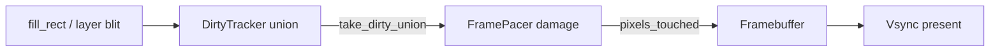

# Teoria passo a passo — Surface, damage e frame pacing

## 1. O problema de produção

Framebuffers e window servers raramente redesenham a tela inteira a cada frame. Um cursor que se move 8×8 pixels não deveria recompor 1920×1080. Este lab é a **referência CPU** do futuro stack gráfico do `chris-os`: surface row-major, clipping AABB, source-over inteiro, **dirty rectangles** e **compose com damage**.

### O quê

`Surface` RGBA8 (`y*width+x`), `fill_rect` com clip, `alpha_over`, `Compositor::compose`, `DirtyTracker` (união AABB) e `FramePacer::compose_with_damage` com `FrameStats {pixels_touched, dirty_area}`.

### Como

Guard em `index`; interseção do retângulo com a surface; blend `src*α + dst*(255-α)` com `+127` antes de `/255`; marcar dirty em cada escrita; no frame seguinte, recompor **só** a união dirty (clipada ao framebuffer).

### Por quê

Sem clipping, write fora do buffer é UB. Sem alpha correto, HUD/sprite ficam errados. Sem damage, o compositor gasta bandwidth linear na resolução — o gargalo típico antes de GPU/vsync. Vsync sem damage ainda desperdiça CPU entre beats.

## 2. Surface e índice row-major

```text
width=4, (x=1,y=2) -> index = 2*4+1 = 9

  x: 0  1  2  3
y0   .  .  .  .
y1   .  .  .  .
y2   .  *  .  .   <- pixel (1,2)
y3   .  .  .  .
```

Cada `Pixel` guarda `r,g,b,a` em 0..255.

## 3. Clipping de fill_rect

```text
surface 4x4, fill_rect(-1,-1,3,3)
clipped: x in [0,2), y in [0,2)  → 4 pixels escritos
```

| Pedido x,y,w,h | x0 | y0 | x1 | y1 | área |
|----------------|----|----|----|-----|------|
| 1,1,2,2 em 4x4 | 1 | 1 | 3 | 3 | 4 |
| -1,-1,3,3 em 4x4 | 0 | 0 | 2 | 2 | 4 |
| 3,3,5,5 em 4x4 | 3 | 3 | 4 | 4 | 1 |

Após o clip, `mark_dirty(x0,y0,x1-x0,y1-y0)` — dirty reflete só o que mudou.

## 4. Layers e z-order

Uma `Layer` referencia surface + `(x,y)`. Ordem do vetor: posteriores por cima.

```text
Layer0 (fundo)  -> primeiro
Layer1 (sprite) -> por cima
Layer2 (HUD)    -> último
```

No blit, o footprint de destino (offset + tamanho da layer ∩ bounds) também entra no dirty.

## 5. Alpha source-over

```text
out = src*alpha + dst*(1-alpha)   // alpha 0..255, destino tratado como opaco
```

Vermelho (255,0,0,128) sobre azul (0,0,255,255):

```text
out_r = (255*128 + 0*127 + 127) / 255 ≈ 128
out_b = (0*128 + 255*127 + 127) / 255 ≈ 128
resultado ~ (128, 0, 128, 255)
```

## 6. Dirty rectangles — união AABB

### O quê

`DirtyTracker` acumula retângulos “sujos” numa **única** união axis-aligned (AABB). `take_dirty_union()` devolve e limpa.

### Como

```text
mark(2,2,3,3)  → union = [2,2]+3x3
mark(0,0,2,2)  → union = [0,0]+5x5   (expandiu)
mark(5,5,2,2)  → union = [0,0]+7x7
```

Trace numérico (surface 8×8):

```text
fill A: (0,0)-(2,2)     area=4
fill B: (5,5)-(7,7)     area=4
union:  (0,0)-(7,7)     area=49   ← cobre pixels limpos no meio
```

### Por quê

AABB é barato (4 inteiros) e suficiente para labs/window servers simples. Em produção (Wayland damage, Chrome, Skia) há listas de regiões, tiles ou quads — a ideia é a mesma: **não toque o que não mudou**. O preço da AABB: overdraw na área “limpa” dentro da união.

## 7. Frame pacing e vsync (conceito)

### O quê

**Vsync** alinha o present ao refresh do monitor (ex.: 60 Hz → ~16,7 ms/frame). **Frame pacing** decide *quando* e *quanto* trabalho cabe nesse orçamento. `FramePacer::compose_with_damage` aqui modela a parte CPU: recompor só o damage e reportar estatísticas.

### Como

```text
budget_60Hz ≈ 16.7 ms
trabalho = f(dirty_area, layers, blend)
se trabalho > budget → drop frame / atraso (jank)
se dirty_area << fullscreen → sobra tempo para input/physics
```

```text
FrameStats:
  dirty_area     = area(damage ∩ framebuffer)
  pixels_touched = pixels realmente escritos (= dirty_area neste lab AABB)
```

### Por quê

Medir só FPS esconde o custo: 60 FPS full-screen e 60 FPS com 2% dirty são cargas diferentes. `pixels_touched` é a métrica pedagógica correta antes de GPU.

Diagrama mental:

```text
app marca dirty ──► take_dirty_union ──► compose_with_damage
                                              │
                                         FrameStats
                                              │
                                         present / vsync
```

## 8. Trace: damage parcial vs full

Framebuffer 8×8 cinza; layer 2×2 vermelha opaca em `(3,3)`.

| Modo | damage | pixels_touched | pixel (0,0) | pixel (3,3) |
|------|--------|----------------|-------------|-------------|
| full compose | — | 64 (novo buffer) | preto bg | vermelho |
| damage 8×8 | 64 | 64 | preto | vermelho |
| damage 2×2 em (3,3) | 4 | 4 | **cinza** (preservado) | vermelho |

Economia: 4/64 = 6,25% do trabalho de pixel neste exemplo.

Em 640×360 (230 400 px), um sprite 32×32 sujo ≈ 1024 px → ~0,4% do frame se o damage for justo (e a AABB não engolir a tela).

## 9. Invariantes

| Invariante | Onde |
|------------|------|
| `0 <= x < width` | `index` lança |
| retângulo vazio não desenha | `width<=0 \|\| height<=0` |
| dirty só após escrita real | clip antes de `mark_dirty` |
| `take_dirty_union` limpa | próximo frame parte do zero |
| `alpha` 0..255 | `uint8_t` |
| `nullptr` ignorado | compose / pace |
| `pixels_touched == dirty_area` | AABB único neste lab |

## 10. Bugs clássicos

1. Índice `x*width+y` em vez de `y*width+x`.
2. Marcar dirty **antes** do clip (inclui área fora da surface).
3. Esquecer dirty no blit da layer → frame pace não redesenha.
4. Damage só da posição *nova* do sprite (fantasma na posição antiga).
5. Z-order invertido no sample por pixel do `compose_with_damage`.
6. Tratar vsync como “grátis”: fila de frames sem pacing → input lag.

## 11. Comparação com produção

| Camada | Este lab | Skia / Chrome | Wayland | FB kernel |
|--------|----------|---------------|---------|-----------|
| Format | RGBA8 | vários | DRM | HW |
| Clip | AABB | paths | damage | scanout |
| Damage | 1 AABB | regions/tiles | wl_surface damage | planes |
| Blend | over int | muitos | GPU | raro |
| Pace | FrameStats | scheduler | presentation clock | vsync IRQ |

## 12. Gamma e premultiplied (conceito)

Monitores não são lineares; engines convertem sRGB↔linear. Premultiplied guarda `r*α/255` para evitar halos. O lab ignora de propósito — saiba o limite ao portar para o chris-os.

## 13. Caminho até o SO

```text
CPU reference → dirty AABB → compose_with_damage → framebuffer
  → window server → virtio-gpu / KMS → vsync / presentation timing
```

## 14. Diagrama



## 15. Benchmark

Compare `Compositor::compose` (full) vs `FramePacer::compose_with_damage` (damage das janelas móveis) em 640×360 / 40 frames. Hipótese: `pixels_touched` do caminho damage << full; FPS sobe se CPU-bound.

## 16. Perguntas de verificação

1. Por que `+127` antes de `/255`?
2. Por que marcar dirty da posição **antiga e nova** de um sprite?
3. Quando a união AABB é pior que redesenhar a tela inteira?
4. O que `dirty_area` mede que o FPS sozinho não mostra?

## Fundamentos (reforço)

### O quê

Compositor software + damage é o oráculo portátil antes de DRM/GPU.

### Como

Paper-trace: entradas → clip → dirty union → pixels escritos → `FrameStats`.

### Por quê

Sem modelo mental, o código vira tentativa-e-erro e o benchmark mente.

### Trace manual

```text
fill(-1,-1,3,3) em 4x4
  clip → [0,2)x[0,2)
  dirty mark (0,0,2,2)
  take → area 4 → compose_with_damage toca 4 pixels
```
