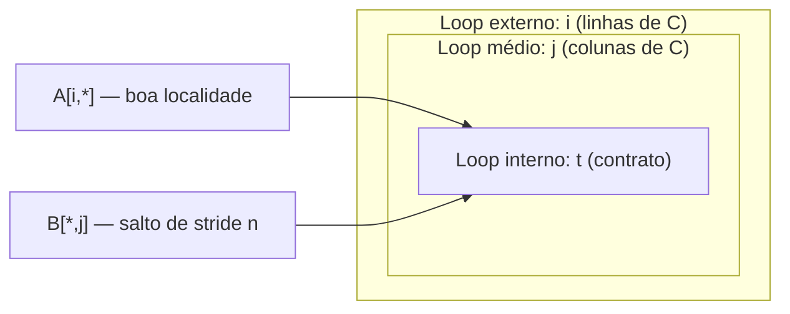
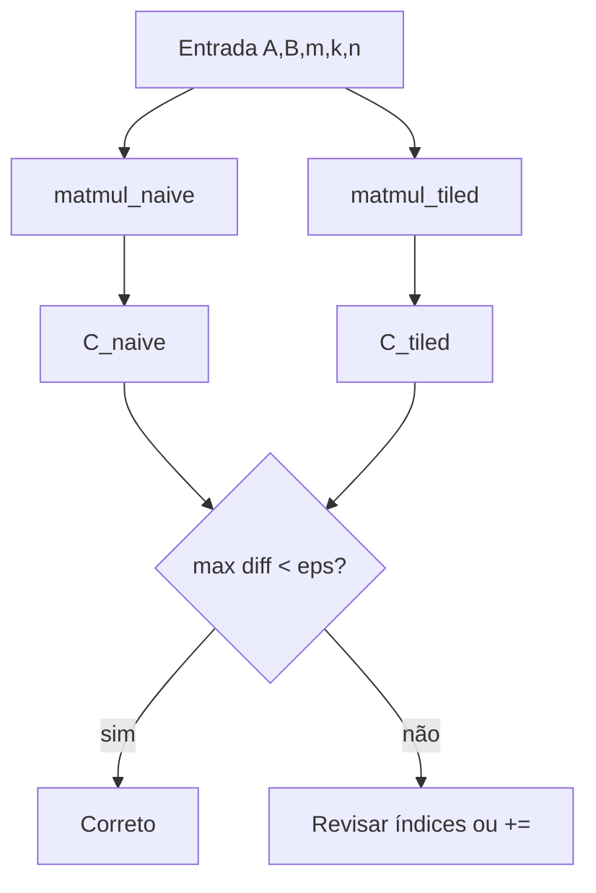

# Teoria passo a passo — AI — Matmul Tiled

## 1. O problema que estamos resolvendo

Multiplicação de matrizes `C = A × B` é o núcleo de redes neurais, gráficos e álgebra numérica. A implementação ingênua com três loops aninhados é correta, mas percorre `B` de forma que quase nunca reaproveita a hierarquia de cache (L1/L2/L3). Este módulo implementa:

1. `matmul_naive` — referência correta e simples.
2. `trace_tile_4x4` — mapeamento de coordenada global para bloco (tile).
3. `matmul_tiled` — mesma matemática, reorganizada para melhor localidade.

O objetivo pedagógico não é bater recordes de GFLOPS, e sim **entender por que a ordem dos loops importa** e provar equivalência numérica entre as duas versões.

## 2. Layout row-major

As matrizes são vetores `std::vector<float>` em ordem **row-major**: elemento `(i, j)` de uma matriz `m × n` está em `data[i * n + j]`.

```text
Matriz 2×3:
  [ a00 a01 a02 ]
  [ a10 a11 a12 ]

vetor: [ a00, a01, a02, a10, a11, a12 ]
índice(i,j) = i * 3 + j
```

### O quê?
Row-major significa que linhas consecutivas ficam contíguas na memória.

### Como?
Para `A` com dimensões `m × k`, o elemento na linha `i` e coluna `t` é `a[i * k + t]`.

### Por quê?
É o layout padrão em C/C++ e em muitas bibliotecas de ML. Indexar errado (`i * m + t` em vez de `i * k + t`) produz resultados plausíveis em casos pequenos e falha em casos maiores.

## 3. Matmul naive (`AI-MM-NAIVE-01`)

### O quê?
Para cada célula `C[i][j]`, some `A[i][t] * B[t][j]` para `t` de `0` até `k-1`.

### Como?

```text
for i in 0..m-1:
  for j in 0..n-1:
    sum = 0
    for t in 0..k-1:
      sum += A[i,t] * B[t,j]
    C[i,j] = sum
```

### Por quê?
É a definição direta da multiplicação. Serve como **oráculo**: qualquer otimização deve reproduzir o mesmo `C` (dentro de tolerância de ponto flutuante).

### Diagrama de acesso



Para cada par `(i,j)`, o loop interno percorre uma **linha de A** (contígua) e uma **coluna de B** (stride `n`, geralmente ruim).

### Trace manual 2×3 · 3×2

```text
A = [1 2 3]     B = [7  8 ]
    [4 5 6]         [9 10]
                    [11 12]

C[0,0] = 1*7 + 2*9 + 3*11 = 58
C[1,1] = 4*8 + 5*10 + 6*12 = 154
```

O teste `test_matmul.cpp` verifica exatamente `c[0] == 58` e `c[3] == 154`.

### Invariantes

- `a.size() == m * k` e `b.size() == k * n`; caso contrário, lance `std::invalid_argument`.
- `c.size() == m * n`, inicializado com zeros antes do acúmulo.
- Índice de `C[i][j]` é `i * n + j`.

### Bugs comuns

| Bug | Sintoma |
|-----|---------|
| Trocar `k` e `n` no índice de `B` | Valores errados em matrizes não quadradas |
| Não zerar `c` antes de somar | Lixo de memória no resultado |
| Usar `i * m + t` para `A` | Passa em 2×2, falha em 3×5 |
| Retornar vetor sem preencher | Teste falha com zeros (estado inicial do starter) |

## 4. Tiling e localidade (`AI-MM-TILED-02`)

### O quê?
Dividir `A`, `B` e `C` em blocos `tile × tile` e processar um micro-bloco por vez, acumulando parcialmente em `C`.

### Como?

```text
for ii in 0, tile, 2*tile, ... < m:
  for kk in 0, tile, ... < k:
    for jj in 0, tile, ... < n:
      for i in ii .. min(ii+tile, m):
        for t in kk .. min(kk+tile, k):
          a_val = A[i,t]
          for j in jj .. min(jj+tile, n):
            C[i,j] += a_val * B[t,j]
```

A ordem `ii → kk → jj` (com `i, t, j` internos) mantém `a_val` em registrador e reutiliza uma faixa de `B` enquanto varre `j` no tile.

### Por quê?
CPUs carregam memória em **linhas de cache** (tipicamente 64 bytes). Revisitar os mesmos blocos antes que sejam expulsos reduz misses. Em matrizes grandes (teste 64×64, tile=8), a diferença de tempo pode ser mensurável no benchmark — mas a correção vem primeiro.

### Diagrama de tiles 4×4

```text
Matriz 8×8 vista como grade de tiles 4×4:

  +-------+-------+
  | T(0,0)| T(0,1)|
  +-------+-------+
  | T(1,0)| T(1,1)|
  +-------+-------+

Coordenada global (5,7) com tile=4:
  tile_row = 5 / 4 = 1
  tile_col = 7 / 4 = 1
```

### Trace `trace_tile_4x4(5, 7, 4)`

```text
entrada: row=5, col=7, tile=4
tile_row = 5 / 4 = 1
tile_col = 7 / 4 = 1
retorno: { tile_row=1, tile_col=1, global_row=5, global_col=7 }
```

### Invariantes

- `tile > 0`; `tile == 0` deve lançar exceção.
- Bordas: use `std::min(ii + tile, m)` (e equivalentes) — matrizes raramente são múltiplos exatos do tile.
- `C` começa zerado; o tiled **acumula** com `+=`, não atribui `=` no micro-kernel.
- Resultado tiled deve coincidir com naive (tolerância `1e-5` em 3×5, `1e-3` em 64×64).

### Bugs comuns

| Bug | Sintoma |
|-----|---------|
| Usar `=` em vez de `+=` no tiled | Só o último tile contribui |
| Esquecer `min(...)` nas bordas | Acesso fora dos limites / lixo |
| Ordem de loops diferente sem equivalência | Divergência numérica ou crash |
| `trace_tile` com `%` em vez de `/` | tile_row/tile_col errados |

## 5. Equivalência tiled vs naive

### O quê?
Duas implementações distintas devem produzir o mesmo vetor `C` para as mesmas entradas.

### Como?
O teste gera `a2` (3×5) e `b2` (5×4), compara elemento a elemento `|naive[i] - tiled[i]| < 1e-5`.

### Por quê?
Tiling é uma **transformação de loop** (reordenação segura da soma). Se os resultados divergem, a lógica de bloco está errada — não é “aproximação numérica aceitável”.



## 6. Teste em escala 64×64

### O quê?
Validação com matrizes `64×64`, `tile=8`, tolerância `1e-3`.

### Como?
`make_matrix` preenche valores pseudo-aleatórios; compara cada posição.

### Por quê?
Erros de índice que “passam” em 3×5 podem aparecer só com mais iterações e bordas de tile não alinhadas (`64 % 8 == 0` aqui, mas o código deve funcionar para qualquer dimensão).

## 7. Relação com hardware real

Em produção, após tiling correto, os próximos passos são:

- **SIMD** (AVX/NEON) no micro-kernel interno.
- **OpenMP** nos loops de tile.
- **GPU** (CUDA/Metal) com shared memory por bloco.

Este laboratório isola a camada de reorganização de loops — sem ela, SIMD só amplifica bugs.

## 8. Perguntas de fixação

1. Por que `B[t * n + j]` e não `B[t * k + j]`?
2. O que acontece se `matmul_tiled` usar `c[i*n+j] = ...` em vez de `+=`?
3. Para `(row,col)=(5,7)` e `tile=4`, qual tile contém esse elemento?
4. Por que validamos shapes antes de computar?
5. Qual loop do naive tem pior localidade de cache e por quê?

## 9. Checklist antes de implementar

1. Trace manual do caso 2×3 · 3×2 no papel.
2. Escreva os índices row-major para `A`, `B`, `C`.
3. Implemente naive e confirme `58` e `154`.
4. Implemente `trace_tile_4x4` e confirme `(1,1)` para `(5,7)`.
5. Implemente tiled e compare com naive antes do teste 64×64.
