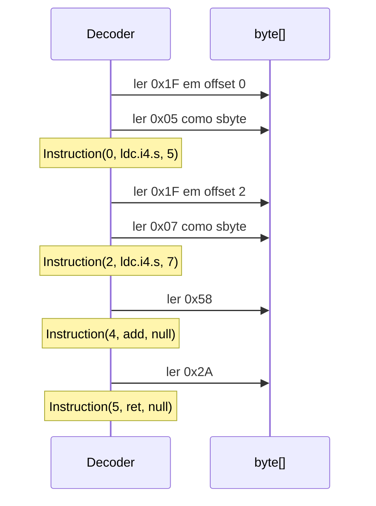

# Teoria passo a passo — .NET — CIL Tiny Decoder

## 1. O problema que estamos resolvendo

Quando você compila C# para uma biblioteca .NET, o compilador gera **CIL** (Common Intermediate Language) — bytecode portável que o runtime JIT interpreta ou compila para código nativo. Ferramentas de engenharia reversa, profilers e debuggers precisam **decodificar** esse fluxo de bytes instrução a instrução.

Este módulo implementa um decodificador mínimo que reconhece três opcodes e lê operandos de tamanho fixo. Não é um desassembler completo; é um laboratório para entender o formato linear de IL.

## 2. Modelo mental: stream de bytes

IL é um array de bytes lido sequencialmente. Cada instrução começa com um **opcode** (1 byte na maioria dos casos). Alguns opcodes trazem **operandos** imediatamente após.

```text
offset:  0    1    2    3    4    5
bytes:  [1F] [05] [1F] [07] [58] [2A]
         |    |    |    |    |    |
         ldc  +5   ldc  +7   add  ret
```

### O quê?
Um decodificador percorre o buffer, avança `i` conforme o tamanho de cada instrução e produz uma lista de `Instruction(offset, name, operand?)`.

### Como?
Loop com índice `i`: leia `opcode = code[i++]`, despache em `switch`, consuma operandos se necessário, adicione à lista.

### Por quê?
Sem consumir operandos na ordem certa, o próximo opcode será lido no meio de um operando — corrupção total do decode.

## 3. Estrutura `Instruction`

```csharp
record Instruction(int Offset, string Name, int? Operand);
```

- `Offset`: posição do opcode no buffer (não do operando).
- `Name`: mnemônico legível (`"ldc.i4.s"`, `"add"`, `"ret"`).
- `Operand`: valor numérico quando a instrução carrega imediato; `null` quando não há.

### Invariantes

- `Offset` aponta sempre para o byte do opcode.
- Instruções sem operando têm `Operand == null`.
- A lista final cobre 100% do buffer sem bytes órfãos.

## 4. Opcode `ldc.i4.s` (`CLR-IL-OPCODE-01` + `CLR-IL-OPERAND-02`)

### O quê?
Carrega um inteiro de 8 bits com sinal na pilha de avaliação.

### Como?
- Opcode: `0x1F`.
- Operando: **1 byte** imediatamente após, interpretado como `sbyte` (signed 8-bit).

```text
0x1F 0x05 → ldc.i4.s 5
0x1F 0xF6 → ldc.i4.s -10   (0xF6 como sbyte = -10)
```

### Por quê?
IL distingue várias formas de carregar constantes (`ldc.i4.0` … `ldc.i4.8` sem operando, `ldc.i4.s` com 1 byte, `ldc.i4` com 4 bytes). Este exercício foca na variante compacta de 1 byte.

### Trace manual do buffer de teste

```text
i=0: opcode 0x1F → ldc.i4.s, lê byte 0x05 → operand 5, i avança para 2
i=2: opcode 0x1F → ldc.i4.s, lê byte 0x07 → operand 7, i avança para 4
i=4: opcode 0x58 → add, sem operando, i=5
i=5: opcode 0x2A → ret, sem operando, i=6 → fim
```

Resultado: 4 instruções; `instructions[0].Operand == 5`, `instructions[2].Name == "add"`, `instructions[3].Name == "ret"`.

### Diagrama



### Bugs comuns (`CLR-IL-OPERAND-02`)

| Bug | Sintoma |
|-----|---------|
| Tratar operando como `byte` sem cast para `sbyte` | `0xF6` vira 246 em vez de -10 |
| Esquecer de incrementar `i` após ler operando | Próximo opcode lê lixo |
| Não verificar `i >= code.Length` antes de ler operando | Aceita buffer truncado `[0x1F]` |
| Usar `unchecked((sbyte)code[i++])` omitido | Overflow em C# em contextos checked |

## 5. Opcode `add` (`CLR-IL-OPCODE-01`)

### O quê?
Desempilha dois `int32`, soma, empilha o resultado.

### Como?
Opcode `0x58`, sem operando. Apenas `result.Add(new(offset, "add", null))`.

### Por quê?
Instruções aritméticas puras não carregam imediatos no stream — os valores já estão na pilha (fornecidos por `ldc.i4.s` anteriores).

## 6. Opcode `ret` (`CLR-IL-OPCODE-01`)

### O quê?
Retorna do método atual.

### Como?
Opcode `0x2A`, sem operando.

### Por quê?
Marca o fim lógico do método no fluxo IL; desassemblers usam isso para delimitar corpos de função.

## 7. Erros e truncamento

### O quê?
Buffer que termina no meio de uma instrução deve falhar.

### Como?

```csharp
if (i >= code.Length)
    throw new InvalidDataException("truncated operand");
```

antes de ler o byte após `0x1F`.

### Por quê?
O teste chama `Decode(new byte[] { 0x1F })` e espera `InvalidDataException`. Aceitar silenciosamente mascararia IL corrompido.

### Trace de falha

```text
buffer = [0x1F]
i=0: opcode 0x1F, precisa de operando
i=1 >= Length=1 → throw InvalidDataException
```

## 8. Opcodes desconhecidos

Qualquer byte não mapeado deve lançar:

```text
InvalidDataException: unsupported opcode 0xXX
```

Isso evita avançar `i` de forma incorreta em streams reais com instruções não implementadas.

## 9. Relação com o ecossistema .NET

| Ferramenta | Papel |
|------------|-------|
| `ildasm` | Desassembler oficial |
| `dotnet ilverify` | Verifica conformidade ECMA-335 |
| dnSpy / ILSpy | UI para explorar assemblies |

Este decoder cobre ~0,1% do conjunto de opcodes, mas o **padrão de leitura** é o mesmo: opcode → operandos de tamanho fixo ou variável → próxima instrução.

## 10. Perguntas de fixação

1. Por que `ldc.i4.s` consome 2 bytes no total e `add` apenas 1?
2. O que acontece se você decodificar `0x1F` sem verificar o tamanho do buffer?
3. Qual a diferença entre `Operand` de `ldc.i4.s` e de `add`?
4. Por que guardamos `offset` antes de incrementar `i`?
5. Como você estenderia o decoder para `ldc.i4` (operando de 4 bytes)?

## 11. Checklist antes de implementar

1. Trace manual do array `{ 0x1F, 0x05, 0x1F, 0x07, 0x58, 0x2A }` no papel.
2. Implemente `0x1F` com leitura de `sbyte` e checagem de truncamento.
3. Adicione `0x58` e `0x2A` sem operandos.
4. Rode `dotnet run` no starter e confirme `OK CIL`.
