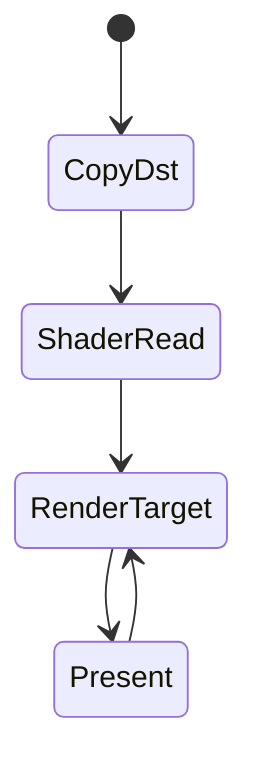

# Teoria passo a passo — Graphics — Vulkan / D3D12 Resource States

## 1. O problema que estamos resolvendo

GPUs modernas executam centenas de operações em paralelo, mas a **memória de textura/buffer** não é um array passivo: cada recurso está em um **estado** que define quais unidades de hardware podem lê-lo ou escrevê-lo. Transição inválida (ex.: escrever enquanto um shader lê) causa corrupção visual, validation layer errors ou crash.

APIs expõem isso de formas diferentes:

- **Vulkan**: `VkImageLayout` + `vkCmdPipelineBarrier`
- **D3D12**: `D3D12_RESOURCE_STATE_*` + `ResourceBarrier`

Este módulo modela um pipeline simplificado com quatro estados abstratos e funções de mapeamento para strings das APIs reais.

## 2. Estados abstratos do laboratório

```cpp
enum class State {
    CopyDst,      // destino de cópia (upload)
    ShaderRead,   // amostragem em shader
    RenderTarget, // escrita de cor no framebuffer
    Present,      // exibição na swapchain
};
```

### O quê?
Quatro fases típicas de um frame: receber dados → usar como textura → desenhar → apresentar na tela.

### Como?
`ResourceTracker` guarda o estado atual e `transition(next)` valida e aplica mudanças permitidas.

### Por quê?
Separar **lógica de pipeline** (o que faz sentido no seu engine) do **nome da API** (Vulkan vs D3D12) permite testar regras sem GPU física.

## 3. Máquina de estados (`GFX-STATE-TRANSITION-01`)

### Transições permitidas

```text
CopyDst ──→ ShaderRead ──→ RenderTarget ──→ Present
                                              │
                                              ↓
                                        RenderTarget
```

| De | Para | Permitido? |
|----|------|------------|
| CopyDst | ShaderRead | sim |
| ShaderRead | RenderTarget | sim |
| RenderTarget | Present | sim |
| Present | RenderTarget | sim (novo frame) |
| CopyDst | Present | não |
| Present | CopyDst | não |
| Qualquer | mesmo estado | não (no-op rejeitado) |

### Diagrama



### O quê?
`transition(State next)` retorna `true` se a mudança é legal e atualiza `state_`; `false` caso contrário.

### Como?

```text
se next == state_ → return false
se par (state_, next) está na tabela permitida → state_ = next; return true
senão → return false (state_ inalterado)
```

### Por quê?
Espelha o fluxo real: após upload você não pode apresentar direto sem passar por shader read e render target. Engines rejeitam ou inserem barriers automáticos — aqui você implementa a rejeição explícita.

### Trace manual do teste

```text
tracker(CopyDst)
  → ShaderRead   OK (true)
  → RenderTarget OK (true)
  → Present      OK (true)
  → CopyDst      REJEITADO (false) — estado permanece Present
```

### Invariantes

- Estado só muda quando `transition` retorna `true`.
- `transition` para o mesmo estado sempre retorna `false`.
- Após rejeição, `state()` reflete o último estado aceito.

### Bugs comuns

| Bug | Sintoma |
|-----|---------|
| Atualizar `state_` mesmo quando `return false` | Teste `!transition(CopyDst)` falha |
| Permitir qualquer transição | Pipeline inválido passa |
| Retornar `true` em no-op (mesmo estado) | Semântica inconsistente |
| Esquecer `Present → RenderTarget` | Segundo frame quebra |

## 4. Mapeamento Vulkan (`GFX-VK-MAP-02`)

### O quê?
Converter `State` abstrato para string de layout Vulkan usado em barriers.

### Como?

| State | String Vulkan |
|-------|---------------|
| CopyDst | `VK_IMAGE_LAYOUT_TRANSFER_DST_OPTIMAL` |
| ShaderRead | `VK_IMAGE_LAYOUT_SHADER_READ_ONLY_OPTIMAL` |
| RenderTarget | `VK_IMAGE_LAYOUT_COLOR_ATTACHMENT_OPTIMAL` |
| Present | `VK_IMAGE_LAYOUT_PRESENT_SRC_KHR` |

### Por quê?
Em Vulkan você declara `oldLayout` e `newLayout` em `VkImageMemoryBarrier`. O nome exato importa para validation layers e para drivers mapearem acessos corretos.

### Relação com HLSL/GLSL do módulo

Os shaders `debug_uv.vert.glsl` / `debug_uv.frag.glsl` e `debug_uv.hlsl` assumem que a textura já está em layout de leitura (`SHADER_READ_ONLY`) quando amostrada — coerente com `ShaderRead`.

## 5. Mapeamento D3D12 (`GFX-D3D12-MAP-03`)

### O quê?
Converter `State` para constante de estado de recurso D3D12.

### Como?

| State | String D3D12 |
|-------|--------------|
| CopyDst | `D3D12_RESOURCE_STATE_COPY_DEST` |
| ShaderRead | `D3D12_RESOURCE_STATE_PIXEL_SHADER_RESOURCE` |
| RenderTarget | `D3D12_RESOURCE_STATE_RENDER_TARGET` |
| Present | `D3D12_RESOURCE_STATE_PRESENT` |

### Por quê?
D3D12 usa `D3D12_RESOURCE_BARRIER` com `StateBefore` e `StateAfter`. O modelo mental é o mesmo de Vulkan, mas a nomenclatura difere (`RENDER_TARGET` vs `COLOR_ATTACHMENT_OPTIMAL`).

### Comparação lado a lado

```text
Fase do frame     Vulkan                              D3D12
─────────────────────────────────────────────────────────────────
Upload            TRANSFER_DST_OPTIMAL                  COPY_DEST
Sample shader     SHADER_READ_ONLY_OPTIMAL              PIXEL_SHADER_RESOURCE
Draw              COLOR_ATTACHMENT_OPTIMAL              RENDER_TARGET
Swapchain         PRESENT_SRC_KHR                       PRESENT
```

## 6. Barriers na prática (contexto)

Embora este módulo não chame APIs reais, o fluxo completo em Vulkan seria:

```text
1. vkCmdPipelineBarrier: UNDEFINED → TRANSFER_DST
2. vkCmdCopyBufferToImage
3. vkCmdPipelineBarrier: TRANSFER_DST → SHADER_READ_ONLY
4. draw com descriptor de textura
5. vkCmdPipelineBarrier: SHADER_READ → COLOR_ATTACHMENT (se reutilizar imagem)
6. render pass
7. vkCmdPipelineBarrier: COLOR_ATTACHMENT → PRESENT_SRC_KHR
8. vkQueuePresentKHR
```

Nosso `ResourceTracker` é a camada que decide **se** o passo 7 é legal dado o histórico.

## 7. Perguntas de fixação

1. Por que `Present → CopyDst` é proibido no exercício?
2. Qual layout Vulkan corresponde a amostrar textura em fragment shader?
3. O que `transition` deve retornar se você pedir `ShaderRead` estando já em `ShaderRead`?
4. Por que D3D12 separa `PIXEL_SHADER_RESOURCE` de `NON_PIXEL_SHADER_RESOURCE` na API real, mas o exercício usa só o primeiro?
5. O que acontece se você mapear `Present` para layout de `TRANSFER_DST`?

## 8. Checklist antes de implementar

1. Desenhe o grafo de transições no papel e marque arestas proibidas.
2. Implemente `transition` sem alterar estado em falha.
3. Preencha `to_vulkan` e confira string exata de `Present`.
4. Preencha `to_d3d12` e confira `RENDER_TARGET`.
5. Rode `ctest` e confirme `OK gpu states`.
