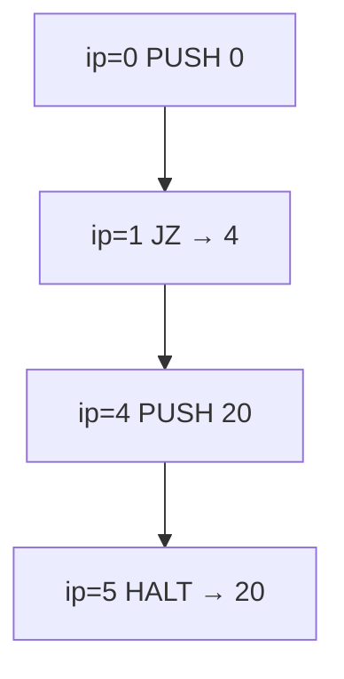

# Teoria passo a passo — JavaScript — Bytecode Branch VM

## 1. O problema que estamos resolvendo

Intérpretes e VMs (JavaScript engines, Python bytecode, JVM, WebAssembly runtimes) executam programas como **sequências de instruções** com um **contador de programa** (`ip`) e, frequentemente, uma **pilha de operandos**. Instruções de salto (`JZ`, `JMP`) alteram o fluxo sem depender de recursão ou `if` do host.

Este módulo implementa uma VM educacional com pilha, trace de IPs visitados e dois tipos de branch ainda não implementados no starter.

## 2. Componentes da VM

```text
┌─────────────────────────────────────┐
│  VM                                 │
│  stack: number[]   ← operandos      │
│  ip: number        ← índice no prog │
│  trace: number[]   ← IPs executados │
└─────────────────────────────────────┘
```

### O quê?
`run(program)` executa até `ip >= program.length` ou encontrar `HALT`.

### Como?
Loop `while`: registra `ip` em `trace`, lê `program[ip]`, despacha por `instruction.op`, atualiza `ip` conforme a semântica.

### Por quê?
Separar fetch-decode-execute é o esqueleto de qualquer VM; branches são o primeiro lugar onde `ip` deixa de ser apenas `ip++`.

## 3. Formato do programa

Cada instrução é um objeto `{ op, arg? }`:

| op | arg | Efeito |
|----|-----|--------|
| `PUSH` | número | `stack.push(arg)`; `ip++` |
| `JZ` | índice alvo | se topo == 0, `ip = alvo`; senão `ip++` |
| `JMP` | índice alvo | `ip = alvo` (incondicional) |
| `HALT` | — | retorna `stack.at(-1)` |

### Programa de teste (ramo condicional)

```javascript
[
  { op: 'PUSH', arg: condition },  // 0
  { op: 'JZ',   arg: 4 },         // 1 — pula para índice 4 se zero
  { op: 'PUSH', arg: 10 },        // 2 — ramo verdadeiro
  { op: 'JMP',  arg: 5 },         // 3 — pula o ramo falso
  { op: 'PUSH', arg: 20 },        // 4 — ramo falso
  { op: 'HALT' },                 // 5
]
```

## 4. Pilha e semântica de `PUSH`

### O quê?
`PUSH` coloca um valor na pilha; o topo é o último elemento (`stack.at(-1)`).

### Como?
Já implementado no starter: `this.stack.push(instruction.arg); this.ip++;`

### Por quê?
`JZ` precisa de um valor condicional no topo — sem `PUSH` anterior, a pilha está vazia.

## 5. Salto condicional `JZ` (`JSVM-JZ-01`)

### O quê?
**Jump if Zero**: desempilha o topo; se for exatamente `0`, atribui `ip` ao alvo; caso contrário, continua na próxima instrução (`ip + 1`).

### Como?

```javascript
const condition = this.stack.pop();
if (condition === undefined) throw new Error('underflow');
this.ip = condition === 0
    ? this._jumpTarget(program, instruction.arg)
    : this.ip + 1;
```

### Por quê?
Bytecode real (JVM `ifeq`, CLR `brfalse`) segue o mesmo padrão: consumir condição da pilha e desviar o fluxo. Usar `=== 0` (não truthy/falsy) evita que `null` ou `""` disparem salto inadvertidamente.

### Diagrama — condição falsa (0)



Trace esperado: `[0, 1, 4, 5]`

### Diagrama — condição verdadeira (1)

```text
ip=0  PUSH 1     stack=[1]
ip=1  JZ→4       pop 1≠0 → ip=2
ip=2  PUSH 10    stack=[10]
ip=3  JMP→5      ip=5
ip=5  HALT       retorna 10
```

Trace esperado: `[0, 1, 2, 3, 5]`

### Invariantes

- `JZ` sempre consome exatamente um elemento da pilha.
- Alvo deve ser inteiro em `[0, program.length)`.
- `ip` nunca deve apontar para meio de uma instrução (aqui cada instrução é 1 índice).

### Bugs comuns

| Bug | Sintoma |
|-----|---------|
| `this.ip++` sempre após `JZ` | Ramo falso nunca executa |
| Não fazer `pop()` | Pilha cresce; condição errada depois |
| Usar truthy (`!condition`) | `0` salta, mas `NaN` também |
| Esquecer `_jumpTarget` | Índices inválidos não lançam `bad target` |

## 6. Salto incondicional `JMP` (`JSVM-JMP-02`)

### O quê?
Atribui `ip` diretamente ao alvo, sem olhar a pilha.

### Como?

```javascript
this.ip = this._jumpTarget(program, instruction.arg);
```

### Por quê?
Depois do ramo verdadeiro (`PUSH 10`), o programa deve **pular** o `PUSH 20` do ramo falso. Sem `JMP`, executaria ambos os ramos.

### Trace do salto em ip=3

```text
Antes: ip=3, arg=5
_jumpTarget valida 5 < program.length
ip = 5 → HALT
```

## 7. `_jumpTarget` e limites

### O quê?
Validação centralizada de alvos de salto.

### Como?

```javascript
if (!Number.isInteger(target) || target < 0 || target >= program.length) {
    throw new Error('bad target');
}
return target;
```

### Por quê?
Saltar para fora do programa causa loop infinito ou `undefined` behavior. O limite de 1000 steps em `run` é rede de segurança, não substituto de validação.

## 8. Trace e depuração

### O quê?
`this.trace` registra cada `ip` **antes** de executar a instrução naquele índice.

### Como?
`this.trace.push(this.ip)` no início de cada iteração do loop.

### Por quê?
Comparar trace esperado vs obtido localiza exatamente onde o fluxo divergiu — mais rápido que inspecionar só o valor final da pilha.

### Exemplo comparativo

| condition | resultado | trace |
|-----------|-----------|-------|
| 0 | 20 | `[0, 1, 4, 5]` |
| 1 | 10 | `[0, 1, 2, 3, 5]` |

## 9. Relação com bytecode real

| Esta VM | Analogia |
|---------|----------|
| `PUSH` | `iconst`, `ldc` |
| `JZ` | `ifeq`, `brfalse` |
| `JMP` | `goto`, `br` |
| `HALT` | `return` / fim de método |
| `ip` | program counter |
| `trace` | debugger single-step log |

Engines reais adicionam frames, constant pool e verificação de tipos — mas o ciclo `fetch → decode → execute → update ip` é idêntico.

## 10. Perguntas de fixação

1. Por que `JZ` usa `=== 0` e não `!condition`?
2. O que acontece se `JMP` apontar para o próprio índice atual?
3. Por que o ramo verdadeiro precisa de `JMP` após `PUSH 10`?
4. Qual a diferença entre `ip++` no `PUSH` e atribuição direta em `JMP`?
5. Como você detectaria underflow sem o `throw` explícito?

## 11. Checklist antes de implementar

1. Trace manual do programa com `condition=0` no papel.
2. Trace manual com `condition=1`.
3. Implemente `JZ` com `pop` e ramificação de `ip`.
4. Implemente `JMP` com `_jumpTarget`.
5. Rode `npm test` e confira traces exatos.
