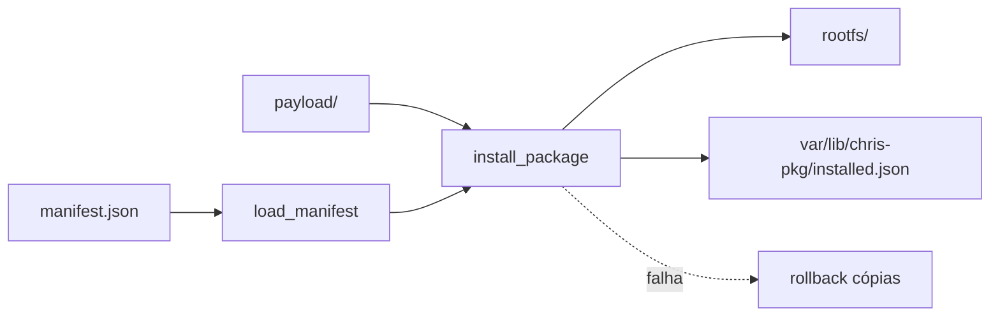

# Teoria passo a passo — Distribuição Linux — Pacotes e Rootfs

## 1. O problema que estamos resolvendo

Uma distribuição Linux precisa de duas peças fundamentais antes de rodar qualquer binário: um **rootfs** (árvore de diretórios mínima) e um mecanismo para **instalar arquivos** de forma previsível e segura. Este laboratório implementa versões educacionais de ambos — um script `build_rootfs.sh` e um gerenciador `chris_pkg.py` — sem a complexidade de apt, rpm ou pacotes `.deb` binários.

O objetivo pedagógico não é replicar Debian, mas internalizar invariantes que aparecem em qualquer gerenciador real: validação antes de mutação, caminhos relativos seguros, instalação transacional e registro de estado só após sucesso.

## 2. Modelo mental do pacote

Cada pacote é um diretório com duas partes:

```text
package/
  manifest.json    # metadados: name, version, files[]
  payload/         # árvore de arquivos relativa ao rootfs destino
```



### Trace de instalação feliz

Pacote `hello` versão `1.0.0` com `files: ["usr/share/hello.txt"]`:

```text
1. load_manifest → valida JSON, name, version, paths
2. plano: payload/usr/share/hello.txt → root/usr/share/hello.txt
3. mkdir -p root/usr/share
4. copy2(src, dst)
5. installed.json ← {"hello": "1.0.0"}
```

## 3. O quê — `load_manifest` (LINUX-PKG-PARSE-01)

**O quê:** ler `manifest.json`, validar estrutura e rejeitar caminhos perigosos antes de qualquer cópia.

**Como:** `json.loads`, checar tipos de `name`, `version` e `files`, iterar cada entrada em `files` e usar `pathlib.Path` para detectar absolutos e componentes `..`.

**Por quê:** um manifest malicioso ou corrompido que chegue ao plano de cópia pode escrever fora do rootfs (`../escape`) ou sobrescrever `/etc/passwd` se o caminho for absoluto. Validar cedo é mais barato que desfazer danos.

### Invariantes de parsing

| Invariante | Significado |
|------------|-------------|
| `name` é string não vazia | identificador do pacote no banco |
| `version` é string não vazia | versão registrada em `installed.json` |
| `files` é lista de strings | plano de instalação explícito |
| cada path é relativo | `Path(item).is_absolute()` é falso |
| nenhum `..` em `Path.parts` | bloqueia path traversal |

### Trace de rejeição

Manifest com `files: ["../escape"]`:

```text
rel = Path("../escape")
rel.parts = ('..', 'escape')
".." in rel.parts → ValueError("unsafe path: ../escape")
```

Nenhum arquivo é tocado. O teste `test_rejects_path_traversal` depende disso.

## 4. O quê — `install_package` (LINUX-PKG-INSTALL-02)

**O quê:** copiar arquivos do `payload/` para o rootfs e atualizar o banco de pacotes instalados.

**Como:** montar lista `(src, dst)`, validar que cada `src` existe, copiar em loop com `shutil.copy2`, gravar `installed.json` só no final. Em qualquer exceção, apagar destinos já copiados nesta execução.

**Por quê:** sem transação, uma falha no meio deixa o sistema em estado inconsistente — arquivos parciais no disco mas banco sem registro, ou o oposto. Rollback manual é o padrão mínimo antes de journals sofisticados.

### Diagrama de estados da instalação

```text
  [PLANEJAR] --src missing--> [ABORT FileNotFoundError]
       |
       v
  [COPIAR loop] --falha no item N--> [ROLLBACK unlink 0..N-1] --> raise
       |
       v
  [GRAVAR installed.json] --> [SUCESSO]
```

### Trace de rollback

Manifest lista `bin/ok` e `bin/missing`; só `bin/ok` existe no payload:

```text
1. plano: [(payload/bin/ok, root/bin/ok), (payload/bin/missing, ...)]
2. copia bin/ok → root/bin/ok existe
3. src bin/missing → FileNotFoundError
4. except: unlink root/bin/ok
5. installed.json nunca foi criado
```

O teste `test_missing_payload_file_rolls_back` verifica exatamente isso.

## 5. O quê — `build_rootfs.sh` (LINUX-ROOTFS-BUILD-03)

**O quê:** criar diretórios FHS mínimos de forma idempotente.

**Como:** loop `mkdir -p "$ROOT/$d"` para `bin etc proc sys dev tmp var/lib/chris-pkg`.

**Por quê:** `mkdir -p` não falha se o diretório já existe; rodar o script duas vezes produz o mesmo resultado. O teste `test_rootfs.sh` executa o builder duas vezes e confirma todos os diretórios.

```text
ROOT=/tmp/myroot
  bin/          # executáveis mínimos
  etc/          # configuração
  proc/ sys/ dev/  # mount points típicos em container/chroot
  tmp/          # temporários
  var/lib/chris-pkg/  # banco do gerenciador
```

## 6. Bugs clássicos de estudante

1. **Gravar `installed.json` antes de copiar:** se a cópia falhar, o banco mente que o pacote está instalado.
2. **Validar path só com `startswith("..")`:** `foo/../../../etc/passwd` pode escapar se não inspecionar `Path.parts`.
3. **Aceitar path absoluto `/etc/shadow`:** `Path("/etc/shadow").is_absolute()` é verdadeiro — rejeitar.
4. **Rollback que não apaga diretórios vazios:** aceitável neste lab; o importante é não deixar o arquivo `bin/ok` após falha.
5. **Esquecer `db_path.parent.mkdir`:** primeira instalação falha ao gravar JSON.
6. **Não mesclar banco existente:** sobrescrever `installed.json` inteiro apaga pacotes anteriores; carregar JSON existente, atualizar chave, gravar.

## 7. Comparação com apt/rpm (produção)

| Aspecto | chris_pkg (lab) | apt/dpkg | rpm/yum |
|---------|-----------------|----------|---------|
| Formato | manifest + payload | .deb binário + control | .rpm + spec |
| Dependências | não | sim (Depends) | sim (Requires) |
| Assinatura GPG | não | sim | sim |
| Rollback | unlink manual | dpkg --configure -a | rpm rollback limitado |
| Path safety | validação em Python | maintainer scripts + policy | idem |
| Idempotência rootfs | mkdir -p | debootstrap, mmdebstrap | mock, rpm --root |

As invariantes de **path seguro** e **não registrar antes do sucesso** são as mesmas; a diferença é escala e tooling.

## 8. Fluxo de bytes no rootfs

```text
  [autor do pacote]
        |
        v
  manifest.json + payload/
        |
        v
  load_manifest()  -------- ValueError se path unsafe
        |
        v
  install_package()
        |-- copia para root/usr/... root/bin/...
        |
        v
  var/lib/chris-pkg/installed.json
        {"hello": "1.0.0", "other": "2.1.0"}
```

## 9. Perguntas de verificação

1. Por que validamos paths em `load_manifest` e não só em `install_package`?
2. O que acontece se `install_package` gravar o banco antes do loop de cópia?
3. Por que `mkdir -p` torna `build_rootfs.sh` idempotente?
4. Como o teste de rollback prova transacionalidade sem um journal em disco?
5. Qual seria o próximo passo realista: hash SHA-256 por arquivo ou dependências entre pacotes?

## 10. Relação com o portfólio

Este módulo conecta **filesystem layout** (FHS), **segurança de path** (tema recorrente em red team e containers) e **atomicidade** (aparece de novo em allocators, streams e drivers). Dominar o plano-validar-executar-registrar aqui facilita ler código de empacotamento real depois.
