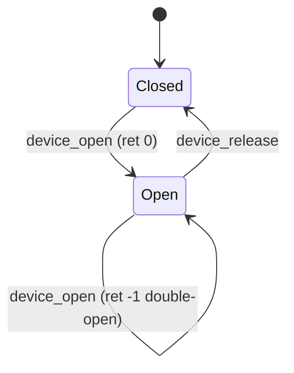

# Teoria passo a passo — Linux — Ciclo de Vida de Driver

Módulo: `linux/kernel_module_driver_lab`. Simulamos um char device em userspace antes de revisar um módulo kernel real.

---

## Visão geral



```
userspace: test_device_model.c
        ↓ chama API pública
device_model.c  (modelo educacional)
        ↓ espelha conceitos de
chris_char.c    (módulo kernel — review only)
        ↓ expõe via
/dev/chris_char (em máquina Linux real)
```

| Camada | O quê | Por quê existe |
|--------|-------|----------------|
| `Device` struct | Estado: aberto, buffer 64B, length | Mesma semântica de um char device mínimo |
| `device_open/release` | Exclusividade de abertura | Kernel não permite dois `open` sem policy explícita |
| `device_read/write` | I/O só com handle aberto | Espelha `file_operations.read/write` |
| `device_trace` | Log de lifecycle no stderr | Correlacionar com `dmesg` no módulo real |

---

## 1. Char devices no Linux

### O quê
Um **character device** entrega bytes em sequência (disco = block device; teclado, `/dev/null`, driver custom = char). O kernel associa major/minor a um conjunto de callbacks `struct file_operations`.

### Como
1. `module_init` registra o device (`misc_register`, `register_chrdev_region`, etc.).
2. Userspace chama `open("/dev/foo")` → kernel chama `fops.open`.
3. `read`/`write` copiam entre buffer do processo e buffer do driver (`copy_from_user` / `copy_to_user`).
4. `release` roda no último `close`; `module_exit` desregistra.

### Por quê
Drivers reais não são “um `main`”: são callbacks invocados pelo VFS quando processos usam file descriptors. O modelo educacional em C userspace remove o kernel da equação até você entender estado e erros.

---

## 2. Modelo `Device` (userspace)

### O quê
```c
typedef struct {
    int is_open;
    size_t length;
    unsigned char buffer[64];
} Device;
```

### Como
- `is_open`: 0 = fechado, 1 = aberto.
- `buffer[64]`: armazena última escrita (tamanho fixo simplifica o lab).
- `length`: quantos bytes são válidos para leitura.

### Por quê
Char devices reais também mantêm estado por `struct file` ou `private_data`. Aqui colapsamos em uma struct para focar em **invariantes de lifecycle**, não em alocação dinâmica.

### Invariantes
- Se `is_open == 0`, `read`/`write` retornam `-1`.
- Segundo `open` com `is_open == 1` retorna `-1`.
- `release` sempre zera `is_open`.

### Bugs comuns
| Sintoma | Causa | Depuração |
|---------|-------|-----------|
| `read` retorna lixo | `length` não atualizado no `write` | Trace `len=` em `device_trace` |
| Double-open passa | Falta check `if (dev->is_open)` | Assert no teste linha 17 |
| Leitura após close funciona | `release` não limpa estado | `device_read` deve checar `is_open` |

---

## 3. `device_open` e `device_release`

### O quê
`open` adquire o device; `release` libera.

### Como (comportamento esperado)
```c
int device_open(Device* dev) {
    if (dev->is_open) return -1;
    dev->is_open = 1;
    return 0;
}
void device_release(Device* dev) {
    dev->is_open = 0;
}
```

### Por quê
No kernel, abrir o mesmo device duas vezes no **mesmo processo** pode ser permitido ou não conforme o driver. Este lab exige **exclusividade** para ensinar checagem explícita — padrão em dispositivos que não são reentrantes.

### Trace manual
Com `device_set_trace(1)`:
```text
[kmod-trace] open open=1 len=0
[kmod-trace] write open=1 len=3
[kmod-trace] read open=1 len=3
[kmod-trace] release open=0 len=3
```

---

## 4. `device_read` e `device_write`

### O quê
Copiar bytes entre caller e buffer interno, só se aberto.

### Como
1. Rejeitar se `!dev->is_open` → `-1`.
2. `write`: `memcpy` até `min(count, sizeof buffer)`; atualizar `length`.
3. `read`: copiar até `min(count, dev->length)` para `dst`.

### Por quê
Espelha o contrato POSIX: `read`/`write` em fd fechado falham (`EBADF`). Truncar em 64 bytes evita overflow — mesma preocupação que `copy_from_user` com tamanho validado no kernel.

### Trace no papel
Escrever `"abc"` (3 bytes), ler 3:
```text
buffer = 'a','b','c',...
length = 3
read(3) → memcpy dst, retorna 3
```

---

## 5. Módulo `chris_char.c` (review)

### O quê
Código kernel mínimo com `miscdevice`, `file_operations`, `module_init/exit`.

### Como
- `MISC_DYNAMIC_MINOR`: kernel escolhe minor automaticamente.
- `misc_register` / `misc_deregister`: par de init/exit obrigatório.
- `MODULE_LICENSE("GPL")`: obrigatório para símbolos GPL do kernel.

### Por quê
Este arquivo **não é compilado** no CI Windows; serve para **leitura crítica** (`KMOD-SOURCE-REVIEW-03`). Use `REVIEW_RUBRIC.md` e pergunte: falta `read`/`write`? Há `copy_to_user`? Cleanup em `module_exit`?

### Comparação produção
| Lab | Driver real |
|-----|-------------|
| Struct `Device` global | `private_data` por `struct file` |
| `memcpy` userspace | `copy_from_user` / `copy_to_user` |
| `fprintf` trace | `pr_info` / `dev_dbg` → `dmesg` |
| Sem locks | `mutex` ou `spinlock` se IRQ/contexto |

---

## 6. Depuração correlacionada

### O quê
Ligar trace userspace ao mental model do kernel.

### Como
1. `device_set_trace(1)` antes dos testes.
2. Em Linux: `sudo insmod chris_char.ko`, `dmesg -w`, `cat /dev/chris_char`.
3. Compare ordem: open → write → read → release.

### Por quê
Lifecycle é invisível sem logs. Desenvolvedores de driver passam metade do tempo em `dmesg` e ftrace.

---

## 7. Resumo — O quê / Como / Por quê

| Tópico | O quê fazer | Como | Por quê |
|--------|-------------|------|---------|
| OPEN-01 | Guard exclusivo em `open` | `if (is_open) return -1` | Evitar estado inconsistente |
| IO-02 | I/O condicionado | Checar `is_open` antes de memcpy | Contrato POSIX / segurança |
| REVIEW-03 | Auditar `chris_char.c` | Rubrica em REVIEW_RUBRIC.md | Código kernel tem regras que userspace não tem |

Próximo passo: `EXERCICIOS.md` e implementação em `starter/device_model.c`.
