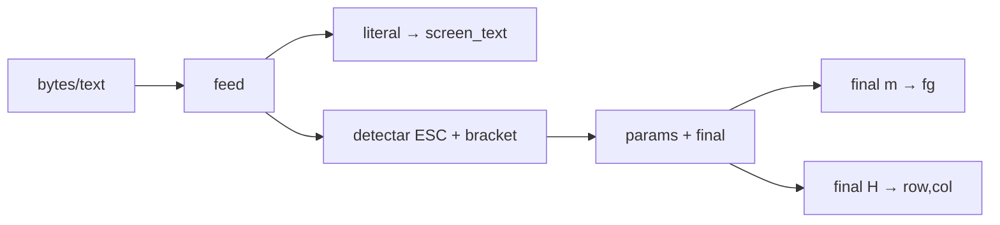

# Teoria passo a passo — Linux — ANSI Parser

## 1. O problema que estamos resolvendo

Quando você abre um terminal (ou um emulador conectado a um PTY), o programa em execução não envia apenas caracteres visíveis — ele mistura **texto literal** com **sequências de controle ANSI** que mudam cor, posição do cursor e outros atributos. Um shell, um pager ou um TUI precisa interpretar esses bytes incrementalmente, chunk por chunk, sem assumir que uma sequência completa chega de uma vez.

Este laboratório implementa `AnsiParser`: um parser mínimo de sequências **CSI** (Control Sequence Introducer) que mantém estado interno (`fg`, `row`, `col`) e acumula apenas caracteres visíveis em `screen_text`. Não confunda com um emulador de terminal completo — cobrimos só SGR (cor) e cursor `H`.

## 2. Modelo mental



Entrada típica:

```text
"A\x1b[31mB\x1b[10;20HC\x1b[0m"
```

Saída de estado após `feed`:

```text
screen_text = "ABC"     # escapes não aparecem
fg = 7                  # reset após \x1b[0m
row = 9, col = 19       # \x1b[10;20H é 1-based → 0-based
```

## 3. O quê — estrutura CSI

**O quê:** sequência que começa com ESC `[`, seguida de parâmetros numéricos separados por `;`, terminando em um byte **final** (`m` ou `H` neste lab).

**Como:** em `feed`, ao ver `\x1b` seguido de `[`, avançar até encontrar um final em `"mH"`. O trecho entre `[` e o final são os params; o último char é `final`.

**Por quê:** o terminal real não entrega "uma sequência por syscall" — você precisa de um loop que consuma byte a byte ou char a char e saiba quando a sequência está completa.

### Formato visual

```text
\x1b [ 3 1 m
 ^   ^ ^^^ ^
 ESC  [ params final(SGR)
```

```text
\x1b [ 1 0 ; 2 0 H
 ^   ^ ^^^^^^^ ^
 ESC  [  params   final(cursor position)
```

## 4. O quê — SGR (TERM-ANSI-SGR-01)

**O quê:** *Select Graphic Rendition* — final `m` altera atributos visuais.

**Como:** em `_apply_csi`, quando `final == "m"`, parsear `params` split por `;` em inteiros (vazio → 0). Para cada valor: `0` reseta `fg` para 7; `31` define vermelho (`fg = 1`).

**Por quê:** cores e estilos são estado do terminal, não caracteres na tela. O teste verifica que `\x1b[31m` muda `fg` e `\x1b[0m` restaura 7 sem poluir `screen_text`.

### Trace SGR

```text
feed("A")
  screen_text = "A", fg = 7

feed("\x1b[31m")
  _apply_csi("31", "m") → fg = 1
  screen_text inalterado

feed("B")
  screen_text = "AB"

feed("\x1b[0m")
  _apply_csi("0", "m") → fg = 7
```

### Params vazios e múltiplos

```text
\x1b[m     → params "" → values [0] → reset
\x1b[31;1m → values [31, 1] → neste lab só 31 altera fg
```

## 5. O quê — Cursor H (TERM-CURSOR-02)

**O quê:** *Cursor Position* — final `H` move o cursor para linha/coluna.

**Como:** params `row;col` em **base 1** (especificação ANSI). Converter para 0-based: `self.row = row - 1`, `self.col = col - 1`. Params omitidos default para 1.

**Por quê:** editores e shells usam `\x1b[H` (home) e `\x1b[10;20H` para posicionar TUI. O teste `test_home_cursor` cobre `\x1b[3;5H` → `(2, 4)` e `\x1b[H` → `(0, 0)`.

### Trace cursor

```text
\x1b[10;20H
params = "10;20"
values = [10, 20]
row = 10 - 1 = 9
col = 20 - 1 = 19

\x1b[H
params = ""
values = [0]  (lista com zero quando vazio)
row = values[0] if values[0] else 1 → 1 → row = 0
col default 1 → col = 0
```

## 6. O quê — `feed` (parser incremental)

**O quê:** método público que processa string mista literal + escapes.

**Como:** loop com índice `index`. Se `\x1b[` detectado, extrair CSI e chamar `_apply_csi`; senão, acrescentar char a `screen_text`.

**Por quê:** separar parsing (`feed`) de semântica (`_apply_csi`) mantém cada TODO testável isoladamente.

### Trace completo do teste principal

Entrada: `"A\x1b[31mB\x1b[10;20HC\x1b[0m"`

```text
index=0 'A' → screen_text="A"
index=1 ESC [ → CSI "31" final m → fg=1
index=5 'B' → screen_text="AB"
index=6 ESC [ → CSI "10;20" final H → row=9,col=19
index=13 'C' → screen_text="ABC"
index=14 ESC [ → CSI "0" final m → fg=7
```

## 7. Invariantes do laboratório

| Invariante | Significado |
|------------|-------------|
| `screen_text` só contém literais | nenhum byte ESC ou param aparece |
| `fg` default 7 | cinza/branco padrão após reset |
| cursor 0-based internamente | API do teste usa row=9 para `\x1b[10;20H` |
| CSI incompleto → `ValueError` | `\x1b[` sem final é erro, não estado pendente |
| classe se chama `AnsiParser` | não `Terminal` — contrato dos testes |

## 8. Bugs clássicos de estudante

1. **Concatenar escapes em `screen_text`:** o usuário veria `\x1b[31m` na tela — errado.
2. **Tratar cursor como 0-based na entrada:** `\x1b[10;20H` com row=10 falha no assert `row == 9`.
3. **Esquecer default 1 em params vazios:** `\x1b[H` deve ir para (0,0), não (-1,-1).
4. **Final só `m`:** `\x1b[10;20H` nunca move cursor se o loop de final não inclui `H`.
5. **CSI incompleto retorna silenciosamente:** deve `raise ValueError("incomplete CSI")`.
6. **Split params sem tratar string vazia:** `"".split(";")` → `['']`; `int('')` falha — use `int(x) if x else 0`.

## 9. PTY e terminal real

Em um PTY Linux (`openpty`, `pty` module), o master recebe bytes do slave misturados. Um `read(1024)` pode cortar `\x1b[31` no fim do buffer e `m` no próximo. Produção mantém buffer entre reads; neste lab assumimos string completa em cada `feed`, mas o loop index-based é o mesmo algoritmo.

```text
  [processo filho] --write(master)--> [emulador]
                                           |
                                           v
                                    AnsiParser.feed(chunk)
```

## 10. Comparação com emuladores reais

| Aspecto | AnsiParser (lab) | xterm / VTE | nota |
|---------|------------------|-------------|------|
| Sequências CSI | m, H | dezenas | subset educacional |
| Estado pendente entre chunks | não | sim | extensão futura |
| Scrollback | não | sim | fora do escopo |
| Cores 256/truecolor | não | sim | só fg 7 e 1 |
| Wide chars / UTF-8 | string Python | decoder | OK para testes |

## 11. Perguntas de verificação

1. Por que `screen_text` e `fg` são campos separados?
2. Qual a diferença entre `\x1b[0m` e não processar SGR?
3. Como `\x1b[H` mapeia para (0,0) com params vazios?
4. O que acontece com `feed("\x1b[")` sem final?
5. Por que o teste exige `AnsiParser` e não `Terminal`?

## 12. Tabela de finals e params suportados

| Entrada | final | params | Efeito no estado |
|---------|-------|--------|------------------|
| `\x1b[31m` | m | 31 | `fg = 1` |
| `\x1b[0m` | m | 0 | `fg = 7` |
| `\x1b[m` | m | (vazio) | `values=[0]` → reset |
| `\x1b[10;20H` | H | 10;20 | `row=9, col=19` |
| `\x1b[3;5H` | H | 3;5 | `row=2, col=4` |
| `\x1b[H` | H | (vazio) | `row=0, col=0` |

Qualquer outro final (`J`, `K`, `f` etc.) é ignorado neste lab — o parser consome a sequência mas `_apply_csi` não altera estado. Extensões futuras adicionariam `elif final == "K":` para limpar tela.

## 13. Máquina de estados simplificada do `feed`

```text
                    +----------------+
                    | LITERAL        |
                    | append char    |
                    +-------+--------+
                            |
              vê ESC + '['  |
                            v
                    +----------------+
                    | CSI_PARAMS     |
                    | até m ou H     |
                    +-------+--------+
                            |
              final encontrado
                            v
                    +----------------+
                    | APPLY_CSI      |
                    +----------------+
```

Se o input termina em `CSI_PARAMS` sem final, transição para erro — não há estado `PENDING` persistido entre chamadas de `feed` neste exercício.

## 14. Relação com o portfólio

Parsing de bytes com estado aparece em ELF inspection, CIL decoder, streams Node e drivers. A disciplina de **tokenizar antes de interpretar** e **manter invariantes de estado** é a mesma em todos esses módulos.

## 15. Checklist antes de implementar

1. Implementar `_apply_csi` para `m` e `H` antes do loop `feed` — facilita testar no REPL.
2. Confirmar que `screen_text` nunca recebe `\x1b`.
3. Rodar `python test_ansi.py` após cada TODO.
4. Testar manualmente `feed("\x1b[")` → deve lançar `ValueError`.
