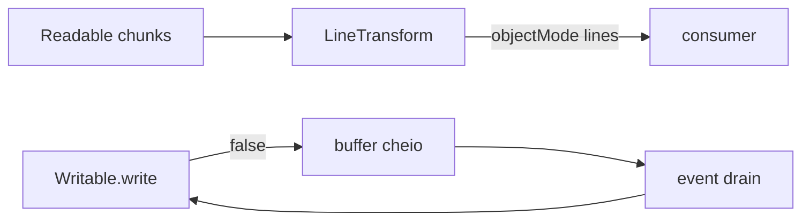

# Teoria passo a passo — Node.js — Streams

## 1. O problema que estamos resolvendo

Programas que processam arquivos, logs ou respostas HTTP raramente recebem todos os bytes de uma vez. Node.js modela isso com **streams**: fontes produzem **chunks**, consumidores processam incrementalmente, e o runtime coordena buffers internos. Dois bugs clássicos aparecem em código real:

1. **Quebra de linha UTF-8:** um caractere multibyte (ex.: `€`) pode ser partido entre dois `chunk`s — concatenar buffers como ASCII quebra o texto.
2. **Backpressure:** escrever mais rápido do que o consumidor processa enche o buffer interno; ignorar `write() === false` causa uso excessivo de memória e perda de controle de fluxo.

Este laboratório implementa `LineTransform` (Transform stream que emite linhas) e `runBackpressureDemo` (Writable com `highWaterMark` baixo para forçar eventos `drain`).

## 2. Modelo mental



### Pipeline do teste integrado

```text
chunk1: "a\n\n"
chunk2: "b" + primeiro byte de €
chunk3: segundo byte de € + "\nc"
        ↓
lines: ['a', '', 'b€', 'c']
```

## 3. O quê — Transform stream (NODE-XFORM-01)

**O quê:** subclasse de `Transform` que recebe chunks binários e emite **strings** (uma por linha) em `objectMode`.

**Como:** `_transform` decodifica UTF-8 com `StringDecoder`, acumula `pending`, faz `split('\n')`, emite linhas completas com `push(line)`, guarda o resto sem `\n` em `pending`. `_flush` decodifica bytes finais e emite `pending` se não vazio.

**Por quê:** `split` em string já decodificada respeita caracteres Unicode; fazer split em `Buffer` antes da decodificação quebraria `€` em dois chunks inválidos.

### Estrutura da classe

```javascript
export class LineTransform extends Transform {
    constructor() {
        super({ readableObjectMode: true });
        this.decoder = new StringDecoder('utf8');
        this.pending = '';
    }
}
```

`readableObjectMode: true` faz cada `push(line)` ser um objeto JavaScript (string), não um Buffer.

## 4. O quê — StringDecoder e UTF-8 multibyte

**O quê:** `StringDecoder` mantém estado entre chamadas para caracteres incompletos.

**Como:**

```javascript
const text = this.pending + this.decoder.write(chunk);
const parts = text.split('\n');
this.pending = parts.pop() ?? '';
for (const line of parts) {
    this.push(line);
}
```

**Por quê:** `€` em UTF-8 é `0xE2 0x82 0xAC`. Se chunk1 termina em `0xE2` e chunk2 começa com `0x82 0xAC`, `decoder.write` só emite `€` quando os bytes estão completos.

### Trace multibyte (teste exato)

```text
pending = ''
decoder.write("a\n\n") → "a\n\n"
parts = ['a', '', '']  → pop → pending=''
push 'a', push ''

decoder.write("b" + 0xE2) → "b"   # byte incompleto retido internamente
parts = ['b'] → pending=''

decoder.write(0x82, 0xAC, "\nc") → "€\nc"
text = pending + "€\nc" = "b€\nc"
parts = ['b€', 'c'] → pending=''
push 'b€', push 'c'
```

### `_flush`

```javascript
this.pending += this.decoder.end();
if (this.pending.length > 0) {
    this.push(this.pending);
}
```

`decoder.end()` libera bytes retidos; sem `_flush`, a última linha sem `\n` final seria perdida.

## 5. O quê — Backpressure (NODE-BACKPRESSURE-02)

**O quê:** quando o buffer interno de um `Writable` atinge `highWaterMark`, `write()` retorna `false` — sinal para **parar** de escrever até o evento `drain`.

**Como:** em `runBackpressureDemo`, loop de 50 writes de 8 bytes; se `!ok`, incrementar `falseWrites`, `await once(sink, 'drain')`, incrementar `drains`.

**Por quê:** sem aguardar `drain`, você bombardeia memória com buffers enquanto o `write` assíncrono (com `setTimeout(2)`) ainda não drenou. Em produção isso derruba throughput estável e pode OOM.

### Diagrama de buffer Writable

```text
highWaterMark = 8 bytes

write(8) → ok true,  buffered 8
write(8) → ok false, buffered > limite  ← PARAR, esperar drain
  ... consumidor processa ...
'drain' → ok para continuar
write(8) → ...
```

### Contrato do demo

```javascript
if (falseWrites === 0 || drains !== falseWrites) {
    throw new Error('backpressure not observed');
}
```

O sink artificial com `highWaterMark: 8` e writes de 8 bytes **garante** múltiplos `false` — se você nunca espera `drain`, `falseWrites > 0` mas `drains` fica 0 e o teste falha.

## 6. Invariantes do laboratório

| Invariante | Significado |
|------------|-------------|
| linhas sem `\n` no output | `push` emite conteúdo entre delimitadores |
| `pending` só guarda linha incompleta | nunca duplicar linha já emitida |
| `decoder.end()` no flush | bytes UTF-8 finais não perdidos |
| `drains === falseWrites` | cada backpressure foi respeitado |
| `falseWrites > 0` | demo realmente observou pressão |

## 7. Bugs clássicos de estudante

1. **`chunk.toString()` direto:** perde estado multibyte entre chunks — use `StringDecoder`.
2. **`split` no Buffer:** `€` partido gera lixo ou replacement character.
3. **Esquecer `parts.pop()`:** última linha parcial é emitida cedo como linha completa.
4. **Não implementar `_flush`:** perde última linha sem newline (`'c'` no teste).
5. **Ignorar retorno de `write()`:** loop dispara 50 writes sem pausa — `drains` permanece 0.
6. **Aguardar `drain` quando `write` retornou true:** contadores desbalanceados.
7. **`callback()` sem `push`:** Transform não emite linhas — teste vê array vazio.

## 8. Trace backpressure (simplificado)

```text
i=0: write 8B → ok
i=1: write 8B → false → falseWrites=1 → await drain → drains=1
i=2: write 8B → ok ou false dependendo do timing
...
finish: falseWrites > 0, drains == falseWrites
```

O `setTimeout(2)` no `write` do sink simula I/O lento — essencial para o buffer encher antes de todas as escritas completarem.

## 9. Comparação com produção

| Aspecto | Este lab | `pipeline()` / `stream/promises` |
|---------|----------|----------------------------------|
| Line breaking | Transform manual | `readline`, split custom |
| UTF-8 | StringDecoder | idem ou `TextDecoder` Web |
| Backpressure | loop + drain manual | `pipeline` propaga automaticamente |
| objectMode | linhas string | comum em parsers JSON/CSV |
| highWaterMark | 8 (forçado) | default 16KB buffers |

Em código moderno prefira `import { pipeline } from 'node:stream/promises'`, mas entender `write()===false` é obrigatório para debugar vazamentos de memória em streams legados.

## 10. `highWaterMark` em uma frase

É o limite soft (em bytes para Buffer mode) antes de `write()` retornar `false`. Não é "tamanho máximo absoluto" — o buffer pode crescer além temporariamente se você ignorar o retorno, o que é exatamente o bug que o demo expõe.

## 11. Perguntas de verificação

1. Por que `pending` existe além do `StringDecoder`?
2. O que acontece se você fizer `chunk.toString('utf8')` em cada `_transform`?
3. Por que o teste parte o `€` em dois buffers?
4. Qual a relação entre `falseWrites` e `drains`?
5. Quando `_flush` roda em relação ao último `write`?

## 12. Ciclo de vida do Transform (callback)

Node chama `_transform(chunk, encoding, callback)` por chunk. Você **deve** chamar `callback()` (sem erro) quando terminar de processar aquele chunk — senão o stream trava. `push(line)` pode ser chamado zero ou várias vezes por chunk.

```text
_transform(chunk1) → push('a'), push('') → callback()
_transform(chunk2) → (nada push, pending='b') → callback()
_transform(chunk3) → push('b€'), push('c') → callback()
_flush()             → callback()
'end' event
```

Esquecer `callback()` é o equivalente a não chamar `drain` no Writable — o pipeline congela sem erro explícito.

## 13. Tabela de responsabilidades por arquivo

| Arquivo | Classe/função | Responsabilidade |
|---------|---------------|------------------|
| `line_transform.js` | `LineTransform` | decode UTF-8, split `\n`, objectMode |
| `backpressure_demo.js` | `runBackpressureDemo` | demonstrar write false + drain |
| `test.js` | asserts integrados | € partido + stats de backpressure |

## 14. Anti-padrões em código de produção

```javascript
// ERRADO: ignora backpressure
for (const chunk of chunks) {
    writable.write(chunk);
}

// CERTO: respeita retorno ou use pipeline()
for (const chunk of chunks) {
    if (!writable.write(chunk)) {
        await once(writable, 'drain');
    }
}
```

```javascript
// ERRADO: split em Buffer
const lines = chunk.toString().split('\n');

// CERTO: StringDecoder entre chunks
const text = this.pending + this.decoder.write(chunk);
```

## 15. Relação com o portfólio

Streams são a contraparte Node do tema **processamento incremental** visto no parser ANSI (bytes parciais) e no gerenciador de pacotes (plano antes de mutar). A regra é universal: **nunca assuma que o próximo chunk completa a unidade lógica anterior**.

## 16. Checklist antes de implementar

1. Implementar `_transform` completo antes de `_flush`.
2. Rodar `node test.js` — o assert de linhas falha primeiro se o Transform estiver vazio.
3. Implementar backpressure só depois das linhas verdes (ou comente temporariamente no teste).
4. Confirmar `package.json` com `"type": "module"` para `import`/`export`.
