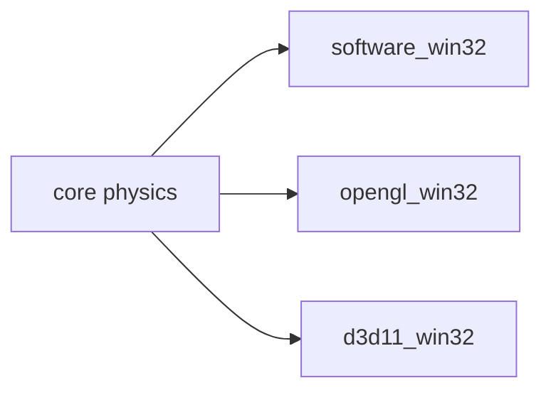

# Teoria — artillery_trajectory_2d

## Visão geral



| Etapa | Por quê |
|-------|---------|
| CPU primeiro | Você vê cada pixel antes da API |
| Mesma cena | Paridade prova entendimento |
| Core isolado | Testes sem janela no CI |

## 1. Conceito 1

Por quê este passo importa no pipeline gráfico.

```text
trace numerico passo 1: valores exemplo
```

## 2. Conceito 2

Por quê este passo importa no pipeline gráfico.

```text
trace numerico passo 2: valores exemplo
```

## 3. Conceito 3

Por quê este passo importa no pipeline gráfico.

```text
trace numerico passo 3: valores exemplo
```

## 4. Conceito 4

Por quê este passo importa no pipeline gráfico.

```text
trace numerico passo 4: valores exemplo
```

## 5. Conceito 5

Por quê este passo importa no pipeline gráfico.

```text
trace numerico passo 5: valores exemplo
```

## 6. Conceito 6

Por quê este passo importa no pipeline gráfico.

```text
trace numerico passo 6: valores exemplo
```

## 7. Conceito 7

Por quê este passo importa no pipeline gráfico.

```text
trace numerico passo 7: valores exemplo
```

## 8. Conceito 8

Por quê este passo importa no pipeline gráfico.

```text
trace numerico passo 8: valores exemplo
```

## 9. Conceito 9

Por quê este passo importa no pipeline gráfico.

```text
trace numerico passo 9: valores exemplo
```

## 10. Conceito 10

Por quê este passo importa no pipeline gráfico.

```text
trace numerico passo 10: valores exemplo
```

## 11. Conceito 11

Por quê este passo importa no pipeline gráfico.

```text
trace numerico passo 11: valores exemplo
```

## 12. Conceito 12

Por quê este passo importa no pipeline gráfico.

```text
trace numerico passo 12: valores exemplo
```

## 13. Conceito 13

Por quê este passo importa no pipeline gráfico.

```text
trace numerico passo 13: valores exemplo
```

## 14. Conceito 14

Por quê este passo importa no pipeline gráfico.

```text
trace numerico passo 14: valores exemplo
```

## 15. Conceito 15

Por quê este passo importa no pipeline gráfico.

```text
trace numerico passo 15: valores exemplo
```
