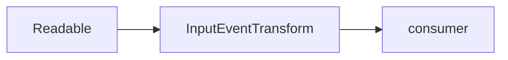

# Teoria — InputEvent Transform (Node.js)

Espelha `gunzip_transform` (Day 06) para registros evdev de 24 bytes.

## 1. Transform stream

`objectMode: true` emite objetos `{ raw: Buffer }` por evento.

## 2. ND-INPUT-01

Acumular buffer até múltiplos de 24.

## 3. ND-INPUT-02

Flush com residual é erro — contrato rígido.

## 4. ND-INPUT-03

Métricas `eventsParsed` e `backpressurePauses`.

## 5. Backpressure

Se `push` retorna false, incrementar pauses (opcional neste lab mínimo).

## 6. Ligação .NET

Mesmo layout que `DN-INPUT-LAYOUT-01`.

## 7. ESM

`package.json` `"type":"module"`.

## 8. Trace

```text
chunk 48B → 2 eventos
chunk 25B + flush → erro
```

## 9. Por quê Node no Dia 07?

Completa trilha runtime junto de C/Rust/.NET/Python.

## 10. Bugs

- Esquecer copiar subarray antes de push.
- objectMode false com objetos.

## 11. Comparação

| gunzip | input_event |
|--------|-------------|
| zlib | fixed record |

## 12. Capstone

Padrão reutilizável em pipelines Node de telemetria.

## 13. Complexidade

O(n) bytes.

## 14. Síntese

### Por quê Transform?

Mesma abstração que backpressure lab.

### Por quê 24 bytes?

evdev `input_event` struct size.

### Por quê métricas?

Observabilidade em produção.

## 15. Próximo passo

Decode campos type/code/value (fora do escopo).

## 16. Diagrama



## 17. Honestidade

Não implementa `read()` syscall — userspace only.

## 18. Fechamento

Fecha trilha Node do Dia 07.

## 19. Paper-trace

Desenhe buffer interno após chunk de 25 bytes.

## 20. Gate

`node test.js` no VALIDATION do dia.

## 21. Ordem sugerida

Após bloco .NET input e após `gunzip_transform` (Day 06) se ainda não feito.

## 22. ESM vs CJS

Este lab usa ESM (`import`) — não misture `require`.

## 23. objectMode

`readableObjectMode: true` evita concatenação manual de objetos JS.

## 24. Fixture futura

Decoder de `type/code/value` pode reutilizar o mesmo Transform.

