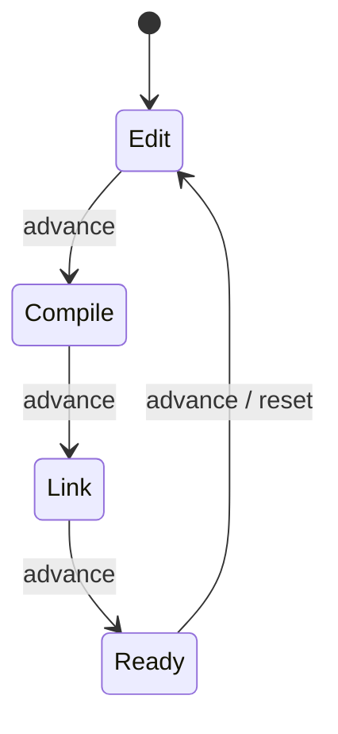

# Teoria — shader_stage_fsm

## Visao geral

Drivers e toolchains de shader nao “pulam” de texto bruto para GPU program sem etapas. Este lab modela o ciclo minimo:



| Stage | Papel | Cor pedagogica (RGB approx) |
|-------|-------|-----------------------------|
| Edit | fonte editavel | amarelo 0.95, 0.75, 0.20 |
| Compile | IR / bytecode | azul 0.25, 0.55, 0.95 |
| Link | programa unificado | roxo 0.70, 0.35, 0.90 |
| Ready | pronto para draw | verde 0.25, 0.85, 0.40 |

## 1. O que e uma FSM de shader

**O que:** maquina de estados finita com quatro estados e transicoes unarias `advance()`.

**Como:** `ShaderFsm` guarda `stage_`; `advance` mapeia cada estado ao seguinte; `reset` forca `Edit`.

**Por que:** APIs reais (HLSL compile → link PSO, GLSL compile → link program) proibem usar um shader incompleto no draw call.

**Invariante:** apos `n` advances, `stage = n % 4` se partiu de Edit.

**Bugs comuns:** pular Link (EDIT→READY) — invalido no modelo pedagogico.

**Trace:** Edit(0) → advance → Compile(1) → advance → Link(2).

## 2. Por que reset e separado de advance

**O que:** `reset()` nao e so “mais um advance”.

**Como:** atribui `stage_ = Edit` independente do estado atual.

**Por que:** falha de compile/link na pratica descarta o pipeline e volta ao editor; o artista nao quer esperar o ciclo completo.

**Invariante:** apos `reset()`, `stage() == Edit` sempre.

**Trace:** partindo de Link, `reset` → Edit (nao Ready).

## 3. Cor como contrato visual

**O que:** `stage_color()` devolve `Rgb` em floats [0,1].

**Como:** switch por `stage_` com constantes fixas (iguais aos asserts do teste).

**Por que:** a cena visual (triangulo) e o HUD devem ler a mesma funcao — prova que o estado do core dirige o present, nao cores hard-coded no backend.

**Invariante:** quatro cores mutualmente distintas (diferenca > 0.1 em algum canal).

**Tabela de aceitacao do teste:**

| Stage | r | g | b |
|-------|---|---|---|
| Edit | 0.95 | 0.75 | 0.20 |
| Compile | 0.25 | 0.55 | 0.95 |
| Link | 0.70 | 0.35 | 0.90 |
| Ready | 0.25 | 0.85 | 0.40 |

## 4. Dual-backend: mesma cena

```text
core::ShaderFsm ──► software_win32 (DIB + StretchDIBits)
                 └► opengl_win32   (glBegin + SwapBuffers)
```

**Por que CPU primeiro:** voce rasteriza o triangulo e as barras HUD pixel a pixel antes de confiar em `glColor3f`.

Animacao obrigatoria: `g_angle += dt * 1.2` e auto-`advance` a cada ~1.5 s.

## 5. Trace numerico completo (igual ao teste)

```text
fsm = ShaderFsm()          # Edit
advance()                  # Compile
advance()                  # Link
advance()                  # Ready
advance()                  # Edit
advance(); advance()       # Link
reset()                    # Edit
stage_color()              # (0.95, 0.75, 0.20)
advance(); stage_color()   # (0.25, 0.55, 0.95)
```

## 6. HUD de barras

Quatro barras verticais a esquerda; a barra do estagio ativo e mais larga (160 vs 90 px). Isso torna o ciclo legivel sem texto GPU.

## 7. Relacao com pipelines reais

| Lab | Vulkan / D3D analog |
|-----|---------------------|
| Edit | source HLSL/GLSL |
| Compile | `dxc` / `glslang` |
| Link | PSO / `glLinkProgram` |
| Ready | bind + draw |

## 8. Invariantes do loop visual

1. `PeekMessage` nao bloqueia — animacao continua.
2. Titulo da janela menciona CPU vs OpenGL.
3. Esc fecha; R chama `reset()`.

## 9. Bugs tipicos

| Sintoma | Causa | Correcao |
|---------|-------|----------|
| cor sempre preta | `stage_color` stub | preencher switch |
| nao muda de estagio | `advance` vazio | implementar switch |
| reset nao volta | esqueceu atribuir Edit | `stage_ = Edit` |
| janela MessageBox | starter nao resolvido | copiar padrao solutions |

## 10. Checklist antes do ctest

- [ ] Tres TODOs no core resolvidos
- [ ] Cores batem com a tabela
- [ ] `advance` cicla 4 estados
- [ ] `reset` ignora estado atual
