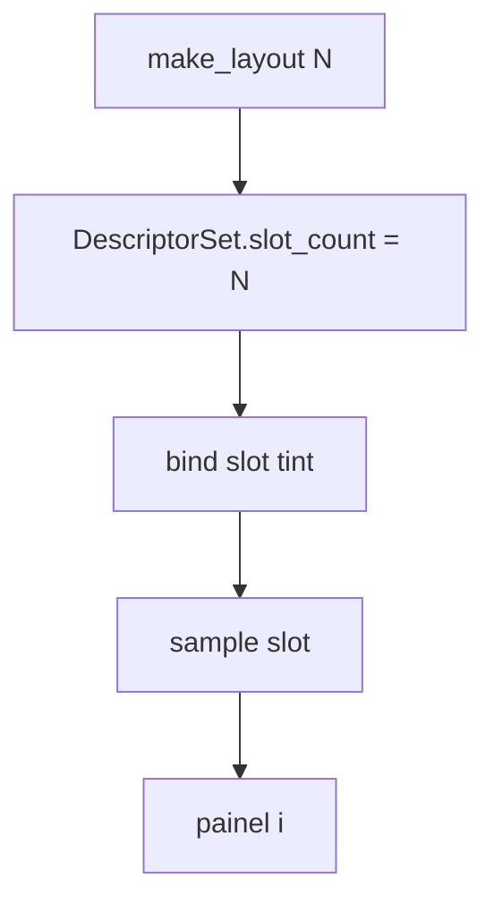
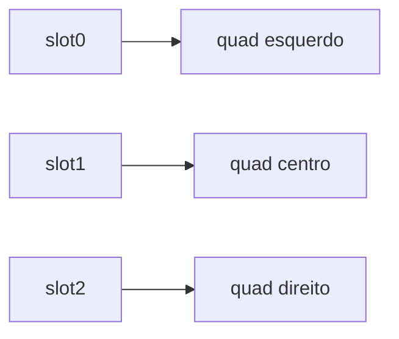

# Teoria — descriptor_binding_model

## Visão geral

Descriptors ligam recursos (aqui: **tints RGB**) a *slots* numerados. O layout diz quantos slots existem; o set guarda os valores; o draw **sample** cada slot.



| Conceito | Analogia API | Lab |
|----------|--------------|-----|
| Layout | set layout / root sig | `slot_count` |
| Bind | update descriptors | `tints[slot]` |
| Sample | shader read | `sample(i)` no CPU/GL |

## 1. Layout: quantos slots?

```text
make_layout(3)  → slot_count = 3
make_layout(99) → slot_count = kMaxSlots (8)
make_layout(-1) → 0
```

### Por que clamar?

Sem clamp, um layout inválido estoura o array fixo `tints[kMaxSlots]`. Em APIs reais a validação acontece na criação do layout.

## 2. Bind: escrever no set

```text
set.slot_count = 3
bind(set, 0, {1,0,0})
bind(set, 1, {0,1,0})
bind(set, 2, {0,0,1})
→ bound[0..2] = true
```

Bind fora do range é no-op (lab defensivo). Não lança exceção para manter o core simples em C++.

| Slot | Tint | bound |
|------|------|-------|
| 0 | vermelho | true |
| 1 | verde | true |
| 2 | azul | true |
| 7 | — | false (sample→0) |

## 3. Sample: ler com fallback

```text
sample(set, 1) → {0,1,0}
sample(set, 7) → {0,0,0}   // OOB / unbound
```

### Por que zero e não crash?

No draw path, um crash por slot errado é difícil de depurar visualmente. Zero aparece como painel preto — sintoma claro.

## 4. Cena visual: três painéis

```text
largura janela / 3
painel i: x0 = i*panel_w + pad
cor = sample(set, i)
bob = sin(t*2)*12
```



## 5. Animação por rebind

A cada ~1.5s:

```text
phase = (phase + 1) % 3
bind(i, palette[(phase + i) % 3])
```

Os painéis “trocam” de cor sem o draw conhecer a paleta — só sample.

### Por que rebind e não mutar o draw?

Em engines, o shader lê descriptors; a CPU atualiza tabelas. Separar bind de sample treina esse hábito.

## 6. Software vs OpenGL

| Etapa | CPU | GL |
|-------|-----|----|
| Cor | `rgb_f(sample)` → fill_rect | `glColor3f` + `GL_QUADS` |
| Present | StretchDIBits | SwapBuffers |

O core é idêntico; só a apresentação muda.

## 7. Trace completo do Caso 3

```text
layout = make_layout(3)
set.slot_count = 3
bind 0,1,2 com R,G,B
sample(0).x == 1
sample(1).y == 1
sample(2).z == 1
sample(7) == zero
```

## 8. Erros clássicos

| Sintoma | Causa | Correção |
|---------|-------|----------|
| layout 99 → 99 | sem clamp | `min(n, kMaxSlots)` |
| sample sempre 0 | não setou `bound` | `bound[slot]=true` |
| painéis pretos | `slot_count` ficou 0 | copie do layout |
| cores não ciclam | esqueceu rebind | timer + bind |

## 9. Ligação com Vulkan/D3D12

Vulkan: `VkDescriptorSetLayout` ≈ layout; `vkUpdateDescriptorSets` ≈ bind; leitura no shader ≈ sample. D3D12: root signature define slots; CPU copia para heap; shader indexa.

## 10. Checklist

1. Layout define capacidade.
2. Bind escreve + marca.
3. Sample lê com fallback.
4. Draw só sampleia.
5. Animação = rebind no tempo.

## 11. Exercício mental

Se `phase=1` e palette = [R,G,B], slot0 recebe G, slot1 recebe B, slot2 recebe R. Confirme no papel antes de olhar a demo.
