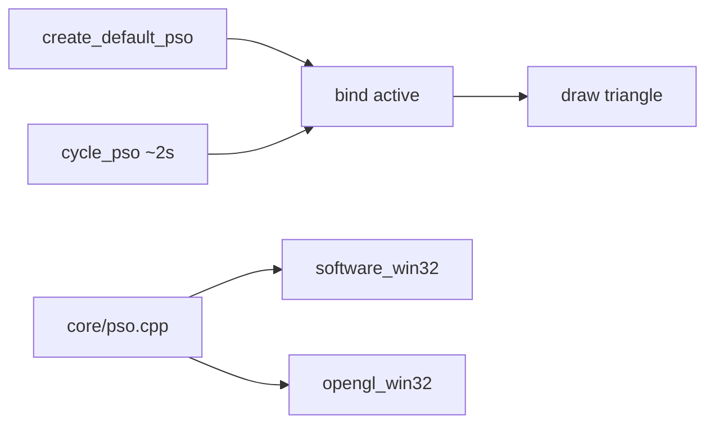
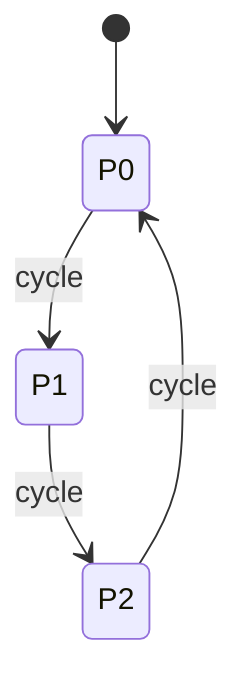

# Teoria — pipeline_state_object

## Visão geral

Um **Pipeline State Object (PSO)** agrupa o estado que a GPU (ou o raster CPU) usa para desenhar: topologia, modo de preenchimento, cor fixa. Neste lab o PSO é uma struct C++ pequena, mas o *contrato* é o mesmo das APIs modernas: criar, bindar, e só então emitir primitivas.



| Etapa | Responsabilidade | Por que importa |
|-------|------------------|-----------------|
| Create | valor inicial estável | demos e testes partem do mesmo estado |
| Bind | aplica snapshot | evita estado global “sujo” |
| Cycle | 3 presets | prova visual fill vs wire vs cor |

## 1. O que vive dentro do PSO

```text
PipelineState {
  topology   // 0 = triângulos, 1 = linhas (lab usa triângulos)
  fill_mode  // 0 = sólido, 1 = wire
  r, g, b    // cor constante do primitivo
}
```

Em D3D12/Vulkan o PSO também congela shaders, blend, depth. Aqui reduzimos ao mínimo pedagógico: fill/wire + cor. Isso basta para o aluno *ver* a mudança de estado na tela.

### Por que este recorte?

Se o PSO tivesse 40 campos, o aluno passaria o tempo a preencher structs. Com três campos, o foco fica no ciclo create → bind → draw.

## 2. Create: preset 0 como default

`create_default_pso()` devolve o preset 0: fill sólido, vermelho (~0.95, 0.25, 0.20).

```text
trace create:
  index = 0
  fill_mode = kFillSolid (0)
  rgb ≈ (0.95, 0.25, 0.20)
  assert: r > 0.5  → passa Caso 1
```

### Por que create separado de bind?

Create produz um valor; bind escreve no “slot” ativo. Em engines reais, muitos PSOs vivem em cache; o draw só faz bind do handle desejado.

## 3. Bind: cópia estrutural

```text
active = {}
src = preset_at(1)  // wire verde
bind(active, src)
→ active.fill_mode == kFillWire
→ active.g ≈ 0.90
```

Bind não desenha. Só atualiza o estado que o backend lê no frame seguinte.

| Campo | Antes | Depois (preset 1) |
|-------|-------|-------------------|
| fill_mode | 0 | 1 (wire) |
| r | 0 | ~0.25 |
| g | 0 | ~0.90 |
| b | 0 | ~0.35 |

## 4. Cycle: máquina de três estados

```text
presets:
  0: solid red
  1: wire green
  2: solid blue

cycle: idx = (idx + 1) % 3; bind(active, preset_at(idx))
```



Trace numérico:

```text
idx=0, bind default
cycle → idx=1, wire
cycle → idx=2, blue (b>0.5)
cycle → idx=0, solid again
```

### Por que ciclar automaticamente?

Sem animação de estado, o aluno poderia achar que “PSO” é só um struct morto. O timer de ~2s força a percepção de *troca de pipeline* durante a execução.

## 5. Animação geométrica (backends)

Independente do PSO, os backends aplicam:

```text
bob = sin(t * 1.2) * 18
ang = t * 0.6
vértices locais → rotação 2D → centro da janela
```

Assim a cena nunca fica estática mesmo entre ciclos de PSO.

## 6. Software vs OpenGL — mesma decisão

| fill_mode | CPU | OpenGL |
|-----------|-----|--------|
| solid | `fill_triangle` | `GL_TRIANGLES` |
| wire | três `draw_line` | `GL_LINE_LOOP` |

A cor vem sempre de `g_active.r/g/b`. O core não sabe o que é `StretchDIBits` nem `SwapBuffers`.

```text
diagrama de dados:
  cycle_pso → g_active → render_scene → present
```

## 7. Erros clássicos

| Sintoma | Causa | Correção |
|---------|-------|----------|
| testes falham no create | retornou `{}` | use `preset_at(0)` |
| bind não muda cor | esqueceu `active = src` | cópia completa |
| cycle fica no 0 | não incrementa idx | `(idx+1)%3` |
| wire invisível no GL | esqueceu `LINE_LOOP` | ramo fill_mode |

## 8. Ligação com APIs reais

Em Vulkan, trocar PSO implica `vkCmdBindPipeline`. Aqui `bind` é o análogo. O ciclo de presets simula um material/pass que troca fill mode em runtime — algo que em APIs modernas exigiria outro PSO (imutável).

## 9. Checklist conceitual

1. PSO = snapshot de estado de desenho.
2. Create ≠ Bind ≠ Draw.
3. Três presets cobrem fill/wire/cor.
4. Backends só interpretam o snapshot.
5. Animação prova que o estado vive no tempo.

## 10. Mini-lab mental

Calcule a cor após dois cycles a partir do default:

```text
start preset 0 (red solid)
cycle → 1 (green wire)
cycle → 2 (blue solid)
esperado: fill_mode=0, b>0.5
```

Se esse raciocínio estiver claro, o código de `GFX-PSO-CYCLE` cabe em poucas linhas.
