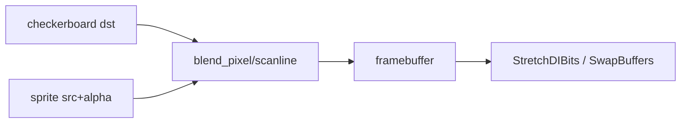
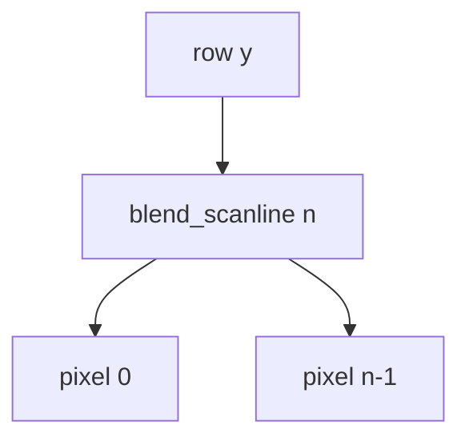

# Teoria — alpha_blend_scanline

## Visão geral

Alpha blending combina um pixel fonte semi-transparente com o destino já no framebuffer. A regra **src-over** (Porter-Duff) é a mais comum em UI e sprites 2D.



| Função | Papel |
|--------|-------|
| `blend_pixel` | um texel src-over |
| `blend_scanline` | linha horizontal (cache-friendly) |
| `update_sprite` | física bounce para animação |

## 1. Pixel RGBA8

```text
Pixel { r, g, b, a }  // 0..255
src-over (straight alpha):
  sa = src.a / 255
  out.c = src.c * sa + dst.c * (1 - sa)
```

### Por que este recorte?

O lab usa float simples no CPU para legibilidade; o hardware GL faz a mesma intenção com `GL_SRC_ALPHA, GL_ONE_MINUS_SRC_ALPHA`.

## 2. Trace numérico — Caso 1

```text
dst = (0,0,0,255)
src = (255,0,0,128)
sa = 128/255 ≈ 0.502
out.r ≈ 255 * 0.502 ≈ 128  (> 100 no assert)
out.g = 0
out.b = 0
```

## 3. Scanline

```text
for i in 0..n-1:
  blend_pixel(dst[i], src[i])
```

### Por que scanline e não só pixel?

Sprites são retângulos: cada linha é contígua. Chamar blend por linha reduz overhead e espelha rasterizers clássicos. O backend CPU do lab usa `blend_scanline` no blit.



## 4. Bounce do sprite

```text
s.x += s.vx * dt
s.y += s.vy * dt
if fora em X: s.vx = -s.vx; corrigir posição
if fora em Y: s.vy = -s.vy; corrigir posição
```

| Entrada | Saída esperada |
|---------|----------------|
| x=10, vx=50, dt=0.1 | x > 10 |

## 5. Cena visual

1. Pintar checkerboard opaco.
2. `update_sprite` nos dois sprites.
3. Blitar com alpha via `blend_scanline`.
4. Apresentar com `StretchDIBits` / `SwapBuffers`.

```text
sprite A: vermelho a=140
sprite B: azul a=160
sobreposição: ordem de desenho importa
```

## 6. OpenGL equivalente

```text
glEnable(GL_BLEND);
glBlendFunc(GL_SRC_ALPHA, GL_ONE_MINUS_SRC_ALPHA);
glColor4f(r,g,b,a); // a em 0..1
```

### Por que não reimplementar lerp no GL?

O hardware já faz src-over; o lab pede paridade visual, não bit-exact com o CPU.

## 7. Software present path

Framebuffer de `Pixel` → converte para `0x00RRGGBB` → `StretchDIBits`. Alpha final não vai ao monitor — só RGB.

## 8. Erros clássicos

| Sintoma | Causa | Correção |
|---------|-------|----------|
| r=0 no teste | não misturou | use sa/da |
| scan não muda | esqueceu loop | `for i… blend_pixel` |
| sprite some | não inverte vel | bounce nos bounds |
| GL sem transparência | blend off | `glEnable(GL_BLEND)` |

## 9. Pré-multiplicado vs straight

Este lab usa **straight alpha**. Engines modernas preferem pré-multiplicado para filtering — fora do escopo.

## 10. Checklist

1. Entender src-over canal a canal.
2. Scanline = N× pixel.
3. Bounce por eixo.
4. Checker prova transparência.
5. GL usa a mesma intenção de blend.

## 11. Mini cálculo

Src a=255 sobre qualquer dst substitui RGB: `out = src`. Confirme no papel antes de codar.

## 12. Ligação com o dia

Substitui o lab headless antigo: agora o aluno *vê* o blend. Core continua testável sem janela no CI.
