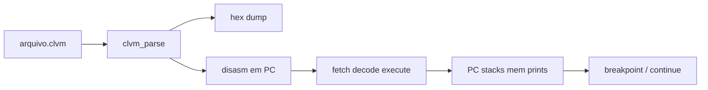

# Teoria — sessão observável da CLVM

Um debugger não é uma VM com `printf`. É um **motor de um opcode**
exposto em views: bytes, mnemônico, PC, pilhas, memória. CONCEITO-chave:
se você não consegue parar no PRINT de `add2` e ver `data=[8]` *antes*
de continuar, ainda não tem um xdbg — só um `run()`.



## CONCEPT-IMAGE-01 — a imagem é um contrato, não um buffer

**O quê.** O arquivo começa com 16 bytes fixos. Magic `CLVM` em ASCII
(`43 4C 56 4D`), `version=1`, `flags=0`, `entry` u16 LE, `code_size` u32
LE, checksum FNV-1a u32 LE sobre **somente** os bytes de code. O ponteiro
`image.code` aponta para `file + 16`. Tamanho total = `16 + code_size`.

**Como.** `Session::load` copia o arquivo para um vetor estável (o
ponteiro do parse não pode pendurar num buffer temporário), chama
`clvm_parse` (já fornecido) e só então define `pc = image.entry`.
Reset de pilhas, RAM e `prints` pertence ao load: reabrir o mesmo
programa não pode herdar `mem[0]=42` da sessão anterior.

**Por quê.** Um debugger que “assume” que o buffer é válido replica o
erro clássico de loaders: `code_size` mentiroso, entry fora, checksum
trocado. O parse do Dia 01 já recusa isso; o xdbg só precisa **não
ignorar** o `char error[128]`.

**Invariante.** Sem `loaded==true` não há hex/disasm/step honestos.

**Bugs comuns.** Copiar `clvm_image` e deixar `code` apontar para um
`std::vector` que depois realoca; esquecer de copiar `file` primeiro.

**Trace.** `add2.clvm` tem 33 bytes: 16 de header + 17 de code. Entry 0.
Os primeiros quatro bytes do arquivo são `43 4C 56 4D`. Oito bytes
soltos (`CLVM\x01\x00\x00\x00`) falham com `file too small`.

Offset do header:

| Offset | Bytes | Campo |
|-------:|-------|-------|
| 0x00 | 43 4C 56 4D | magic |
| 0x04 | 01 | version |
| 0x05 | 00 | flags |
| 0x06 | 00 00 | entry = 0 |
| 0x08 | 11 00 00 00 | code_size = 17 |
| 0x0C | FNV-1a | checksum |

## CONCEPT-HEX-01 — ver o arquivo, não a interpretação

**O quê.** Hex dump é a view de **arquivo**, não da RAM. Header e code
compartilham o mesmo espaço de offsets: 0x00–0x0F header, 0x10+ code.
A RAM de 256 B é outra view (`mem`).

**Como.** 16 bytes por linha, offset em hex de 4 dígitos, bytes em hex
de 2 dígitos, tag `header` ou `code`. `add2` na linha 0x00 mostra
`43 4C 56 4D ... header`. Na linha 0x10 começa `01 03 00 00 00` (PUSH 3)
com tag `code`.

**Por que** separar as tags: o aluno mistura “PC=0” com “offset 0 do
arquivo”. PC=0 é o primeiro byte de **code**, que no arquivo está no
offset 16. Sem a tag, o dump mente.

**Invariante.** Offset `n` no dump é `file[n]`, sempre.

**Bugs comuns.** Dump só do `image.code` (some o header); dump da RAM
no comando `hex`; little-endian impresso como big-endian nos u32 do
header — o dump é **byte a byte**, então `11 00 00 00` já é LE.

**Trace.** PUSH 3 ocupa 5 bytes de code: `01 03 00 00 00`. No arquivo
isso vive em 0x10–0x14.

## CONCEPT-DECODE-01 — o tamanho do operando é parte da ISA

**O quê.** Disasm lê **um** opcode em `pc` (índice em code, não em
arquivo) e imprime o mnemônico. PUSH lê i32 LE nos 4 bytes seguintes.
JMP/JZ/CALL/JNZ lêem i16 relativo. O resto é 1 byte.

**Como.** Tabela `operand_bytes`: PUSH→4, branches→2, senão 0. Se o
resto do code for menor que o operando, imprima `<truncated>` — isso é
view, o `step` é quem falha com `truncated` / `unknown opcode`.

Para `add2` em pc=0: `pc=0 PUSH 3`. Depois de dois PUSH, pc=10:
`pc=10 CALL +2`. O `+2` é o displacement, não o endereço absoluto.
Alvo = PC_após_i16 + disp = 13 + 2 = 15 (o ADD).

**Por que** mostrar o displacement cru: é o mesmo número que o
assembler gravou. Se você “ajuda” convertendo para label, o aluno não
vê o i16.

**Invariante.** Disasm **não** avança PC. Só `step` muta estado.

**Bugs comuns.** Tratar PUSH como 1 byte (mutante OPSIZE): o próximo
disasm lê `03` como opcode ADD e o mundo desaba. Ler i16 como u16
sem sinal: um JMP para trás vira um salto enorme.

**Trace byte a byte do CALL em add2:**

```text
code[10] = 0x0B        CALL
code[11] = 0x02        disp low
code[12] = 0x00        disp high  → i16 = +2
next_pc  = 13
target   = 13 + 2 = 15  (ADD)
```

## CONCEPT-STEP-01 — um opcode, não um `run()`

**O quê.** `step` faz fetch (lê `code[pc++]`), decode (switch), execute
(efeito de pilha/mem/PC). HALT muda `status` para `halted`. PRINT não
escreve no stdout da sessão: empurra o i32 para `prints`, para o teste
poder ler o valor sem parsear a REPL.

**Como.** Copie a semântica do Dia 04, mas **pare** depois de um opcode.
`need(n)` verifica `pc + n <= code_size` *depois* de consumir o opcode
byte. JMP/CALL somam o i16 a partir do PC já avançado além do operando.

**Por que** não chamar um `run()` interno: o ponto pedagógico é ver
CALL empilhar 13, ADD reduzir `[3,5]` para `[8]`, RET devolver o PC.
Um loop opaco só entrega o `8` final, igual ao Dia 04.

**Invariante.** Cada `step` bem-sucedido incrementa `steps` em 1.
Depois de HALT, novos `step` são no-ops que devolvem `halted`.

**Bugs comuns.** Executar até HALT dentro de `step`; esquecer `pc += 4`
no PUSH; CALL sem `return` no erro (lição do starter Dia 04).

**Trace feliz de add2 (sete steps):**

```text
pc  data     call   op     depois
0   []       []     PUSH 3  pc=5  data=[3]
5   [3]      []     PUSH 5  pc=10 data=[3,5]
10  [3,5]    []     CALL    pc=15 call=[13]
15  [3,5]    [13]   ADD     pc=16 data=[8]
16  [8]      [13]   RET     pc=13 call=[]
13  [8]      []     PRINT   pc=14 prints=[8]
14  [8]      []     HALT    status=halted
```

## CONCEPT-STACKS-01 — duas pilhas, dois underflows

**O quê.** Data stack: i32. Call stack: endereços de retorno (size_t).
RET **nunca** dá pop na data stack. `regs` imprime as duas, mais PC,
status, prints e steps.

**Como.** Formato estável para testes:

```text
pc=15
status=ready
data=[3,5]
call=[13]
prints=[]
steps=3
```

**Por que** listas sem espaços depois da vírgula: o teste procura
`data=[3,5]` e `call=[13]`. Um espaço extra quebra o contrato.

**Invariante.** `bad_ret.asm` (RET nua) → `return stack underflow`,
não `stack underflow`.

**Bugs comuns.** Uma pilha só; imprimir call stack como i32 signed;
RET empcilhando na data stack.

## CONCEPT-MEM-01 — 256 bytes fora do arquivo

**O quê.** RAM zerada no `load`. STORE: pop addr, pop value, escrever
i32 LE se `addr >= 0 && addr+4 <= 256`. LOAD é o inverso. `mem 0 4`
depois de `STORE 42 em 0` mostra `2A 00 00 00`.

**Como.** `mem_in_bounds` é o predicado único. O mutante NO-BOUNDS
remove essa checagem: `STORE` em 254 escreveria além de `mem[255]`.

**Por que** 254 falha: 254+4=258 > 256. 252 é o último endereço legal
(252,253,254,255).

**Invariante.** `hex` nunca mostra a RAM; `mem` nunca mostra o arquivo.

**Bugs comuns.** Bounds `addr < 256` (aceita 254); tratar bytes como
host-endian; não zerar `mem` no load.

**Trace `mem_demo`:** PUSH 42, PUSH 0, STORE → `mem[0..3] = 2A 00 00 00`.
Depois LOAD/PRINT → `prints=[42]`.

## CONCEPT-BREAK-01 — continue não é step em loop cego

**O quê.** `break <pc>` registra um PC de **code**. `continue` executa
o opcode atual mesmo se ele for um breakpoint (para sair do ponto) e
só então para quando o PC **pousa** de novo num endereço marcado,
antes de executá-lo.

**Como.** Em add2, PRINT vive no PC 13. `break 13` + `continue` deve
parar com `status=breakpoint`, `pc=13`, `prints=[]`, disasm `PRINT`.
Um `step` extra executa o PRINT e `prints=[8]`. Sem breakpoints,
`continue` anda até HALT ou erro.

**Por que** pular o PC de partida: senão você nunca sai do breakpoint.
gdb/`stepi` fazem o mesmo contrato.

**Invariante.** Breakpoint não altera a ISA; só o escalonador de step.

**Bugs comuns.** Parar *depois* de executar o PC marcado (PRINT já
correu); tratar breakpoint como endereço de arquivo (+16); `continue`
chamar `run()` opaco.

## Mapa mental vs. x64dbg

x64dbg mostra hex do módulo, disasm x86-64, registradores e dump de
memória, com F7=step e F9=run. Aqui o “módulo” é a imagem CLVM, os
“regs” são PC+pilhas, e F7 é `step`. A pedagogia é a mesma; a ISA
cabe no CI Linux.
