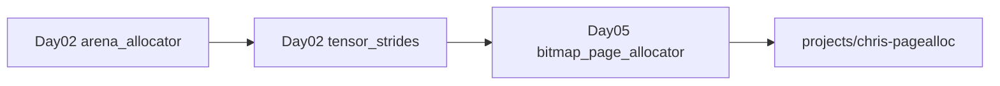
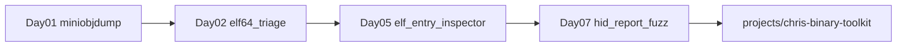
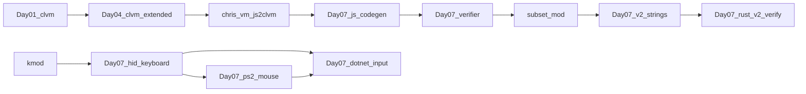
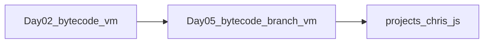
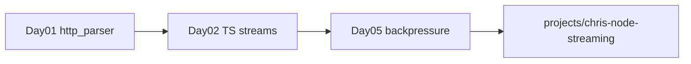
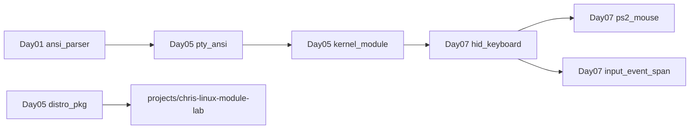
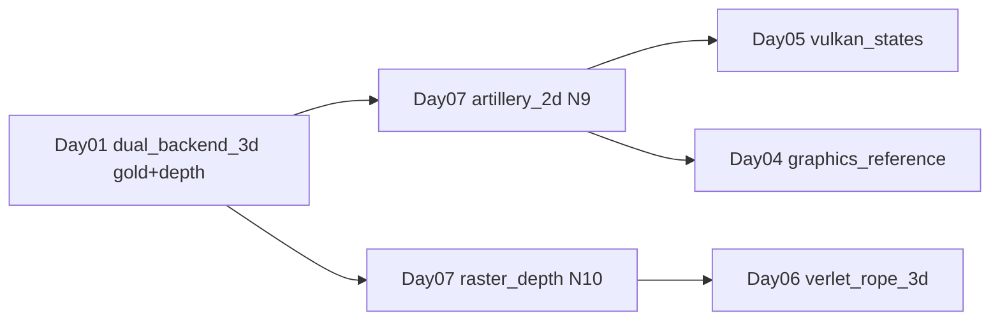
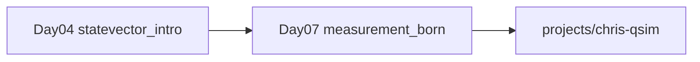
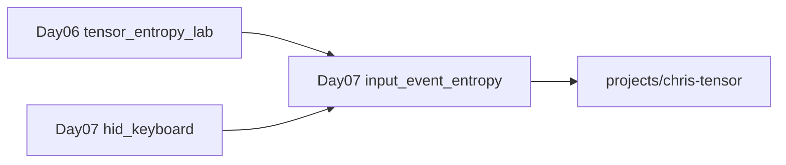
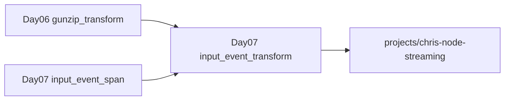

# Learning paths — trilhas verticais multi-dia

Módulos dentro de um dia são independentes. Estas trilhas conectam conceitos entre dias e terminam em **capstones** em `projects/`.

---

## 1. Memória e alocação

| Etapa | Módulo | Conceito |
|-------|--------|----------|
| 1 | `2026-09-04/systems/arena_allocator` | bump pointer, align, reset O(1) |
| 2 | `2026-09-04/ai/tensor_strides` | layout contínuo, views sem cópia |
| 3 | `2026-09-05/systems/bitmap_page_allocator` | page→byte→bit, first-fit |
| Capstone | `projects/chris-pagealloc` | allocator com trace + testes OOM |

**Pergunta de síntese:** quando arena perde para bitmap e vice-versa?

---

## 2. Binários, ELF e reversing

| Etapa | Módulo | Conceito |
|-------|--------|----------|
| 1 | `2026-09-03/tooling/miniobjdump` | ELF/PE headers, primeiros opcodes |
| 2 | `2026-09-04/redteam/elf64_triage` | Ehdr + Phdr/Shdr + dynsym + strings |
| 3 | `2026-09-05/redteam/elf_entry_inspector` | `e_entry`, validação byte-a-byte |
| 4 | `2026-09-06/redteam/compressed_blob_triage` | blobs comprimidos → triage |
| 5 | `2026-09-07/redteam/hid_report_fuzz` | HID boot malformado → bounds no parser N5 |
| Capstone | `projects/chris-binary-toolkit` | pipeline strings + ELF + YARA-style + HID fuzz |

---

## 3. VMs e bytecode

### 3a. CLVM (formato próprio → frontend JS)

| Etapa | Módulo | Conceito |
|-------|--------|----------|
| 1 | `2026-09-03/systems/clvm` | loader, stack VM, JMP/JZ; assembler como IR legível |
| 2 | `2026-09-04/systems/clvm_extended` | CALL/RET, mem, EQ/LT/JNZ |
| Capstone | `projects/chris-vm` | ISA + **`js2clvm`** + checklist N0 |
| N1 | `2026-09-07/systems/clvm_js_codegen` | você implementa codegen (LET/WHILE/CALL) |
| N2 | `2026-09-07/systems/clvm_bytecode_verifier` | stack-effect + branch bounds |
| N3 | chris-vm `%` + `N3_SUBSET_MOD.md` | extensão subset ainda v1 |
| N4 | `2026-09-07/systems/clvm_v2_strings` | FORMAT **v2** strings (Dia01 intocado) |
| N7 | `2026-09-07/rust/clvm_v2_verify` | parser/verifier v2 em Rust |

Estude o capstone com `TEORIA` / `RESOLUCAO_GUIADA` / `docs/STUDY_CHECKLIST_N0.md`.

### 3b. JavaScript-like VM (trilha paralela)

| Etapa | Módulo | Conceito |
|-------|--------|----------|
| 1 | `2026-09-04/javascript/bytecode_vm_from_scratch` | dispatch loop, stack trace |
| 2 | `2026-09-05/javascript/bytecode_branch_vm` | branches, IP, condicionais |
| Capstone | `projects/chris-js` | VM com branches + testes (bytecode **próprio**, não CLVM) |

**Perguntas de síntese:** (1) o que CALL/RET na CLVM e um call frame na JS VM têm em comum? (2) por que existem duas VMs (chris-vm vs chris-js)? quando faria sentido **retargetar** o frontend JS para emitir CLVM em vez de opcodes chris-js?
---

## 4. Streams, I/O e backpressure

| Etapa | Módulo | Conceito |
|-------|--------|----------|
| 1 | `2026-09-03/network/http_parser` | parsing incremental, estados |
| 2 | `2026-09-04/nodejs/typescript_stream_backpressure` | Transform, `write()` false |
| 3 | `2026-09-05/nodejs/stream_transform_backpressure` | demo observável de backpressure |
| Capstone | `projects/chris-node-streaming` | pipeline com métricas de buffer |

---

## 5. Linux: userspace → kernel

| Etapa | Módulo | Conceito |
|-------|--------|----------|
| 1 | `2026-09-03/terminal/ansi_parser` | FSM ESC/CSI |
| 2 | `2026-09-05/linux/pty_ansi_terminal` | SGR, cursor, preparação PTY |
| 3 | `2026-09-05/linux/kernel_module_driver_lab` | char device lifecycle |
| 4 | `2026-09-07/linux/hid_keyboard_boot` | HID boot → InputEvent → ring/read |
| 5 | `2026-09-07/linux/ps2_mouse_input` | pacote PS/2 → REL_X/REL_Y |
| 6 | `2026-09-07/dotnet/input_event_span` | struct evdev 24B + Span parsers |
| 7 | `2026-09-05/linux/distro_pkg_rootfs` | rootfs mínimo (opcional) |
| Capstone | `projects/chris-driver-lab` + `chris-linux-module-lab` | fila de input + módulo real |

---

## 6. GPU, .NET e performance

| Etapa | Módulo | Conceito |
|-------|--------|----------|
| 1 | `2026-09-03/graphics/dual_backend_3d` | software vs GL (+ D3D11 extensão) |
| 2 | `2026-09-07/graphics/artillery_trajectory_2d` | física 2D + CPU/GL/D3D11 |
| 3 | `2026-09-07/graphics/raster_depth_parity` | Z-buffer CPU + paridade GL |
| 4 | `2026-09-04/os/graphics_reference` | compositor RGBA + dirty-rect |
| 5 | `2026-09-06/graphics/verlet_rope_3d` | Verlet 3D + wireframe CPU/GL + orbit camera |
| 6 | `2026-09-05/graphics/vulkan_d3d12_resource_states` | estados GPU + frame graph |
| 1b | `projects/chris-lantern-hunt` | FPS horror OpenGL (opcional) |
| 5b | `2026-09-05/ai/tiled_matmul_cache` | cache blocking, benchmark |
| Capstone | `projects/chris-tensor` + `projects/chris-gpu-state` + `projects/chris-artillery-2d` |

---

## 7. Compressão e formatos de arquivo

| Etapa | Módulo | Conceito |
|-------|--------|----------|
| 1 | `2026-09-06/systems/rle_byte_codec` | runs byte-a-byte |
| 2 | `2026-09-06/systems/huffman_entropy` | entropia, árvore canônica |
| 3 | `2026-09-06/systems/lz77_dictionary` | janela deslizante |
| 4 | `2026-09-06/systems/deflate_blocks` | RFC 1951 subset |
| 5 | `2026-09-06/tooling/zlib_gzip_containers` | wrappers zlib/gzip |
| 6 | `2026-09-06/tooling/png_idat_pipeline` | chunks PNG + IDAT |
| 7 | `2026-09-06/redteam/compressed_blob_triage` | magic bytes, limites, strings |
| 8 | `2026-09-06/dotnet/span_deflate_buffers` | Span + inflate stored |
| 9 | `2026-09-06/rust/rle_byte_codec` | CHRLE em Rust |
| 10 | `2026-09-06/rust/gzip_member_parse` | header gzip sem panic |
| Capstone | `projects/chris-compress` | CLI encadeada |

---

## 8. Quantum — statevector e medição

| Etapa | Módulo | Conceito |
|-------|--------|----------|
| 1 | `2026-09-04/quantum/statevector_intro` | gates H, X, CNOT; amplitudes |
| 2 | `2026-09-07/quantum/measurement_born` | medição projetiva, colapso, Born |
| Capstone | `projects/chris-qsim` | simulador 2-qubit + testes de probabilidade |

**Pergunta de síntese:** por que medir |+⟩ em base computacional dá 50/50?

---

## 9. AI — entropia em streams de input

| Etapa | Módulo | Conceito |
|-------|--------|----------|
| 1 | `2026-09-06/ai/tensor_entropy_lab` | Shannon, RLE, gzip ratio em tensor |
| 2 | `2026-09-07/ai/input_event_entropy` | mesmas métricas em bytes de InputEvent |
| Capstone | `projects/chris-tensor` | benchmarks + layouts contínuos |

---

## 10. Node.js — Transform de eventos de input

| Etapa | Módulo | Conceito |
|-------|--------|----------|
| 1 | `2026-09-06/nodejs/gunzip_transform` | Transform, flush, backpressure |
| 2 | `2026-09-07/nodejs/input_event_transform` | records 24B, buffer parcial, métricas |
| Capstone | `projects/chris-node-streaming` | pipeline com métricas de buffer |

---

## 11. Complemento Dia 07 — AI KV cache

| Etapa | Módulo | Conceito |
|-------|--------|----------|
| 1 | `2026-09-06/ai/tensor_entropy_lab` | entropia + compressão |
| 2 | `2026-09-07/ai/kv_cache_ring` | ring buffer K/V + eviction determinística |
| 3 | `2026-09-07/ai/input_event_entropy` | métricas em stream InputEvent |

---

## 12. Complemento Dia 07 — parsers + agent

| Etapa | Módulo | Conceito |
|-------|--------|----------|
| 1 | `2026-09-07/parsers/pratt_query_lang` | lexer + Pratt binding power |
| 2 | `2026-09-07/agent/loop_state_machine` | FSM perceive→verify + replay |
| Capstone | `projects/chris-smart-grep` + `projects/chris-agent-harness` | query lang + harness |

---

## 13. Complemento Dia 07 — infra cross-trilha

| Módulo | Trilha | Conceito |
|--------|--------|----------|
| `2026-09-07/redteam/elf_program_header_triage` | Red team | ELF64 PHDR triage |
| `2026-09-07/dotnet/cil_cfg_verifier` | .NET | CFG CIL stack depth |
| `2026-09-07/nodejs/libuv_phase_probe` | Node | fases libuv / starvation |
| `2026-09-07/graphics/resource_state_tracker` | GFX | GPU state barriers (headless) |
| `2026-09-07/linux/proc_task_snapshot` | Linux | `/proc` snapshot → chris-top |

---

## 14. Day 2026-09-08 — CLVM toolchain + input multiplexação

| Etapa | Módulo | Conceito |
|-------|--------|----------|
| 1 | `2026-09-08/systems/clvm_disassembler` | disassemble CLVM v2 bytecode |
| 2 | `2026-09-08/systems/clvm_peephole_opt` | constant folding peephole |
| 3 | `2026-09-08/rust/clvm_disasm` | Rust disassembler port |
| 4 | `2026-09-08/linux/input_event_ring_mux` | mux kbd+mouse ring 24B |
| 5 | `2026-09-08/nodejs/duplex_event_pipe` | Duplex stream 24B events |
| 6 | `2026-09-08/dotnet/pe_export_span` | PE export directory Span |
| 7 | `2026-09-08/redteam/pe_export_triage` | PE export triage |
| 8 | `2026-09-08/tooling/wasm_section_header` | WASM section headers |
| 9 | `2026-09-08/graphics/shader_stage_fsm` | shader compile stage FSM |
| 10 | `2026-09-08/quantum/bell_state_prep` | Bell state preparation |
| 11 | `2026-09-08/ai/softmax_stable` | numerically stable softmax |
| 12 | `2026-09-08/parsers/json_rd_lexer` | JSON RD lexer subset |
| 13 | `2026-09-08/agent/tool_protocol_fsm` | tool calling FSM |

---

## 15. Day 2026-09-09 — observabilidade, profiling e depuração

| Etapa | Módulo | Conceito |
|-------|--------|----------|
| 1 | `2026-09-09/systems/clvm_trace_profiler` | opcode trace + hotspot counting |
| 2 | `2026-09-09/systems/arena_telemetry` | bump allocator stats/telemetry |
| 3 | `2026-09-09/linux/perf_event_open_lab` | perf_event syscall subset simulation |
| 4 | `2026-09-09/rust/stack_sample_trace` | Rust stack sampling trace |
| 5 | `2026-09-09/dotnet/activity_source_span` | ActivitySource diagnostic spans |
| 6 | `2026-09-09/graphics/gpu_timer_query` | GPU timer query simulation |
| 7 | `2026-09-09/redteam/yara_match_scan` | YARA-style pattern scan |
| 8 | `2026-09-09/quantum/decoherence_noise` | simple noise channel |
| 9 | `2026-09-09/ai/attention_mask` | attention mask computation |
| 10 | `2026-09-09/nodejs/async_hooks_trace` | async_hooks timeline |
| 11 | `2026-09-09/parsers/logfmt_lexer` | logfmt key=value lexer |
| 12 | `2026-09-09/agent/verify_replay_log` | verify+replay log FSM |
| 13 | `2026-09-09/tooling/pdb_symbol_index` | PDB symbol index basics |

---

## Como usar

1. Escolha uma trilha alinhada ao seu objetivo de portfólio.
2. Faça os módulos na ordem — cada um assume vocabulário do anterior.
3. Após cada módulo: porte para `projects/` ([PORTING_GUIDE.md](PORTING_GUIDE.md)).
4. No capstone: integre código de 2+ dias em um único repositório com testes unificados.
5. Documente conclusão em `research/YYYY-MM-DD-<trilha>.md`.

---

## 14. Day 10 — Capstone integração (2026-09-10)

**Tema:** Integração multi-trilha — preparação capstone

| # | Módulo | Conceito |
|---|--------|----------|
| 1 | `2026-09-10/systems/clvm_pipeline_integration` | capstone systems |
| 2 | `2026-09-10/systems/unified_input_pipeline` | capstone systems |
| 3 | `2026-09-10/linux/composite_input_driver` | capstone linux |
| 4 | `2026-09-10/rust/cross_verify_clvm` | capstone rust |
| 5 | `2026-09-10/dotnet/capstone_input_host` | capstone dotnet |
| 6 | `2026-09-10/graphics/pipeline_state_object` | capstone graphics |
| 7 | `2026-09-10/redteam/capstone_triage` | capstone redteam |
| 8 | `2026-09-10/quantum/capstone_measurement` | capstone quantum |
| 9 | `2026-09-10/ai/capstone_tokenizer` | capstone ai |
| 10 | `2026-09-10/nodejs/capstone_stream_pipeline` | capstone nodejs |
| 11 | `2026-09-10/parsers/capstone_query_eval` | capstone parsers |
| 12 | `2026-09-10/agent/capstone_agent_loop` | capstone agent |
| 13 | `2026-09-10/tooling/capstone_format_detect` | capstone tooling |

## 15. Day 11 — Relocação, ABI e verificação cruzada (2026-09-11)

| # | Módulo | Capstone |
|---|--------|----------|
| 1 | `2026-09-11/systems/clvm_reloc_apply` | chris-vm |
| 2 | `2026-09-11/systems/bump_poison_arena` | chris-arena |
| 3 | `2026-09-11/linux/uevent_kv_parse` | chris-driver-lab |
| 4 | `2026-09-11/rust/clvm_reloc_verify` | chris-vm |
| 5 | `2026-09-11/dotnet/pe_import_span` | chris-dotnet-pe |
| 6 | `2026-09-11/graphics/alpha_blend_scanline` | chris-renderer |
| 7 | `2026-09-11/redteam/import_name_triage` | chris-binary-toolkit |
| 8 | `2026-09-11/quantum/phase_kickback` | chris-qsim |
| 9 | `2026-09-11/ai/rms_norm` | chris-tensor |
| 10 | `2026-09-11/nodejs/shared_atomics_ring` | chris-node-streaming |
| 11 | `2026-09-11/parsers/ini_rd_lexer` | chris-smart-grep |
| 12 | `2026-09-11/agent/tool_barrier_join` | chris-agent-harness |
| 13 | `2026-09-11/tooling/coff_sym_name` | chris-binary-toolkit |

### Day 08 — trilha paralela GitHub

| 1 | `2026-09-08/systems/spsc_ring_buffer` | trilha A |
| 2 | `2026-09-08/architecture/cache_set_sim` | trilha A |
| 3 | `2026-09-08/ai/online_softmax` | trilha A |
| 4 | `2026-09-08/redteam/wasm_binary_triage` | trilha A |
| 5 | `2026-09-08/parsers/nfa_to_dfa` | trilha A |
| 6 | `2026-09-08/agent/bm25_code_ranker` | trilha A |
| 7 | `2026-09-08/unix/xargs_lite` | trilha A |
| 8 | `2026-09-08/nodejs/worker_transfer` | trilha A |
| 9 | `2026-09-08/dotnet/gc_allocation_probe` | trilha A |

### Labs GitHub incorporados (09–11)

| 1 | `2026-09-09/agent/agent_state_machine` | github track |
| 2 | `2026-09-09/ai/welford_layernorm` | github track |
| 3 | `2026-09-09/architecture/branch_predictor` | github track |
| 4 | `2026-09-09/dotnet/channel_backpressure` | github track |
| 5 | `2026-09-09/graphics/explicit_barriers` | github track |
| 6 | `2026-09-09/linux/proc_stat_parser` | github track |
| 7 | `2026-09-09/nodejs/async_context` | github track |
| 8 | `2026-09-09/parsers/pratt_expr` | github track |
| 9 | `2026-09-09/redteam/x86_prologue_triage` | github track |
| 10 | `2026-09-09/systems/buddy_allocator` | github track |
| 11 | `2026-09-09/unix/grep_dfa` | github track |
| 12 | `2026-09-10/agent/transactional_patcher` | github track |
| 13 | `2026-09-10/ai/tiled_attention_online_softmax` | github track |
| 14 | `2026-09-10/architecture/tlb_page_walk` | github track |
| 15 | `2026-09-10/dotnet/pinned_memory_probe` | github track |
| 16 | `2026-09-10/graphics/descriptor_binding_model` | github track |
| 17 | `2026-09-10/linux/procfs_module_lab` | github track |
| 18 | `2026-09-10/nodejs/message_channel_rpc` | github track |
| 19 | `2026-09-10/parsers/backtracking_regex_vm` | github track |
| 20 | `2026-09-10/redteam/elf64_relocation_triage` | github track |
| 21 | `2026-09-10/systems/aba_tagged_freelist` | github track |
| 22 | `2026-09-11/agent/context_budgeter` | github track |
| 23 | `2026-09-11/ai/kv_cache_ring` | github track |
| 24 | `2026-09-11/algorithms/robin_hood_hash` | github track |
| 25 | `2026-09-11/dotnet/jit_callsite_model` | github track |
| 26 | `2026-09-11/network/length_prefixed_framing` | github track |
| 27 | `2026-09-11/nodejs/worker_pool_scheduler` | github track |
| 28 | `2026-09-11/parsers/pike_regex_vm` | github track |
| 29 | `2026-09-11/quantum/statevector_bitmask` | github track |
| 30 | `2026-09-11/redteam/dwarf_line_program` | github track |
| 31 | `2026-09-11/systems/hazard_pointer_stack` | github track |
