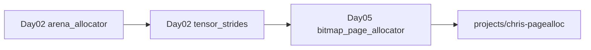
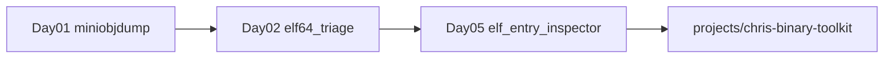
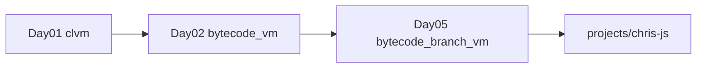
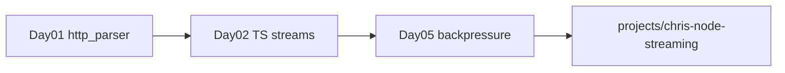
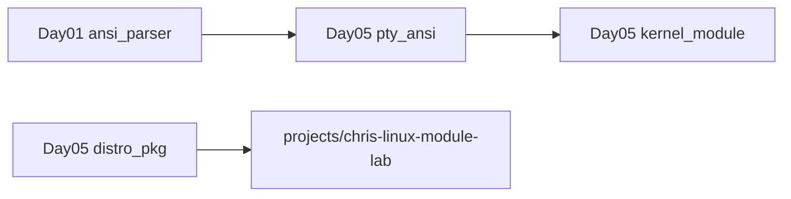
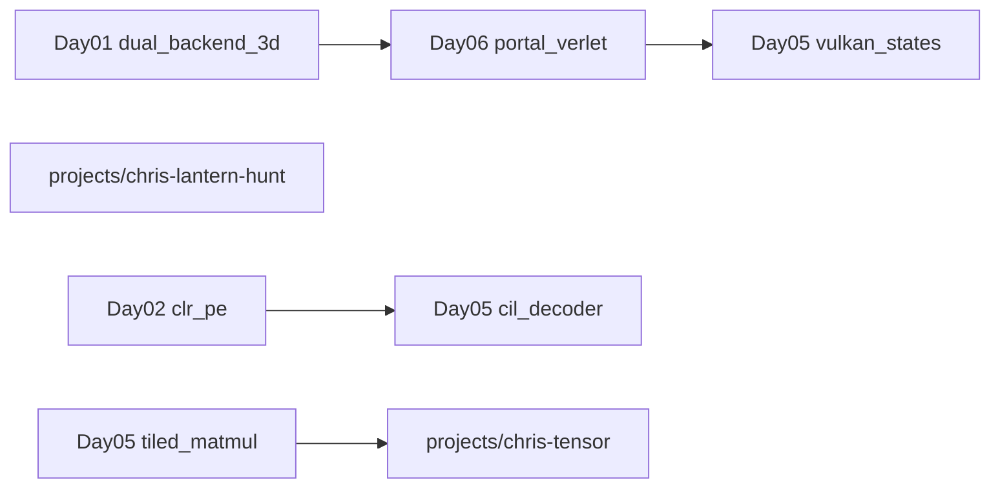
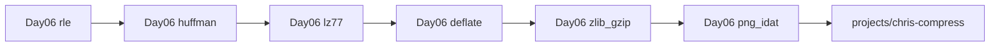

# Learning paths — trilhas verticais multi-dia

Módulos dentro de um dia são independentes. Estas trilhas conectam conceitos entre dias e terminam em **capstones** em `projects/`.

---

## 1. Memória e alocação

| Etapa | Módulo | Conceito |
|-------|--------|----------|
| 1 | `2026-09-04/systems/arena_allocator` | bump pointer, align, reset O(1) |
| 2 | `2026-09-04/ai/tensor_strides` | layout contínuo, views sem cópia |
| 3 | `2026-09-05/systems/bitmap_page_allocator` | page→byte→bit, first-fit |
| Capstone | `projects/chris-pagealloc` | allocator com trace + testes OOM |

**Pergunta de síntese:** quando arena perde para bitmap e vice-versa?

---

## 2. Binários, ELF e reversing

| Etapa | Módulo | Conceito |
|-------|--------|----------|
| 1 | `2026-09-03/tooling/miniobjdump` | ELF/PE headers, primeiros opcodes |
| 2 | `2026-09-04/redteam/elf64_triage` | Ehdr + Phdr/Shdr + dynsym + strings |
| 3 | `2026-09-05/redteam/elf_entry_inspector` | `e_entry`, validação byte-a-byte |
| Capstone | `projects/chris-binary-toolkit` | pipeline strings + ELF + YARA-style |

---

## 3. VMs e bytecode

| Etapa | Módulo | Conceito |
|-------|--------|----------|
| 1 | `2026-09-03/systems/clvm` | stack VM, loader binário |
| 2 | `2026-09-04/javascript/bytecode_vm_from_scratch` | dispatch loop, stack trace |
| 3 | `2026-09-05/javascript/bytecode_branch_vm` | branches, IP, condicionais |
| Capstone | `projects/chris-js` | VM com branches + testes |

---

## 4. Streams, I/O e backpressure

| Etapa | Módulo | Conceito |
|-------|--------|----------|
| 1 | `2026-09-03/network/http_parser` | parsing incremental, estados |
| 2 | `2026-09-04/nodejs/typescript_stream_backpressure` | Transform, `write()` false |
| 3 | `2026-09-05/nodejs/stream_transform_backpressure` | demo observável de backpressure |
| Capstone | `projects/chris-node-streaming` | pipeline com métricas de buffer |

---

## 5. Linux: userspace → kernel

| Etapa | Módulo | Conceito |
|-------|--------|----------|
| 1 | `2026-09-03/terminal/ansi_parser` | FSM ESC/CSI |
| 2 | `2026-09-05/linux/pty_ansi_terminal` | SGR, cursor, preparação PTY |
| 3 | `2026-09-05/linux/kernel_module_driver_lab` | char device lifecycle |
| 4 | `2026-09-05/linux/distro_pkg_rootfs` | rootfs mínimo (opcional) |
| Capstone | `projects/chris-linux-module-lab` + VM real com `insmod` |

---

## 6. GPU, .NET e performance

| Etapa | Módulo | Conceito |
|-------|--------|----------|
| 1 | `2026-09-03/graphics/dual_backend_3d` | software vs GL |
| 1b | `projects/chris-lantern-hunt` | FPS horror OpenGL (projeto extra opcional) |
| 2 | `2026-09-06/graphics/portal_verlet_physics` | portais stencil + Verlet + esfera |
| 3 | `2026-09-04/os/graphics_reference` | compositor RGBA + dirty-rect + frame pacing |
| 4 | `2026-09-05/graphics/vulkan_d3d12_resource_states` | máquina de estados GPU |
| 5 | `2026-09-05/ai/tiled_matmul_cache` | cache blocking, benchmark |
| Capstone | `projects/chris-tensor` + `projects/chris-gpu-state` |

---

## 7. Compressão e formatos de arquivo

| Etapa | Módulo | Conceito |
|-------|--------|----------|
| 1 | `2026-09-06/systems/rle_byte_codec` | runs byte-a-byte |
| 2 | `2026-09-06/systems/huffman_entropy` | entropia, árvore canônica |
| 3 | `2026-09-06/systems/lz77_dictionary` | janela deslizante |
| 4 | `2026-09-06/systems/deflate_blocks` | RFC 1951 subset |
| 5 | `2026-09-06/tooling/zlib_gzip_containers` | wrappers zlib/gzip |
| 6 | `2026-09-06/tooling/png_idat_pipeline` | chunks PNG + IDAT |
| Capstone | `projects/chris-compress` | CLI encadeada |

---

## Como usar

1. Escolha uma trilha alinhada ao seu objetivo de portfólio.
2. Faça os módulos na ordem — cada um assume vocabulário do anterior.
3. Após cada módulo: porte para `projects/` ([PORTING_GUIDE.md](PORTING_GUIDE.md)).
4. No capstone: integre código de 2+ dias em um único repositório com testes unificados.
5. Documente conclusão em `research/YYYY-MM-DD-<trilha>.md`.
