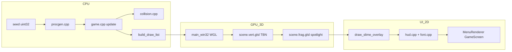

# TEORIA_PASSO_A_PASSO — Lantern Hunt

Teoria operacional para o dia **Chris Lantern Hunt**. Cada seção segue o padrão **O quê / Como / Por quê / Invariantes / Bugs comuns / Trace manual**.

Pré-requisitos sugeridos: módulo `days/2026-09-03/graphics/dual_backend_3d` (câmera FPS e matrizes) e leitura de `projects/chris-renderer/opengl_win32/main.cpp` (bootstrap WGL).

---

## 0. Problema do dia — horror = informação limitada

### O quê
Um FPS em dungeon procedural onde o jogador **não vê o mapa inteiro**. A lanterna (spotlight) revela albedo e relevo (normal map); o resto permanece em penumbra. Objetivos, água, gosma e insetos criam risco sob visibilidade reduzida.

### Como
O jogo combina:
- **Render:** cone de luz estreito + `u_ambient` baixo (`0.03` em `solutions/src/main_win32.cpp`).
- **Gameplay:** som ambiente + passos; HUD mínimo (vida, respiração, objetivo).
- **Progressão:** cinco objetivos em cadeia (`objectives.cpp`) antes da vitória.

### Por quê
Horror não é só “escuro”: é **decisão com dados incompletos**. Limitar informação visual força o jogador a usar áudio, memória espacial e lanterna como recursos — o mesmo motivo de fog-of-war em roguelikes, aplicado em 3D imediato.

### Invariantes
- Fora do cone da lanterna, `diff * spot ≈ 0` — apenas `u_ambient` ilumina.
- O jogador nunca recebe minimapa completo no HUD do dia 1.
- Falha (morte) deve ser legível: overlay de gosma, barra de vida, Game Over explícito.

### Bugs comuns
| Sintoma | Causa provável |
|---------|----------------|
| “Não assusta, está claro” | `u_ambient` alto ou cone largo (`cutoff` baixo) |
| Jogador perdido sem feedback | HUD/objetivos não implementados (`LANTERN-HUD-14`, `OBJ-17`) |
| Vitória sem tensão | Todos os pickups visíveis com luz global |

### Trace manual
Cena: corredor reto, jogador no meio. `u_light_dir` aponta para frente; parede lateral a 90°. Com `cutoff = 0.92`, a parede lateral recebe `spot = 0` → cor `albedo * 0.03` ≈ quase preto. Jogador só vê detalhe ao girar a câmera.

---

## 1. Pipeline completo do frame

### O quê
Fluxo de dados desde a seed até pixels na tela, incluindo overlay 2D.

### Como



Ordem em `main_win32.cpp` (loop de frame):
1. Input + `game_update` (movimento, água, AI, pickups, checkpoint).
2. Clear + depth test.
3. Para cada `DrawCommand`: bind albedo/normal, uniforms lanterna, `glDrawArrays`.
4. `draw_slime_overlay` (tela cheia, blend).
5. `HudRenderer::draw` ou `MenuRenderer` conforme `GameScreen`.

### Por quê
Separar **simulação** (`game.cpp`, testável sem GPU) de **apresentação** (`main_win32.cpp`, `hud.cpp`) permite `ctest` em procgen/colisão/objetivos/checkpoint enquanto o aluno itera shaders e áudio.

### Invariantes
- `game_update` não chama OpenGL.
- `build_draw_list` é função pura do `GameState` (mesmo estado → mesma lista).
- Overlay 2D desabilita depth test durante desenho.

### Bugs comuns
| Sintoma | Causa |
|---------|-------|
| HUD atrás da parede | `glDisable(GL_DEPTH_TEST)` não chamado em `font.begin_frame` |
| Menu aparece no jogo | `GameScreen` não verificado antes de `g_hud.draw` |
| Câmera não move mas mundo sim | Confundir `u_view` com identidade |

### Trace manual
Frame `t=0.016s`, seed `42`: `game_update` move câmera → `cell_at_world` retorna `Floor` → `move_with_collision` aplica slide → `build_draw_list` emite ~800+ comandos para grid 32×32 → 3 draws de comida ativa → HUD imprime `COMIDA 0/5`.

---

## 2. WGL + extensões OpenGL 2.0

### O quê
No Windows, `opengl32.dll` exporta apenas OpenGL 1.1. Shaders (`#version 120`), VBOs e `glUseProgram` exigem carregar ponteiros via `wglGetProcAddress`.

### Como
Em `solutions/src/main_win32.cpp`:
1. `ChoosePixelFormat` + `SetPixelFormat` (RGBA, depth 24).
2. `wglCreateContext` / `wglMakeCurrent`.
3. `load_gl_functions()` resolve `glCreateShader`, `glCompileShader`, `glLinkProgram`, `glGetUniformLocation`, etc.
4. CMake define `LANTERN_SHADER_DIR` para `starter/src/shaders` ou `solutions/src/shaders`.

### Por quê
É o mesmo padrão do `chris-renderer` e do dia `dual_backend_3d`: controle total sem GLFW/GLEW no currículo low-level.

### Invariantes
- Contexto WGL ativo antes de qualquer chamada GL 2.0+.
- Shaders lidos do disco em cada build; path absoluto via macro do CMake.

### Bugs comuns
| Sintoma | Causa |
|---------|-------|
| `glCreateShader` é nullptr | `load_gl_functions` não chamado |
| Shader file not found | `LANTERN_SHADER_DIR` incorreto no target `lantern_hunt_starter` |
| Tela preta sem erro | `glGetError` ignorado; programa shader link fail |

### Trace manual
`initialize_wgl(hwnd)` retorna true → `load_gl_functions` preenche `pglCreateShader` → `initialize_program` lê `scene.vert.glsl` + `scene.frag.glsl` de `LANTERN_SHADER_DIR` → link OK → `g_program != 0`.

---

## 3. Câmera FPS (ligação com Day01 dual_backend_3d)

### O quê
`FpsCamera` em `solutions/src/math.hpp`: posição, yaw/pitch, vetores `forward()`, `right()`, `up()` para movimento e lanterna.

### Como
- **Mouse:** altera yaw/pitch com clamp em pitch (evita flip).
- **Movimento:** WASD projeta `forward`/`right` no plano XZ (`game_update` zera componente Y).
- **Matrizes:** `view = look_at(position, position + forward, up)`; `projection = perspective(fov, aspect, near, far)`.

Referência cruzada: `days/2026-09-03/graphics/dual_backend_3d` — mesma convenção right-handed, câmera como ponto de vista.

### Por quê
FPS horror exige olhar livre; a lanterna segue `camera.forward()` em `main_win32.cpp` (`u_light_dir`).

### Invariantes
- Movimento horizontal não altera pitch.
- `forward()` normalizado antes de disparar projétil (`LANTERN-PROJ-05`).

### Bugs comuns
| Sintoma | Causa |
|---------|-------|
| Movimento diagonal 1.4× mais rápido | Não normalizar soma WASD |
| Lanterna não segue mira | `u_light_dir` fixo em vez de `camera.forward()` |
| Mouse invertido | Sinal errado no delta Y |

### Trace manual
Yaw `90°`, pitch `0`: `forward()` ≈ `(0, 0, -1)` em mundo. Passo `W` adiciona `forward_flat * speed * dt` → nova posição entra em `move_with_collision`.

---

## 4. UV mapping + texturas stb_image

### O quê
Coordenadas `(u, v)` ligam vértices 3D a texels 2D. `stb_image` decodifica PNG em CPU; `glTexImage2D` envia para GPU.

### Como (`solutions/src/texture.cpp`, `LANTERN-TEX-02`)
```cpp
stbi_set_flip_vertically_on_load(1);
unsigned char* pixels = stbi_load(path.c_str(), &width, &height, &channels, 4);
glGenTextures(1, &texture_id);
glTexImage2D(GL_TEXTURE_2D, 0, GL_RGBA, width, height, 0, GL_RGBA, GL_UNSIGNED_BYTE, pixels);
```
Assets gerados por `tools/generate_assets.py` em `assets/textures/`.

### Por quê
Albedo diferencia chão, parede, inseto, altar sob a lanterna — sem textura, horror perde materialidade.

### Invariantes
- Sempre pedir 4 canais (`stbi_load` último arg `4`) para consistência GL_RGBA.
- `stbi_image_free` após upload.

### Bugs comuns
| Sintoma | Causa |
|---------|-------|
| Textura de cabeça para baixo | Flip inconsistente entre assets e UV |
| Seam em parede longa | `GL_CLAMP` em vez de `GL_REPEAT` |
| Failed to load texture | Assets não gerados (`python tools/generate_assets.py`) |

### Trace manual
`floor_albedo.png` 256×256 → `glTexImage2D` nível 0 → fragment sample `v_uv = (0.5, 0.5)` → texel central do concreto.

---

## 5. Normal map + matriz TBN

### O quê
Normal geométrica do cubo é plana. **Normal map** codifica micro-relevo em tangent space (RGB → vetor em [-1,1]).

### Como
**Vertex** (`scene.vert.glsl`):
```glsl
vec3 T = normalize(mat3(u_model) * a_tangent);
vec3 N = normalize(mat3(u_model) * a_normal);
T = normalize(T - dot(T, N) * N);
vec3 B = cross(N, T);
v_tbn = mat3(T, B, N);
```
**Fragment** (`LANTERN-NORM-03`):
```glsl
vec3 tangent_normal = texture2D(u_normal_map, v_uv).rgb * 2.0 - 1.0;
vec3 N = normalize(v_tbn * tangent_normal);
```

### Por quê
Paredes de cubo têm poucos triângulos; normal map simula rachaduras visíveis só onde a lanterna bate — núcleo do “horror = informação”.

### Invariantes
- TBN deve ser ortonormal (T ⟂ N após Gram-Schmidt).
- Normal map e albedo compartilham mesmos UV.

### Bugs comuns
| Sintoma | Causa |
|---------|-------|
| Shimmering ao mover | TBN não ortonormalizado |
| Relevo “invertido” | Espaço tangente left vs right handed |
| Plano sem relevo | Sample albedo em vez de `u_normal_map` |

### Trace manual
Texel normal map `(128, 128, 255)` → tangent `(0,0,1)` → após TBN, `N` permanece próximo da normal da face → diffuse inalterado. Texel `(200, 128, 128)` → inclina N → highlight deslocado.

---

## 6. Spotlight da lanterna

### O quê
Luz posicional na câmera com cone direcional: dentro do cone, diffuse; fora, apenas ambiente.

### Como (`scene.frag.glsl`, uniforms em `main_win32.cpp`)
```glsl
float theta = dot(-L, normalize(u_light_dir));
float spot = theta > u_spot_cutoff ? pow(theta, u_spot_exponent) : 0.0;
float diff = max(dot(N, L), 0.0) * spot;
vec3 lighting = u_ambient + diff * u_light_color;
```
Valores de referência: `u_ambient = 0.03`, `u_spot_cutoff = 0.92`, `u_spot_exponent = 48`.

### Por quê
Cone estreito força o jogador a **varrer** o ambiente com o mouse — mecânica de tensão, não só estética.

### Invariantes
- `u_light_pos` = posição da câmera.
- `u_light_dir` = `camera.forward()` atualizado todo frame.

### Bugs comuns
| Sintoma | Causa |
|---------|-------|
| Tudo iluminado | `cutoff` muito baixo ou `exponent` pequeno |
| Normal map invisível | `diff` zero porque `N` e `L` perpendiculares e `spot` ok — verificar TBN |
| Lanterna aponta para trás | Sinal de `L` ou `u_light_dir` |

### Trace manual
`theta = 0.95` > `0.92` → `spot = 0.95^48 ≈ 0.08` (ainda visível). `theta = 0.90` → `spot = 0` → só `0.03` ambiente.

---

## 7. Procgen determinística

### O quê
`generate_dungeon(seed)` em `procgen.cpp` preenche grid 32×32 com salas, corredores, água e gosma de forma **reprodutível**.

### Como
1. Grid inicial `Wall`.
2. Até 8 salas: retângulos aleatórios sem overlap (padding 2).
3. Ordenar salas por `x`; conectar centros com corredores em L (`carve_h` + `carve_v`, ordem alternada por `rng() % 2`).
4. `carve_water_pool` — anel `WaterShallow`, interior `WaterDeep`.
5. `scatter_slime` — 6 células `Slime` em chão.

### Por quê
Testes automáticos (`test_procgen`) e debug exigem seed fixa; jogador pode usar seed `42` ou aleatória no menu.

### Invariantes
- Borda do grid permanece parede.
- Mesma seed → mesmas células (`test_procgen` compara loop duplo).

### Bugs comuns
| Sintoma | Causa |
|---------|-------|
| test_procgen FAIL floors | Poucas salas aceitas (overlap muito agressivo) |
| Layout diferente com mesma seed | Ordem de conexão não determinística (falta sort) |
| Sem água | `carve_water_pool` não chamado |

### Trace manual (grid seed 42, trecho conceitual)
`rng = mt19937(42)` → sala 0 em `(x=12,y=5,w=6,h=5)` carve → … → 8 salas → sort por x → corredor sala0→1: `carve_h` depois `carve_v` se bit rng par → `floor_count()` ≥ 180, `water_count()` ≥ 8, `rooms.size()` ≥ 6. Célula `(10,10)` deve ser `Floor` (assert implícito no layout estável).

---

## 8. Colisão AABB slide

### O quê
Jogador = AABB vertical (`kPlayerRadius`, `kPlayerHeight`). Paredes e deep water (sem natação) = AABB por célula. Resolução por eixo de menor penetração.

### Como (`collision.cpp`, `LANTERN-CAM-02`)
- `player_aabb(position, radius, height)`.
- `resolve_axis`: escolhe X ou Z com menor overlap; desloca posição.
- `move_with_collision`: 2 passes sobre todo o grid.
- Deep water sem `swimming`: tratado como sólido.

### Por quê
Slide evita “grudar” em cantos — essencial em dungeon grid.

### Invariantes
- Não alterar Y na colisão horizontal (FPS terrestre).
- `swimming == true` permite entrar em `WaterDeep`.

### Bugs comuns
| Sintoma | Causa |
|---------|-------|
| Atravessa parede fina | Um pass apenas |
| Preso em canto | Não resolver menor overlap |
| Não entra na água profunda | `swimming` false permanentemente |

### Trace manual
Pos `(3.3, 0.8, 5.0)`, raio `0.32`, move `+X 0.5` contra parede em `x=3` → overlap X menor → slide para `x=2.68` → segundo pass corrige Z se necessário.

---

## 9. Áudio miniaudio

### O quê
`AudioEngine` (`audio.cpp`): engine global, ambiente em loop, passos e tiro one-shot.

### Como (`LANTERN-AUDIO-08`)
- `ma_engine_init` → `ma_sound_init_from_file(ambient, MA_SOUND_FLAG_STREAM)` → loop.
- Passos: `ma_sound_seek_to_pcm_frame(0)` + `ma_sound_start`, cooldown `0.35s`.
- `update_movement_cooldown(dt)` no frame.

### Por quê
Feedback sonoro substitui informação visual limitada; passos confirmam movimento em corredores escuros.

### Invariantes
- Init engine antes dos sounds; `uninit` ordem inversa.
- Cooldown evita spam de WAV ao segurar W.

### Bugs comuns
| Sintoma | Causa |
|---------|-------|
| Sem som | WAV ausente em `assets/audio/` |
| Ambiente corta | Stream flag omitida |
| Passos metralhadora | Cooldown não decrementado |

### Trace manual
`t=0`: passo → cooldown `0.35`. `t=0.1`: movimento, `play_footstep` ignorado. `t=0.36`: novo passo aceito.

---

## 10. Bitmap fonts → HUD ortográfico

### O quê
Texto e barras 2D sobre o mundo 3D via projeção ortográfica e `GL_QUADS` imediatos.

### Como (`font.cpp`, `LANTERN-FONT-13`)
- Fonte 5×7 embutida (`font5x7[]`), ASCII `' '`..`'Z'`.
- `begin_frame`: `glOrtho(0, width, height, 0, -1, 1)`, blend alpha.
- `draw_text`: por pixel ligado no glyph, quad `2*scale` px.
- Alternativa curricular: `stb_truetype` rasteriza TTF para atlas (não obrigatório no dia 1).

### Por quê
HUD legível sem engine de UI; orto mapeia pixels de janela 1:1.

### Invariantes
- `end_frame` restaura matrizes e depth test.
- Cor de texto definida por `glColor4f` antes dos quads.

### Bugs comuns
| Sintoma | Causa |
|---------|-------|
| Texto espelhado | Ortográfico Y invertido sem ajuste |
| Barras não aparecem | Desenho antes de `begin_frame` |
| Caracteres `@` faltando | `glyph_pixel` só até `'Z'` |

### Trace manual
String `"VIDA"` em `(24, height-58)`, scale `1` → 4×(5+1)×2 px largura → barra vermelha acima em `y = height-40`.

---

## 11. Água — shallow vs deep, breath, swim speed

### O quê
Três estados: seco, `WaterShallow`, `WaterDeep` (+ natação). Breath meter limita tempo submerso.

### Como (`game.cpp` `update_water_state`, `LANTERN-WATER-12`)
| Célula | `water` | `swimming` | breath | velocidade |
|--------|---------|------------|--------|------------|
| Shallow | Shallow | false | recupera +25/s | ×0.6 em movimento |
| Deep | Deep | true | drena −18/s | ×0.75, `y=0.9` |
| Ar | None | false | recupera +30/s | normal |

`breath <= 0` → dreno de vida `−20/s`. Colisão bloqueia deep sem swim.

### Por quê
Camadas de risco: shallow penaliza; deep exige gestão de respiração — decisão sob lanterna estreita.

### Invariantes
- `is_walkable(deep)` false se `!swimming`.
- Breath clampado [0, 100].

### Bugs comuns
| Sintoma | Causa |
|---------|-------|
| Afoga em shallow | Case errado no switch |
| Nada em terra | `swimming` não resetado ao sair |
| test_procgen FAIL water | `water_count` < 8 |

### Trace manual
Entra deep com breath `100`: em `100/18 ≈ 5.5s` breath zera; mais `5s` a −20 hp/s → morte se não subir.

---

## 12. Dano + gosma — estado, overlay, partículas

### O quê
`CellType::Slime` e contato com insetos aplicam dano, lentidão (`slime_slow`) e overlay verde (`draw_slime_overlay`).

### Como (`LANTERN-SLIME-11`)
- Slime chão: `health -= 8/s`, `slime_slow = 1`, `slime_overlay = 1`.
- Inseto próximo (`dist < 0.7`): `health -= 12/s`, mesmos flags + `spawn_slime_particles`.
- Partículas: pool `kMaxSlimeParticles`, gravidade simples, decay overlay `−0.8/s`.

### Por quê
Feedback visceral quando a visão já é limitada — jogador **sente** perigo pelo HUD e cor.

### Invariantes
- `slime_slow` decai; velocidade mínima ~55% com slow ativo.
- Overlay alpha proporcional a `slime_overlay`.

### Bugs comuns
| Sintoma | Causa |
|---------|-------|
| Tela sempre verde | Overlay não decai |
| Dano sem contato | Raio de inseto grande |
| Sem partículas | Pool esgotado sem reuse |

### Trace manual
Pisa slime: overlay `1.0`, speed `4.5×0.55`. Após `1.25s` sem slime, overlay ≈ `0`, slow ≈ `0`.

---

## 13. Objetivos + checkpoints

### O quê
Cinco objetivos ordenados (`ObjectiveTracker`) + altares que salvam snapshot (`CheckpointData`).

### Como
Objetivos (`objectives.cpp`):
1. Explorar 3 salas — `on_room_entered`
2. Coletar 5 comidas — `on_food_collected`
3. Eliminar 4 insetos — `on_bug_killed`
4. Ativar altar (tecla E) — `on_checkpoint_activated`
5. Escapar — `on_escape_ready(all_complete)`

Checkpoint (`checkpoint.cpp`, `LANTERN-CHK-16`): salva posição, vida, breath, contadores; `game_respawn_to_checkpoint` restaura.

### Por quê
Estrutura narrativa mínima para “dia completo”; checkpoint reduz frustração sem mapa.

### Invariantes
- Objetivo `Escape` só completa quando todos anteriores `completed`.
- `checkpoint.valid` false até primeiro altar.

### Bugs comuns
| Sintoma | Causa |
|---------|-------|
| Vitória prematura | `on_escape_ready(true)` sem checar outros |
| E não salva | `interact_pressed` não setado no input |
| Restore ignora comida | `food_collected` omitido no save |

### Trace manual
Visita 3 salas → obj1 done. Coleta 5 → obj2. Mata 4 → obj3. Pressiona E no altar → `checkpoint_save`, obj4. `all_complete()` → `won`, `GameScreen::Victory`.

---

## 14. Menu — enum `GameScreen`

### O quê
Máquina de telas: `MainMenu`, `Playing`, `Paused`, `GameOver`, `Victory` (`game.hpp`).

### Como (`hud.cpp` `MenuRenderer`, input em `main_win32.cpp`)
- Menu principal: 3 itens (seed 42, aleatório, sair); setas/W/S + Enter.
- Esc alterna `Playing` ↔ `Paused`.
- Game Over / Vitória: Enter volta ao menu.
- `game_update` só roda em `Playing`.

### Por quê
Separa bootstrapping (carregar GL/texturas) de sessão de jogo; pausa para leitura de objetivos.

### Invariantes
- `game_reset` chamado ao escolher “Jogar”.
- HUD mundo não desenha em `MainMenu` (só menu renderer).

### Bugs comuns
| Sintoma | Causa |
|---------|-------|
| Jogo roda no menu | Falta guard `screen == Playing` |
| Pausa sem overlay | `draw_paused` não chamado |
| Seed aleatória igual | `std::random_device` não usado no menu |

### Trace manual
Boot → `MainMenu` → Enter item 0 → `game_reset(42)` → `Playing` → Esc → `Paused` → Esc → `Playing` → morre → `GameOver` → Enter → `MainMenu`.

---

## Leituras e referências cruzadas

| Tópico | Caminho no repositório |
|--------|------------------------|
| Câmera FPS | `days/2026-09-03/graphics/dual_backend_3d` |
| WGL bootstrap | `projects/chris-renderer/opengl_win32/main.cpp` |
| Shaders solução | `solutions/src/shaders/scene.*.glsl` |
| Testes | `solutions/tests/test_*.cpp` |
| Assets | `tools/generate_assets.py` → `assets/` |

## Por quê — síntese pedagógica

### Por quê este projeto existe?
Integrar em um dia jogável: GL imediato no Windows, conteúdo procedural testável, pipeline horror (luz + som + HUD), e gameplay com objetivos — espelhando como times indie prototipam antes de engines pesadas.

### Por quê estas invariantes?
Determinismo (procgen), separação sim/render (testes sem GPU), e informação limitada (spotlight) são pilares **mensuráveis** — você sabe que acertou quando `ctest` passa **e** o corredor fora do cone fica ilegível.

### Por quê medir FPS?
`build_draw_list` gera milhares de cubos; o benchmark do dia 1 estabelece linha de base para instancing/mesh merge no dia 2 (`docs/BENCHMARK_GUIADO.md`).
